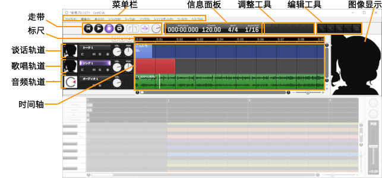

原文：[CeVIO AI ユーザーズガイド ┃ 各部の名前](https://cevio.jp/guide/cevio_ai/operation/)

---

## 标尺

点击标尺可以将位置光标移动到想开始播放的位置。

双击标尺可以从被点击的位置进行回放（或在回放过程中停止）。

## 图像显示

可以从「选项」中选择展示更大的图像或者隐藏图像。

## 音频轨道

可以使用 [+] 按钮或「音轨」菜单中的「添加音轨」来添加音轨。

## 谈话轨道 / 歌唱轨道

在 Talk 新手包等只有谈话功能有效的环境中，不显示歌唱轨道、调整工具和编辑工具。

在 Song 新手包等只有歌唱功能有效的环境中，不显示谈话轨道。

当只有谈话或歌唱引擎的一方有效时，如果您购买并激活了另一方的新手包，所有功能都将启用。

---
***译者的举例***

以 IA 和 OИE 的 CeVIO AI 系列为例。新手包包含声库和对应编辑器的激活码，例如， OИE Talk 新手包包含了 OИE 谈话声库和 CeVIO 谈话编辑器，共两个激活码。

- 若只购入了 OИE Talk Voice 单体，由于缺少激活 CeVIO 编辑器的激活码，谈话功能和歌唱功能均不可用。

- 若只购入了 OИE Talk 新手包，则谈话功能可正常使用，歌唱功能不可用。在此基础上：

  - 若想使用 IA 的谈话声库，由于 CeVIO 的谈话编辑器已激活，所以只需购买 IA 的 Talk Voice 声库单体。

  - 若想使用 OИE 的歌唱声库，则需再购买 OИE 的 Song 新手包，将编辑器与声库一起激活。激活后，即使以后只使用 OИE 的谈话声库创作，歌唱功能也处于可用状态。

- 若只购入了 IA Song 新手包，则歌唱功能可正常使用，谈话功能不可用。在此基础上：

  - 若想使用 OИE 的歌唱声库，同上，只需购买 OИE 的 Song Voice 声库单体。

  - 若想使用 IA 的谈话声库，同上，需再购买 IA 的 Talk 新手包。激活后，即使以后只使用 IA 的歌唱声库创作，谈话功能也处于可用状态。

  - 若想使用 IA 的英语歌唱声库，由于日语与英语共享一个编辑器，所以只需购买 IA English Voice 单体。（分开的话才出大问题吧……）

---

*[「选项」]: オプション / Options
*[「音轨」]: トラック / Track
*[「添加音轨」]: トラックの追加 / Add Track
