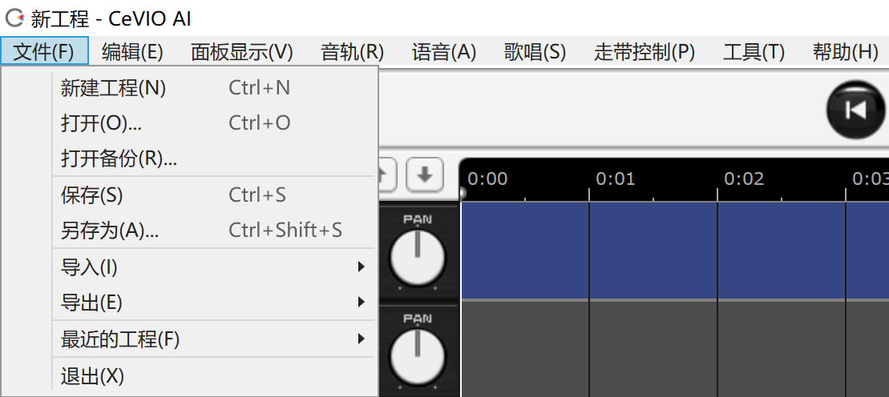

译自 CeVIO 官网。本文为非官方译文，仅供参考。限于译者日语水平，文本翻译难有错漏。若有发现还请指正。

中文翻译来源于 [VOICeVIO/Ulysses 的汉化补丁](https://github.com/VOICeVIO/CeVIO.CN)。在此感谢。

原文：[CeVIO AI ユーザーズガイド ┃ メニュー](https://cevio.jp/guide/cevio_ai/operation/menu/)

---

【hint：如果你不理解菜单里的某个选项是做什么用的，试试将鼠标长时间停留在那个选项上。】

## ファイル / File / 文件

### 新規プロジェクト / New Project / 新建工程

创建一个新项目（包括谈话和歌唱）。

如果有正在编辑的内容，会显示保存确认画面。

### 開く/ Open / 打开

打开保存的项目文件。

如果有正在编辑的内容，会显示保存确认画面。

### バックアップを開く / Open Backup / 打开备份

打开项目的备份。

备份文件每隔 5 分钟自动保存一次，一周后自动删除。

### 保存 / Save / 保存

保存正在编辑的项目。

### 名前を付けて保存 / Save As / 另存为

命名并保存正在编辑的项目。

输入一个文件名，然后点击【保存】。

保存的文件后缀是“ccs”。

### インポート / Import / 导入

#### セリフのテキストの読み込み / Text File / 导入台词文本

将文本文件的台词导入谈话轨道。

[文本文件的导入](2022-03-04-talktrack-talk_04)

#### 青空文庫の読み込み / AozoraBunko File / 从青空文库导入

将青空文库的台词文件，除注释 [#...] 以外的文本导入谈话轨道。

#### 字幕の読み込み / Subtitle File / 导入字幕文件

将 SubRip (.srt) 和 SubViewer (.sbv) 格式的字幕文件导入谈话轨道。

#### MIDIの読み込み / MIDI File / 导入MIDI音轨

将标准 MIDI 文件导入歌曲轨道。

#### MusicXMLの読み込み / MusicXML File / 导入MusicXML

将 MusicXML 文件导入歌曲轨道。

[MIDI／MusicXML的导入](2022-04-11-songtrack-fileimport)

#### オーディオファイルの読み込み / Audio File / 导入音频文件

将外部音频文件加载到以当前光标位置为起点的音频轨道上。

[关于音频文件的格式](2022-05-01-audio)

#### トラック単位の読み込み / Track File / 导入音轨单位文件

加载在「导出音轨单位文件」中保存的文件。

#### 設定の読み込み / Settings File / 导入设置

加载已保存的环境设定。

可选的导入选项有「常规设置」「用户词典」「预置」「台词片段」。

「用户词典」「预置」「台词片段」可以选择「替换现有内容」或「在现有内容的基础上添加」的导入选项。

### エクスポート / Export / 导出

#### ミックスダウンWAV書き出し / Audio Mixdown / 导出WAV音频文件

将全部轨道导出为一个 WAV 格式（48kHz 16bit 立体声）的文件。

#### セリフの連続WAV書き出し / Audio Files per Each Line / 导出语音部分为WAV文件

将所选谈话轨道以 WAV 格式（48kHz 16bit 单声道）导出每一行的内容。

* 如果在「详细」中关闭了「按音轨建立文件夹，按序号命名文件」，文件就不会被划分到文件夹中，文件名号就变成了所有轨道中所有行的序列号。

#### セリフのテキスト書き出し / Text File / 导出台词文本

将所选谈话轨道以用逗号分隔的文本格式导出每一行的内容。

#### 字幕テキストの書き出し / Subtitle File / 导出字幕

将所选谈话轨道以 SubRip (.srt) 和 SubViewer (.sbv) 格式导出每一行的内容。可以用于 YouTube 的字幕。

#### ソングのWAV書き出し / Audio File of Song / 导出歌唱部分为WAV文件

将所选歌唱轨道以 WAV 格式（48kHz 16bit 单声道）导出。

#### MIDIの書き出し / MIDI File / 导出 MIDI

将所选歌唱轨道导出为 MIDI 文件。

* 即使选择了多个音轨，它们也会被合并到一个文件中，而调号反映在可供选择的第一个音轨「Conductor Track」中。

#### MusicXMLの書き出し / MusicXML File / 导出 MusicXML

将所选歌唱轨道导出为 MusicXML 文件。

#### トラック単位の保存 / Track File / 导出音轨单位文件

保存对所选轨道进行的编辑。

保存的文件可以导入到另一个项目并重新使用。

保存文件的后缀是“ccst”。

#### 設定の書き出し / Settings File / 导出设置

导出当前的环境配置文件。

可选的导出选项有「常规设置」「用户词典」「预置」「台词片段」。

保存文件的后缀是“ccsa”。

### 最近使ったプロジェクト / Recent Project / 最近的工程

可以选择最近使用的工程并打开。

### 終了 / Quit / 退出

关闭程序。

如果有正在编辑的内容，会显示保存确认画面。

## 編集 / Edit / 编辑

### 元に戻す / Undo / 撤销

回退到之前的工作状态。

### やり直し / Redo / 重做

回退到执行「撤销」前的工作状态。

### 切り取り / Cut / 剪切

切取选择的台词或音符。

### コピー / Copy / 复制

复制选择的台词或音符。

### 貼り付け / Paste / 粘贴

在光标当前的位置粘贴复制（剪切）的台词或音符。

### 削除 / Delete / 删除

删除选择的台词或音符。

### すべて選択 / Select All / 全选

选择当前轨道的所有台词或音符。

## 表示 / View / 面板显示

### 標準 / Normal / 标准

默认的显示。

### 全画面 / Full Screen / 全屏

隐藏窗口标题和菜单，使编辑屏幕更宽。

* 若要退出全屏，请按 [F11]。

### コンパクト / Portrait / 封面

只显示角色图。这种显示方式适用于外部调用等。

除了播放/停止，移动位置光标的快捷键在封面显示模式中也有效。

在封面显示模式中，你可以通过右键点击切换到「始终置顶」。

## トラック / Track / 音轨

### トラックを追加 / Add Track / 添加音轨

在当前所选音轨下面添加一个新的音轨。

最多可以创建 32 个谈话轨道、歌唱轨道和音频轨道。

### トラックを複製 / Duplicate Track / 复制音轨

将当前所选音轨复制为一个新轨道。

### トラックを削除 / Remove Track / 删除音轨

删除当前所选音轨。

### トラックを上に移動 / Move Track Up / 上移音轨

将当前所选音轨向上移动 1 个轨道。

### トラックを下に移動 / Move Track Down / 下移音轨

将当前所选音轨向下移动 1 个轨道。

### トラック内容をクリア / Clear Track Contents / 清空音轨的内容

将当前所选音轨的内容全部清除。

### トラック内容を等間隔に整列 / Align Track Element / 设置音轨的内容为等间隔排列

将当前所选音轨的元素（台词和外部音频）以相等的间隔放置。

### トラックを固定 / Freeze Track / 冻结音轨

将当前所选音轨的音频输出到一个文件中，减少播放延迟和多个音轨的混合时间。它还能在播放过程中减少 CPU 和内存的负荷，这在音轨过多导致声音中断或内存不足时很有用。

* 编辑轨道的内容时将会自动解冻。

### トラックをミュート / Mute Track / 使音轨静音

静音当前音轨。

### トラックをソロ / Solo Track / 使音轨独奏

只播放当前音轨。

### トラックのキャスト / Cast / 音轨配音角色

更改当前谈话轨道或歌唱轨道的角色。

## トーク / Talk / 谈话

### 単語の登録 / Japanese Word Registration / 注册单词

将读错的单词的读音和重音登记到词典中。

### 辞書の管理 / Japanese Dictionary Management / 词典管理

可以浏览已注册的单词，并对其进行编辑或删除。

### セリフクリップ一覧 / Speech Clips / 浏览台词片段

可以浏览已注册的台词，并将其插入到选定的行中，或从列表中删除。

### 検索 / Find Text / 搜索

通过关键词搜索台词。这在台词行数很多的时候很有用。

### 文のまとめ入力 / Enter Text Collectively / 长段文本输入

对于那种一口气输入到一行里十分费时费力的长句子，可以用这个功能一次性输入。

也可以当台词分割功能使用。

### 連続でセリフ入力 / Continuous Input / 连续输入台词

开启该选项时，将会启用下列功能以辅助台词的连续输入。

* 按 <kbd>Enter</kbd> 键结束这一行的编辑，自动移至下一行并进入编辑状态。

* 按 <kbd>Shift + Enter</kbd> 键结束这一行的编辑，自动移至上一行并进入编辑状态。

* 按 <kbd>Ctrl+ Enter</kbd> 键结束这一行的编辑，按 <kbd>Esc</kbd> 键撤销编辑，在空白行按 <kbd>Enter</kbd> 键结束编辑。

### セリフの自動整列 / Automatic Line Alignment / 自动排列台词

开启该选项时，输入台词后后续的台词会自动前后移动（以维持间距）。

关闭该选项时，台词的编辑与移动不会改变其他台词的位置。

### 空白行の追加 / Add Blank Line / 添加空白行

在台词列表末尾添加 10 行空白行。

### 音素グラフ / Phoneme Graph / 音素图

#### 調整モード / Edit Mode / 调整模式

在语调 / 音高 / 音量三个调整模式间切换。

#### 長さのラインを重ねて表示 / Overlay Duration Lines / 显示调整线

关闭该选项时，长度调节的调整线将隐藏。

* 长度依然可以通过拖拽音素图上下的文本区域来调整，上下滚动鼠标滚轮也可以。

#### 音素単位で調整 / Phoneme Mode / 按音素单位调整

开启该选项时，可以对音素单位做更细致的调整。

* 即使关闭该选项，也可以按 <kbd>Alt</kbd> 暂时切换到以音素为单位显示音素图，然后用鼠标拖动来调整音素单位。

#### 初期値に戻す / Reset / 恢复默认设置

将音素图当前调整模式下的所有长条柱恢复到调整前的状态。

### 音素グラフの配置 / Placement of Phoneme Graph / 音素图显示

变更音素图的显示位置。也可以选择隐藏。

### 別トラックのセリフを表示 / Other Track Lines / 显示别的音轨的台词

选择是否要在台词列表里显示所有谈话轨道的台词。

### 列の表示 / Column / 选择列

修改台词列表里信息列的显示状态。

## ソング / Song / 歌唱

### 选择 / 范围选择 / 画笔 / 直线 / 橡皮擦工具

選択／まとめ選択／ペン／ライン／消しゴムツール

Selection / Collectively Selection / Draw / Draw / Line / Eraser Tool

切换编辑工具。

[编辑工具](2022-02-06-operation-edittool)

### クオンタイズ / Quantize / 量化

变更量化。

[量化是](2022-02-04-operation-infopanel)

### 調整モード / Edit Mode / 参数调整

在用于输入音符和歌词的乐谱编辑模式和调整时间、音量、音高和颤音的模式间切换。

也可以禁用所选音轨的颤音。

### 歌詞のまとめ入力 / Enter Lyrics Collectively / 输入歌词

一次性往当前选中的音符（若未选定的话则从头开始）插入歌词。

### 音素で歌詞入力 / Enter Lyrics with Phoneme / 按音素输入歌词

按音素记号（发音记号）输入歌词。

开启该选项时，输入模式切换为音素输入模式，歌词输入栏的背景会变为蓝灰色。

### 細かい空白の除去 / Remove Fine Spaces / 消除短空白

删除 MIDI 文件导入等原因导致的小空隙（休止符）。

### 小節の挿入 / Insert Measures / 插入小节

在指定的位置往所选音轨或全部音轨中插入小节。

也可以通过按住钢琴卷帘底部的滚动条的向右滚动按钮，或通过 <kbd>Shift</kbd> + 下鼠标滚轮的方式往末尾追加小节。

### 小節の削除 / Delete Measures / 删除小节

在指定的位置往所选音轨或全部音轨中删除小节。

### 別トラックの音符表示 / Other Track Notes / 显示其他音轨的音符

选择是否要在乐谱编辑页面里显示所有歌唱轨道的音符。

### ルーラー表示 / Ruler View / 显示标尺

修改曲速、拍子、调号、强弱记号的显示与否。

### ライン表示 / Line View / 显示网格线

修改钢琴卷帘内拍子线、量化线的显示与否。

开启「在调整界面也显示网格线」时，调整界面中也会显示网格线。

### ガイドカーソル / Guide Cursor / 光标指示器

修改标尺栏内当前鼠标对应量化位置的显示与否。

* 使用范围选择工具 / 画笔工具 / 直线工具时该量化位置也会出现在乐谱编辑页面中。

## トランスポート / Transport / 走带控制

### 再生／停止 / Start/Stop / 播放/停止

从光标的位置开始播放。

### 停止 / Stop / 停止

停止播放。停止状态下再次点击会依次回到播放开始位置、歌曲开头。

### 停止時に開始位置に戻る / Return to Start Position when Stopped / 停止时返回开始播放位置

停止播放时光标返回到播放开始的位置。

### 再生中の自動スクロール / Auto scroll / 播放时自动滚动

在播放时自动滚动时间轴 / 台词列表 / 钢琴卷帘。

关闭该选项时，将启用手动滚动。该选项能在播放时修改。

### 繰り返し / Circle / 循环

开启 / 关闭播放的循环设置。

### 始点マーカー / Start Marker / 起点标记

设置 / 撤除循环的起点。

### 終点マーカー / End Marker / 终点标记

设置 / 撤除循环的终点。

### 先頭へ移動 / Goto Zero / 返回开头

使光标移动到开头。

### 始点マーカーへ移動 / Goto Start Marker / 移动到起点标记

使光标移动到起点标记所在的位置。

### 終点マーカーへ移動 / Goto End Marker / 移动到终点标记

使光标移动到终点标记所在的位置。

### 選択要素へ移動 / Goto Selected Element / 移动到选择要素

使光标移动到当前选定台词 / 外部音频的左端。

### 指定位置へ移動 / Goto Time / 向指定位置移动

使光标移动到指定位置。

可以以「分：秒」或「小节：拍子」的方式输入位置。

### カーソルへ移動 / Goto Cursor / 显示光标

显示光标所在的位置。

当找不到画面外的光标位置时很有用。

### タイムベース / Timebase / 时间基准

将工具栏 / 时间轴的时间切换为以秒 / 小节为显示单位。

### 上下の表示位置 / Vertical Location / 走带控制器上下位置

将走带控制器的位置设置为上部 / 中部 / 下部。

### 左右の表示位置 / Horizontal Location / 走带控制器左右位置

将走带控制器的位置设置为左侧 / 中间 / 右侧。

## ツール / Tool / 工具

### オプション / Options / 选项

可以改变环境设置，比如角色显示，谈话 / 歌唱的各种设置。

[选项](2022-06-01-option)

## ヘルプ / Help / 帮助

### ヘルプの表示 / User Manual / 显示联机帮助

在浏览器中打开本用户指南。必须连接到网络。

### CeVIOオフィシャルサイト / CeVIO Official Website / CeVIO官方网站

在浏览器打开 CeVIO 的官方网站。必须连接到网络。

### アップデートを確認 / Check for Update / 检查更新

检查是否有较新的版本。必须连接到网络。

### 製品を購入 / Activate Product License / 序列号认证

在这里输入序列号以激活许可证。必须连接到网络。

也可以在这里确认已激活的产品和它们的序列号。

### バージョン情報 / About CeVIO AI / 版本信息

确认本软件的版本、声库、声音合成引擎的信息。

*[「常规设置」]: 全般設定 / General Settings
*[「用户词典」]: ユーザー辞書 / User Dictionary
*[「预置」]: プリセット / Preset
*[「台词片段」]: セリフクリップ / Speech Clips
*[「替换现有内容」]: 既存内容を置き換える / Replace existing items
*[「在现有内容的基础上添加」]: 既存内容に追加する / Merge with existing item
*[「导出音轨单位文件」]: トラック単位の保存 / Track File
*[「详细」]: 詳細 / Details
*[「按音轨建立文件夹，按序号命名文件」]: トラック毎にフォルダと通し番号を分ける / Separate folders and numbers for each track
*[「按音轨建立文件夹，按序号命名文件」]: トラック毎にフォルダと通し番号を分ける / Separate folders and numbers for each track
*[「始终置顶」]: 手前に表示 / 
*[「在调整界面也显示网格线」]: 調整画面にも表示 / Line Display on Adjustment Screen
