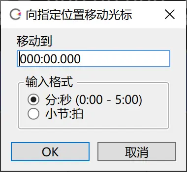
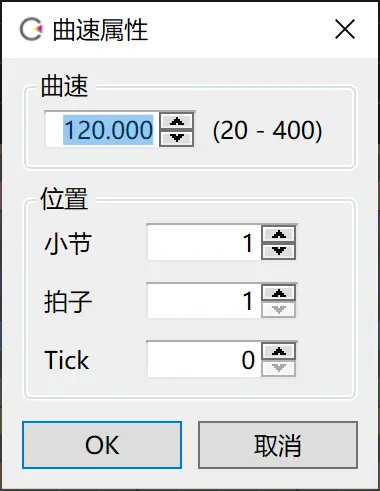
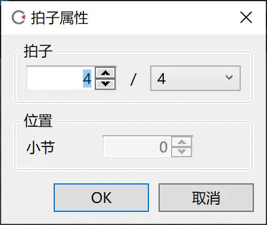
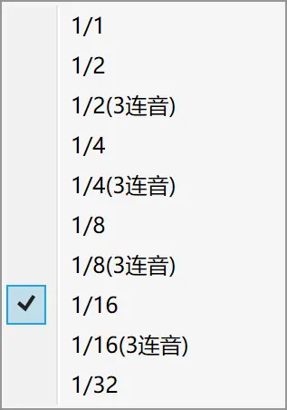

原文：[CeVIO AI ユーザーズガイド ┃ インフォパネル](https://cevio.jp/guide/cevio_ai/operation/infopanel/)

---

### 时间轴光标位置

*ポジションカーソルの位置 / Time of Cursor Position*

显示光标在时间轴上的位置。

鼠标左键单击输入数值可以直接移动光标。

鼠标右键单击可以在「分：秒：微秒」和「小节：拍子：Tick」间切换。

（1 秒等于 1000 微秒。4 分音符的长度是 960 tick。）

### 光标处的曲速

*テンポ / Tempo of Cursor Position*

显示光标当前所在位置的曲速。单击可以修改。

* 曲速的设定对全体歌唱轨道起效。对谈话轨道没有影响。

* 如果想在歌曲中间修改曲速，可以在钢琴卷帘里的标尺栏上添加新的曲速。

### 拍子

*拍子 / Time Signature of Cursor Position*

显示光标当前所在位置的拍子。单击可以修改。

* 拍子的设定对全体歌唱轨道起效。对谈话轨道没有影响。

* 如果想在歌曲中间修改拍子，可以在钢琴卷帘里的标尺栏上添加新的拍子。

### 音符量化

*クオンタイズ / Quantize*

显示当前的量化设定。单击可以修改。

* 该设定控制的是钢琴卷帘内的音符。对谈话轨道没有影响。

---
***音符量化是？***

假设量化设置为 1/8，则一个小节将等分为八份，音符的开头与结尾将自动吸附到划分后的小节上。

当量化设置为 1/8（三连音）时，一个小节将被等分为 12 份。音符的位置也会被补正到这 12 个格子的位置上。

如果待插入的音符最短长度为 1/8，推荐将量化设置为 1/8；如果是 1/16 则推荐设置为 1/16。

**音符按照本来的乐谱输入的话，就能自然地唱出来。**

**不推荐用音符和音符间细小的空隙表示促音（っ），或用音符来表达发声的时机。**

**将促音包含在歌词中，在 时间页面调整发声的时机，会得到更好的歌声。**

（译者注：意思就是：保留促音，不要拆音。

（官方推荐原样保留促音，一个可能的原因是，CeVIO 的 AI 倾向于将所有末尾带空白的音符判定为句子的结束（也就是唱完了一句话），然后就会给这个空隙生成呼吸音，并把下一个音符的发音细节按歌词开头来画参数。如果像 VOCALOID 那样直接把促音的那个音符删掉的话，那就会因为铺天盖地的呼吸音而给人一种气短的感觉……

（不要拆音也是差不多的原因。拆音会干扰 AI 的判定。TMG 这个参数非常强大（或者可以说是 CeVIO 的特色），所有想做的拆音操作基本都可以交给 TMG 解决。

（另外以前有个秘技可以确认 CeVIO 是怎么判断一个音符是句子头还是尾的，不过 8.1 就删掉了，翻译这篇文章的时候已经是 8.5 了就没有介绍的必要了……）
