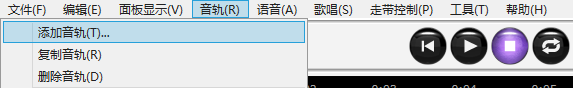
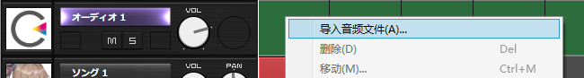

原文：[CeVIO AI ユーザーズガイド ┃ オーディオトラックの操作](https://cevio.jp/guide/cevio_ai/audio/)

---

音频轨道可以导入 WAV 格式的文件作为背景音乐或效果音。

## 添加音轨

刚启动时是没有音频轨道的。

要处理音频，请在 [+] 按钮里选择「音频轨道」或音轨菜单里的「添加轨道」来添加一条音频轨道。

最多可以添加 32 条轨道。

## 读取音频文件

在「文件」菜单中选择「导入」，或右键单击外部音频轨道并选择「导入音频文件」，可以在光标的当前位置加载音频文件。

也可以直接把音频从资源管理器拖拽到音频轨道上，来在鼠标光标的位置加载音频文件。

音频文件加载完毕后，音频元素会以波形的形式显示。

!!! info "关于音频文件格式"
    只支持 8 位或 16 位比特率的 WAV 格式。

    \* 不支持 24 位和 32 位。

    如果采样率不是 48kHz，文件会自动转换为 48kHz。
    
    如果音频元素不能正确播放，或在加载上耗费了过长的时间，请使用转换软件将音频文件转换为 48kHz 16 位 WAV 格式。

!!! info "关于音频文件的路径"
    音频文件的路径会记录在项目中。下次打开项目时，将从该路径导入。

    如果导入音频文件后移动了它的位置，则必须删除音频元素并重新导入。

    如果想在不同的电脑上打开项目，可以把音频文件放在与项目文件相同的路径，这样它就会正常加载。

## 删除音频元素

选择一个音频元素然后按 ++del++ 键，或者在右键菜单中选择「删除」，就可以删除该元素。

※不会删除源文件。

## 调整播放时间

左右拖动（鼠标左键按住并移动）音频元素来更改播放的时间。

按住 ++alt++ 键并拖动音频元素，可以将元素的左或右边缘吸附到最接近的秒（或小节，取决于标尺栏的时间基准）上。

元素右键菜单的「移动」可以将音频元素按指定的方式移动。

### 指定目标位置

直接指定移动的时间戳。

### 指定移动量

以相对于原始位置的正/负时间指定。

### 光标位置

移动到光标的当前位置。

## 音频的自动排列

通过右键菜单的「自动排列音频」开启自动排列时，音频元素和台词元素会自动前后移动以避免重叠。

通过右键菜单或选项的「语音设定」同时开启「多音轨自动排列」的设置时，来自其他轨道的台词也会自动前后移动以避免重叠。如果你想让音频与来自其他轨道的音频重叠，关闭其一（或都关掉）。

!!! tip "与其他语音合成软件交叉使用"
    如果勾选「音频自动排列」，「语音设置」中的「多音轨自动排列」以及「台词间隔」中的「对音频也应用」，音频元素就会以与台词相同的方式自动对齐。如此一来，便能更容易地创建与其他语音合成软件的对话。
