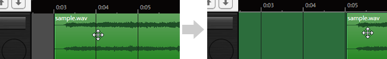

Original article: [CeVIO AI ユーザーズガイド ┃ オーディオトラックの操作](https://cevio.jp/guide/cevio_ai/audio/)

---

Audio tracks can import WAV format audio files as background music or sound effects.

## Add Track

There is no audio track when it starts.

To handle audio, select "Audio Track" from the [+] button or "Add Track" in the "Track" menu.

Up to 32 audio tracks can be added.

## Importing an Audio File

By selecting "Import" from the "File" menu or by right-clicking on an audio track and selecting "Import Audio File", an audio file can be loaded at the current position of the cursor.

By dragging and dropping audio directly from the Explorer onto the audio track, an audio file can also be loaded at the current position of the cursor.

Once the audio file has been loaded, the audio element will be displayed as a waveform.

!!! info "About Audio File Formats"
    Only WAV format with 8bit or 16bit bit rate is supported.

    (24-bit and 32-bit are not supported.)

    If the sampling rate is other than 48kHz, the file will be automatically converted to 48kHz.
    
    If the audio element does not play correctly or takes too long to load, use a conversion tool to convert the audio file to 48kHz 16bit WAV format.

!!! info "About the Paths to the Audio Files"
    The paths to the audio files will be recorded in the project. The next time the project is open , they will be imported from those paths.

    If you move an audio file after importing it, you must delete the audio element and re-import it.

    If you want to open the project on a different computer, you can place the audio files in the same paths as the paths recorded in project file, and they will still be imported properly.

## Delete the Audio Element

Select an audio element and press ++del++ , or select "Delete" in the context menu to delete the element.

\* The source file will not be deleted.

## Adjust Playback Timing

Drag an audio element left or right (hold down the left mouse button) to change the playback timing.

Hold down ++alt++ and drag to attach the left or right edge of the element to the closest second (or bar, depending on the time base of the ruler).

Right-click on an audio element and choose "Move" to move the element in the specified way.

### Specified Time

Directly specify the destination time.

### Moving Amount

Move to specified relative time from the current position.

### Cursor Position

Move to the current Cursor position.

## Automatic Audio Alignment

When "Automatic Audio Alignment" in the right-click menu is turned on, audio elements will be automatically aligned so that they will not overlap each other.

If "Automatic Multi-track Alignment" in the right-click menu is also turned on, audio elements will be automatically aligned so that they will not overlap with audio elements and line elements from other tracks. If you want to overlap with audio from other tracks, turn one of them off (or both).

!!! tip "Cross-use with Other Text-to-speech Software"
    If "Automatic Audio Alignment" "Automatic Multi-track Alignment", and "Apply to Audio Element" in "Speech Interval" are turned on, audio elements will be automatically aligned in the same way as lines, making it easier to create a dialogue with other text-to-speech software.
