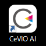

Original article: [CeVIO AI ユーザーズガイド ┃ インストールと認証](https://cevio.jp/guide/cevio_ai/firstguide/install/)

---

To use this product, connect to the Internet, then follow the steps below:

1. Download the latest version from the "[New Features](https://cevio.jp/guide/cevio_ai/)" page;

2. Double click the downloaded file to run it. 
   
   The installation screen will pop up, follow the on-screen instructions to continue installing;

3. Once the installation is completed, a CeVIO AI shortcut will be created on the desktop.
   
    
   
    Double click to execute it;
   
    \* If it does not execute, please check this [page](../faq/faq.md).

4. When first execute, an "Activate" window will pop up.

    Enter the Product Key of Song or Talk Editor and email address.
    
    \* You need to provide email address in some cases, for example, when the Product Key is missing. Please enter it accurately.

    \* If you purchase only Talk Voice or Song Voice products that do not include 'Starter Pack' in their product names and do not have the necessary editor, please purchase one from the editor sales site listed on this [product information](https://cevio.jp/products_cevio_ai/) page.

    !!! info "About Product Key"

        For physical / boxed edition, the Product Key can be found on a manual, or on the card encased in a silver bag or a plastic bag.

        For digital edition purchased from **Amazon**, please use the link in the "Order Confirmation" email to display the product page, and check in "ゲーム&PCソフトダウンロードライブラリ".

        For **DLsite**, please see the download screen for this software in the Purchase History.

        For **Vector PC Shop**, please access the received page from the link in "ライセンスキーのご案内" email, then click "ライセンスキーを表示" to check.

        For **DMM**, please check in the "PCゲーム/ソフトウェア 購入済み商品" in your account.

        For **animate GAMES**, please check the received email when purchased.

5. Next, activate the Song or Talk Voice;

6. If you want to add another Editor or more Voices, activate them from "Activate Product License" in "Help" menu.

## About Uninstallation

To uninstall, for Windows 11/10 users, select "CeVIO AI" from "Applications" in "Settings" and then uninstall it. For Windows 8 users, select it from "Uninstall a program" in "Control Panel".

To uninstall the Voice, follow the same steps. Select the Voice and then perform the uninstallation procedure.

\* DO NOT delete the files directly from the installation directory. The software will not work properly.

## If Wanted to Use in Another Computer

Follow the step 1~5 on the new computer directly.

\* This software does not require operations such as "Deactivate".

\* After activation, you must wait 24 hours before you can perform the activation again on another computer with the same Product Key.

\* Each Product Key of this software can only activate one device at once.

*[ライセンスキーのご案内]: Information of license key
*[ライセンスキーを表示]: Show license key
*[ゲーム&PCソフトダウンロードライブラリ]: Games and PC Software Download Library
