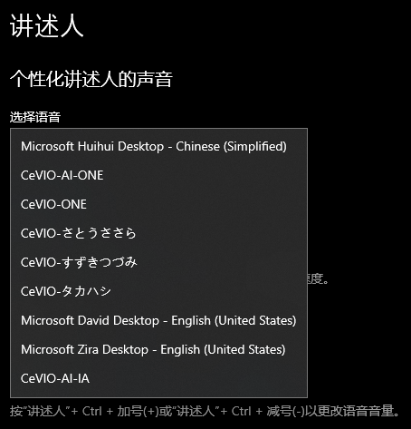

Original article: [CeVIO AI ユーザーズガイド ┃ 外部連携インターフェイス](https://cevio.jp/guide/cevio_ai/interface/)

---

!!! warning
    Translator's Notes:
    
    - Programming knowledge is required to understand the contents of this section.
    - Please read the notes at the end of this page carefully before using the API.

The text-to-speech function of the speech engine can be invoked via external software.

There are three available methods for different applications to call.

## Call from SAPI5

It can read text aloud after linking with software that supports SAPI5.

CeVIO AI can be linked with 64-bit software and can also be used as a "Narrator" for Windows 10. In "Choose a voice" of "Personalize Narrator's voice" in Windows Settings, you can choose the character as Narrator. [^1]

- Microsoft Office such as Word and Excel, and Acrobat Reader are not supported.
- As CeVIO AI is a 64-bit application, it cannot be linked directly with 32-bit external software (e.g. 棒読みちゃん, BouyomiChan). (There seems to be external softwares that can link "CeVIO AI" with "BouyomiChan", etc.)

!!! tip "Default presets"
    External cooperation will use the "Default preset" in the "Talk Settings" under the Options.

    In SAPI5, "speed" is determined by the setting of the linking party, "volume" and "pitch" are jointly determined by the setting of the linking party and this application, and other settings are determined by this application.

    If you want to increase the volume when linking, or want the message to be read with your favorite emotion setting, add that setting to the preset and then make it the default preset.

!!! info "Use in project"
    - Support parameter specifications using the following SAPI XML TTS tags.
      
        `<pitch>` `<volume>` `<rate>` `<silence>`

        `pitch`, `volume`, `rate` only support formats enclosed in tags (do not support statements in sentences).

    - Support SAPI5's `Volume` property and `Rate` property.

## Use as a COM component

Emotions and conditions can be finely controlled from programs such as C++ via a dedicated API.

[See here for more details.](com.md)

## Used as a .NET assembly

Emotions and conditions can be finely controlled from .NET programs such as C# via a dedicated API.

[See here for more details.](dotnet.md)

!!! warning "Caution"
    - Products without Talk functions, such as the Song Starter Pack, cannot be called using external cooperation interface.
    - ① is a simple implementation of the API using ②. Compatibility with all SAPI5 software is not guaranteed.
    - When using ② or ③, please first call the API for starting "CeVIO AI".
    - The total number of applications that can use the external call interface at the same time throughout ① to ③ is 1.
    - In the case of any of ① to ③, the terms and conditions of use are the license agreement that comes with the product.
    
    \* The external cooperation interface cannot be used for commercial purposes. If you require real-time speech synthesis for commercial use, please contact CeVIO official via [this page](http://cevio.jp/contact_others/). 
    
    \* [Within this range](http://cevio.jp/commercial/) can be used free of charge.

[^1]: Translator's note: You can also use the shortcut ++ctrl+windows+n++ to open the "Narrator" settings directly.
