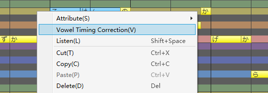
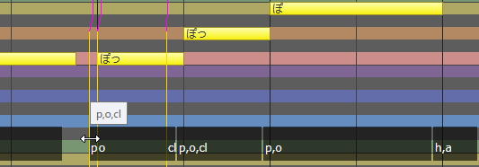
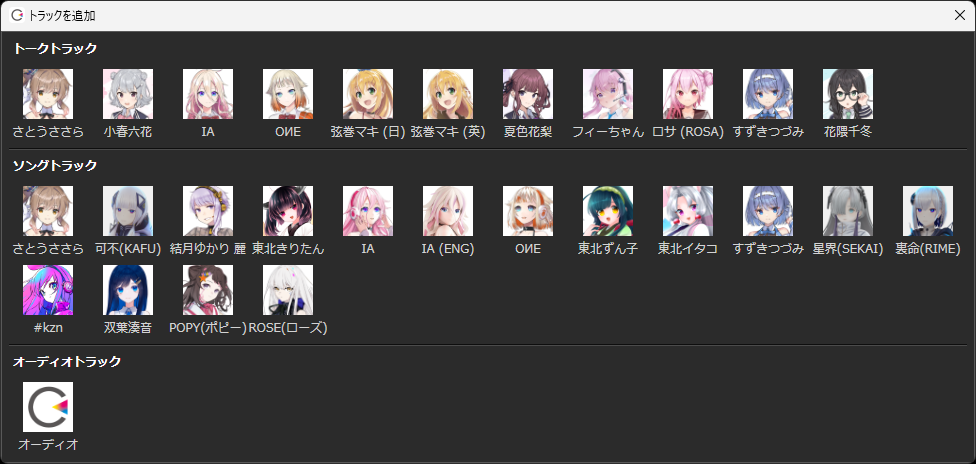

------------------------------------------------------

Dec.20, 2022 Version 8.4 Official Release (8.3.22.0～8.4.0.0)
------------------------------------------------------

Version 8.4 includes improvements to the song timing adjustment function and minor usability improvements such as the cast list.

（Dec.15 version 8.3.22.0 pre-release. Dec.20 version 8.4.0.0 release.）

▼Song related changes

- Updated to Song Engine 6.2.0. Fixed a bug that the VOL sometimes became too large in empty bars at the beginning/end of a song.

    \* It only reduces the noise in empty bars at the beginning/end and does not change other sounds.

- A new function "Vowel Timing Correction" was implemented.

    Vowel timing is automatically adjusted to the beginning of the note. \* Version 8.4.0.0 updated (functional change)

    

    - You can choose it from the right-click menu of the note (or after selecting a range in the TIMING adjustment screen).
    - Consonants are moved the same amount as vowels (if it can't, use ratio to adjust it; if there's no space for it, pass).

    \* Please use it as a supplement as the mechanical correction may lose its original good listening feel..

- While adjusting the timing of notes in the Score Edit Screen, the line of phonemes contained in the notes is also displayed.

- In the Timing Adjustment Screen, the modes of phoneme/note unit adjustment are integrated.

    The lower black band allows note-by-note adjustment and the upper lines allow phoneme-by-phoneme adjustment without switching modes.
    
    
    
    \* The shortcut key ++ctrl+shift+p++ for switching between phoneme/note modes has been removed.

- When the ++alt++ key is held down on the timing adjustment screen, the temporary status line can be displayed or not displayed.

    \* You can use ++ctrl+i++ to show/hide the persistent status line.

    \* After displaying the status line, you can temporarily adjust it in note units by pressing the ++alt++ key.

- The vowel of the previous note is not moved during note-by-note timing adjustment. \* Version 8.4.0.0 updated
- The special symbols `^` and `＾` in lyrics are now supported. \* Version 8.4.0.0 updated
- Fixed a bug that an error message was displayed when dragging after collectively selection.
- "夢ノ結唱 POPY(ポピー)" Song Voice 1.0.0 is now supported.
- "夢ノ結唱 ROSE(ローズ)" Song Voice 1.0.0 is now supported.

▼Talk related changes

- When pressing the left mouse button in the accent adjustment screen where there is no mora, it will be auditioned immediately.
- Fixed a bug that the check status of "Export Lines Text" or "Export Timing Data" in the dialog WAV export window is cleared when exporting song or line as WAV.
- Fixed a bug that WAV files were not output if the output destination path contained double-byte characters when the specific API of the external linkage interface was used with English voices.

    .NET interface: Talker2.OutputWaveToFile()

    COM interface: ITalker2::OutputWaveToFile()　ITalker2V40::OutputWaveToFile()

    \* Fixed a problem in which voice waveforms were not generated when "Tsurumaki Maki (EN)" was specified for "Speaker Name" in "Recotte Studio". We sincerely apologise for any inconvenience caused.

▼Other changes

- The cast list displayed by "Add track" is folded back with 12 characters for easy viewing.

    

    \* The function for sorting casts is in develop.

- The version check of the song engine/talk engine when opening a project has been relaxed to suppress warnings.

    \* For example, between version 6.2.0 and 6.2.1, difference in the last digit (no change in waveform) do not display a warning message now, suppressing frequent warnings for each new voice support.

- Changed the default setting of the right-click menu "Automatic Audio Alignment" for audio tracks to off.

    \* This is a change to the settings during installation. If you have been using CeVIO since before the update, it will not change.

    \* Turn off if you want to overlay multiple audios, or on if you want to auto-align.

- Improved the final backup of projects when the application is closed due to an error while preparing for timeline playback.
- When a 5-minute backup of a project is skipped (e.g. during WAV export), retry at 1-minute intervals.
- Fixed a problem in which the information message is hidden in the splash screen when the application is started in an environment where "vc_redist.x64.exe" is not yet installed.
- Other minor improvements and bug fixes.

------------------------------------------------------

Oct.12, 2022 Version 8.3.17.0
------------------------------------------------------

▼Common to Songs and Talks

　Added "Sample Rate" to "Environment" under "Options".

　Supported sampling rate 32kHz/44.1kHz/96kHz output (except for mixdown WAV export).

▼Song related changes

- Updated to Song Engine 6.1.5. No change in sound quality.

- The display of notes on another track is now supported for 9 or more tracks.

- Fixed a bug in "SEKAI" and "Suzuki Tsudumi Song Voice" that the emotional parameters saved in the project were not restored in some cases.

▼Other changes

Other minor changes.

------------------------------------------------------

Sep.12, 2022 Version 8.3.15.0
------------------------------------------------------

- The number of initial presets of "Suzuki Tsudumi Talk Voice" was changed from 2 to 5.

- Restored the cast image of "Suzuki Tsudumi Talk Voice".
    - Please install "Suzuki Tsudumi Talk Voice" installer 1.0.2 from User's Guide.

------------------------------------------------------

Sep.6, 2022 Version 8.3.13.0
------------------------------------------------------

▼Song related changes

- Improved "Enter Lyrics Collectively".
    - All subsequent lyrics are displayed if only one note is selected (when Space-Separated).
    - Fixed a problem that the cursor always moves to the beginning after pasting.

- When editing lyrics in Japanese Song Voice, IME is not turned on if the input lyrics are in English.

- Fixed a bug that the piano roll returns to vertical scrolling when the "Mouse Wheel" option is changed to "Horizontal Scroll" and the application is launched next time.

- Fixed a bug that an error was sometimes displayed when "Paste lyrics only".

- Fixed a bug that an error was sometimes displayed when "Merge Notes".

- Fixed a bug in which an error was sometimes displayed when moving notes under certain conditions.

▼Talk related changes

- Updated to Talk Engine 6.0.20. No change in sound quality.

- The weight cursor is now displayed after text input, emotion adjustment, and other time-consuming processes.

- Supported "CeVIO AI Suzuki Tsudumi" Talk Voice 1.0.1.

▼Other changes

- The location of the file opened in "Recent Projects" is now reflected in the folder displayed in the next "Open" window.

------------------------------------------------------

Aug.17, 2022 Version 8.3.10.0
------------------------------------------------------

▼Song related changes

- Updated to Song Engine 6.1.4. No change in sound quality.

- "Paste Lyrics Only" function is implemented.
    - After copying a note, you can select it from the right-click menu of the note.
    - The lyrics will be applied to the note whose relative time matches that of the source note.

- Added "Falsetto" to "Note(s) Properties".
    - Enables batch falsetto of multiple notes.

- Fixed a bug in which TMG adjustments for tracks that were never selected after opening a project with multiple song tracks were not reflected in playback or WAV export.

▼Talk related changes

- Fixed a bug that pre-rendering before playback takes more than 1 minute, an error message is displayed and the application is closed.

▼Other changes

- Improved to guide the user to Microsoft's download page when the required Windows library is not yet installed.

- Other minor improvements.

------------------------------------------------------

Aug.4, 2022 Version 8.3.7.0
------------------------------------------------------

▼Song related changes

- Supports the free trial version of "Suzuki Tsudumi Song Voice".
    - After 12:00 on Aug. 5, the trial version will be available from the "Trial Version" in the "Help" menu.

- The operation that does not follow the pitch adjustment by vertical movement of notes has been changed to [Alt] key pressing.
    - Cursor key up/down note movement should also not follow the pitch adjusted by pressing the [Alt] key.

- Pasting of text including line feeds is now possible in the "Enter Lyrics Collectively".

- The following shortcut keys are added.
    - [Shift+2]...Overlay Timing.
    - [Shift+3]...Overlay Volume.
    - [Shift+4]...Overlay Pitch.
    - [Shift+5] ...Overlays Vibrato Amplitude.
    - [Shift+6] ...Overlays Vibrato Frequency.
    - [Shift+7]...Overlay Alpha Details.

▼Talk related changes

- Updated to Talk Engine 6.0.19. No change in sound quality.
    - Fixed a bug that caused a forced termination when adjusting emotions with lines that contain some Japanese character strings.

- Updated to Japanese Talk Dictionary 3.0.15. Added new words.

▼Other changes

- Other minor improvements.

------------------------------------------------------

Jul.11, 2022 Version 8.3.6.0(～8.3.2.0)
------------------------------------------------------

Version 8.3 is even easier to use with many improvements, including support for exporting 24bit / 32bit float WAV files, implementation of new Song functions, improved operability, and improved Talk phonographs.

▼Common to Songs and Talks

- WAV export format was added to "Environment" under "Options.
　Supports 24 bit / 32 bit float output (except for mixdown WAV export).

▼Song related changes

- Updated to Song Engine 6.1.3. No change in sound quality.

- Supported Accent and Staccato settings.

- Supported the dynamics setting of "ffff", "fff", "ppp", "ppppp".

- The "Merge Notes" function has been implemented.

- The right-click menu changes depending on the situation, making it easier to set notes, etc.
    - When a single note is selected, the attributes (Accent/Staccato/Breath/Slur/Falsetto) can be set and auditioned.
    - With multiple notes selected, slurs can be set, notes can be combined, and auditioning can be performed.

- When moving notes other than with the "Collectively Select" tool, the parameters will automatically follow if they have already been adjusted.
    - When dragging notes, the pitch adjustment can be disabled by holding down the [Shift] key.

- The following processes have been speeded up to improve response time.
    - Loading a project.
    - Undo/Redo.
    - Paste after copying a collectively selection, and drag/cut/delete after collectively selection.
    - Insert/delete measures.
    - Add, change, and delete tempo and time signatures.
    - Move notes with the up/down cursor keys (when "Auto Play" is on).

- Improved eraser behavior for phoneme/note timing.
    - The State Line is not necessarily initialized, but interpolated based on the ratio of the previous/next phoneme/note.

- The "Enter Lyrics Collectively" can now be completed by pressing the [Enter] key.

- The following shortcut keys have been added.
    - [Ctrl+Arrow Left/Right]...Switch Edit Tools.
    - [Ctrl+Tab]...Display the next adjustment screen.
    - [Ctrl+Shift+Tab]...Display the previous adjustment screen.
    - [Shift+Q]...Next quantize value.
    - [Shift+W]...Previous quantize value.
    - [Shift+T]...Triplet on/off.
    - [Ctrl+U]...Merge notes (when multiple notes are selected).

- The menu name "Remove Fine Spaces" was changed to "Remove Rests".
　The gap between one note and the next note can now be filled even when only one note is selected.

- The MIDI Import Window now supports "- .midi" extensions.

- Fixed a bug that the eraser could not erase the adjustment timing in the Score editing screen.

- Fixed a bug that the mouse cursor did not return to the pen, etc., when the mouse cursor was moved out of the adjustment screen and then returned.

- Fixed a bug in which the tempo, time signature, key signature, and dynamics were not pasted correctly under certain circumstances after copying a measure by measure with the "Collectively Select" tool.

▼Talk related changes

- Updated to Talk Engine 6.0.18. No change in sound quality.

- Updated to Japanese Talk Dictionary 3.0.14.

- Improved phoneme graph.
    - The bar graph of the mouse cursor position in PIT and VOL is surrounded by a vertical line to make it easier to understand the operation target.
    - Phoneme names are now displayed at the top of the PIT and VOL bar graphs. It is easier to adjust while looking at the top of the graph.

- The following shortcut keys have been added.
    - [Ctrl+Tab]...Display the next adjustment screen.
    - [Ctrl+Shift+Tab]...Display the previous adjustment screen.

▼Other changes

- The default horizontal zoom setting has been reduced to make it easier to see the timeline.

- All supported file extensions are now initially displayed in the import window.

- The maximum number of "Recent Project" in the "File" menu has been increased to 10 files.

- Other minor improvements and bug fixes.
