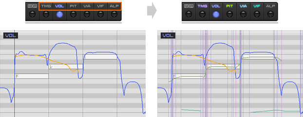

Original article: [CeVIO AI ユーザーズガイド ┃ 調整ツール（ソング）](https://cevio.jp/guide/cevio_ai/operation/adjusttool/)

---

Switch the edit mode of the Song Track.

Click on the text above the button (e.g. "PIT") to display other screens superimposed on the current adjustment screen.

(Cannot be used in Talk Track or Audio Track.)

### Edit Score

Edit the score by adding notes, deleting notes, etc.

### Edit Timing

Adjust the timing of the vocalization.

### Edit Volume

Adjust the volume of the note.

### Edit Pitch

Adjust the pitch of a note.

\* Outside of the pitch adjustment page, when the pitch is superimposed, the pitch affected by the vibrato will also be displayed.

\* In the pitch adjustment page, when the amplitude or frequency of the vibrato is superimposed, the pitch affected by the vibrato will also be displayed.

### Edit Vibrato Amplitude

Adjust the vibrato amplitude here.

### Edit Vibrato Frequency

Adjust the vibrato frequency here.

### Edit Alpha Detail

Adjust the more detailed variation of timbre within a track.
