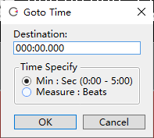
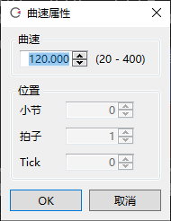
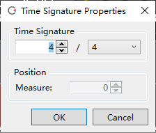
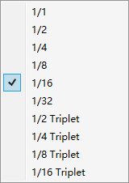
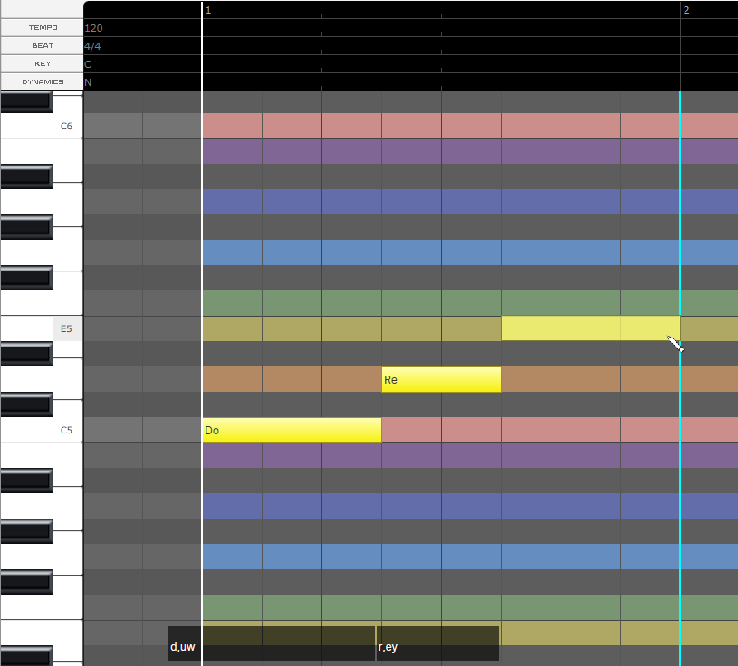
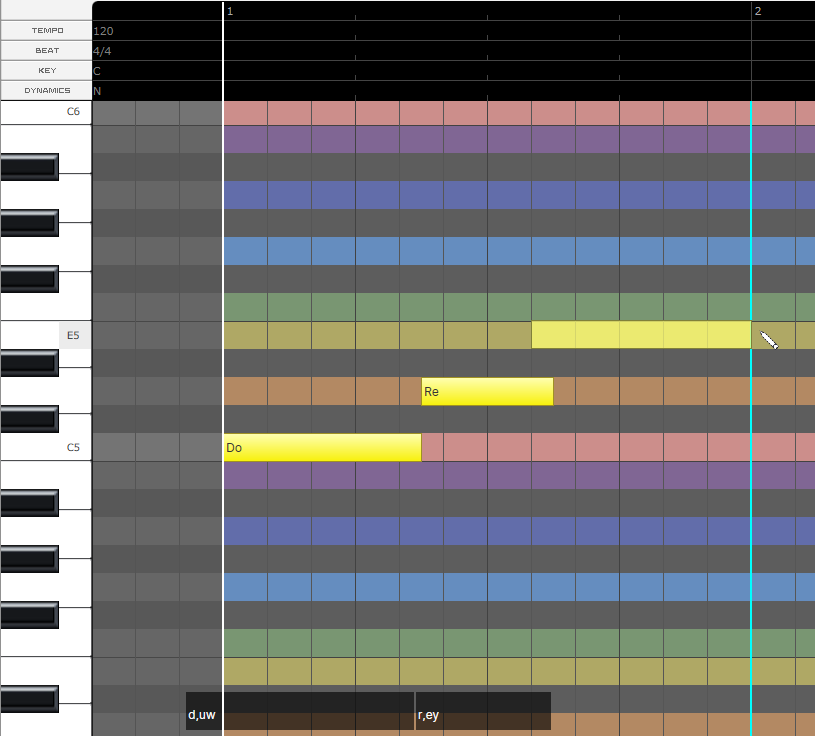

Original article: [CeVIO AI ユーザーズガイド ┃ インフォパネル](https://cevio.jp/guide/cevio_ai/operation/infopanel/)

---

### Time of Cursor Position

Display the positon of position cursor.

Left-click to directly enter and move to the position.

Right-click to toggle between "Minute: Second: Millisecond" and "Measure: Beat: Tick".

(1 second is 1,000 milliseconds; a quarter note is 960 ticks long.)

### Tempo of Cursor Position

Show the tempo at the cursor position. Click to change it.

\* Tempo is a common setting for all song tracks. It does not affect the talk track.

\* If you want to change the tempo in the middle of a song, add a tempo from the ruler in piano roll .

### Time Signature of Cursor Position

Show the time signature (beat) at the cursor position. Click to change it.

\* Time signature is a common setting for all song tracks. It does not affect the talk track.

\* If you want to change the time signature in the middle of a song, add a time signature from the ruler in piano roll .

### Quantize

Show the current quantize setting. Click to change it.

\* This setting controls the notes in the piano roll. It does not affect the talk track.

!!! info "Quantize is"

    Assume that quantize is set to 1/8, the notes will be corrected to the beginning and end of the eight divisions of a bar. 

    

    If quantize is set to 1/8 (triplets), the notes will be corrected to the position where a bar is divided into 12 sections.

    

    If the shortest note you are entering is a 16th note, we recommend setting it to 1/16; if it is an eighth note, we recommend setting it to 1/8.

!!! tip

    Entering the notes as the original score can get a more naturally voice.

    It is not recommended to use the tiny gaps between the notes to express the sokuon (っ, small tsu), or to use the position of the notes to express the timing of the vocalisation.

    Including the sokuon in the lyrics and adjusting the timing of the vocalisation in the Timing adjustment screen will get a better song.

<!-- ---

    译者注：意思就是：保留促音，不要拆音。

    官方推荐原样保留促音，一个可能的原因是，CeVIO 的 AI 倾向于将所有末尾带空白的音符判定为句子的结束（也就是唱完了一句话），然后就会给这个空隙生成呼吸音，并把下一个音符的发音细节按歌词开头来画参数。如果像 VOCALOID 那样直接把促音的那个音符删掉的话，那就会因为铺天盖地的呼吸音而给人一种气短的感觉……

    不要拆音也是差不多的原因。拆音会干扰 AI 的判定。TMG 这个参数非常强大（或者可以说是 CeVIO 的特色），所有想做的拆音操作基本都可以交给 TMG 解决。

    至于 64 分音……估计 CeVIO 团队也是被问烦了，直接在[常见问题](../faq/faq.md)那里贴了个“为什么量化里没有 64 分音）的 FAQ……

    另外以前有个秘技可以确认 CeVIO 是怎么判断一个音符是句子头还是尾的，不过 8.1 就删掉了，翻译这篇文章的时候已经是 8.2.5 了就没有介绍的必要了…… -->

\* If there is no Song Track, the tempo, time signature, and quantize will not be displayed.
