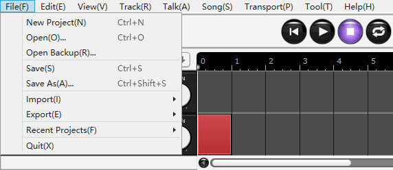

Original article: [CeVIO AI ユーザーズガイド ┃ メニュー](https://cevio.jp/guide/cevio_ai/operation/menu/)

---

!!! tip
    If you don't understand what an option does, try hovering the mouse over that option for a while.

## File

### New Project

Create a new project (including Talk, Song, etc.).

If any content is being editing, a saving confirm dialog will be displayed.

### Open

Open a saved project file.

If any content is being editing, a saving confirm dialog will be displayed.

### Open Backup

Open a backup of the project.

Backup file is saved automatically per 5 minutes, and deleted automatically after a week.

### Save

Overwrite the project file being edited and save it.

### Save As

Name and save the project file being edited.

Enter a file name and click [Save].

The extension of the saved file will be `.ccs`.

### Import

#### Text File

Import lines from a text file onto a Talk Track.

[Importing lines](../../talktrack/talk_04)

#### AozoraBunko File

Import lines from a AozoraBunko ([青空文庫](https://www.aozora.gr.jp/)) file excluding comment `#...` onto a Talk Track.

#### Subtitle File {#subtitle-file-import}

Import lines from a SubRip (`.srt`) file or SubViewer (`.sbv`) onto a Talk Track.

#### MIDI File {#midi-file-import}

Import a standard MIDI file onto a Song Track.

#### MusicXML File {#musicxml-file-import}

Import a MusicXML file onto a Song Track.

[Importing MIDI/MusicXML](../../songtrack/fileimport)

#### Audio File

Load an external audio file onto a audio track which starts at the current cursor position.

[About the format of audio files](../../songtrack/audio)

#### Track File {#track-file-import}

Load the file saved in [(Export) Track File](#track-file-export).

#### Settings File {#setting-file-import}

Load the saved environment settings.

Available import settings are "General Settings" "Talk: User Dictionary" "Talk: Preset" adn "Talk: Speech Clips".

"Talk: User Dictionary" "Talk: Preset" "Talk: Speech Clips" allow you to select the import option of "Replace existing items" or "Merge with existing items".

### Export

#### Audio Mixdown

Export all the tracks to a stereo WAV (48kHz 16bit) file.

#### Audio Files per Each Line

Export selected Talk Track(s) in monaural WAV format for each line.

\* Sample Rate and Bit Depth can be specified in Option.

\* If "Separate folders and numbers for each track" is unchecked in "Details", files will not be divided into folders, and the file name numbers will be the serial numbers of all the lines in all the tracks.

#### Text File {#text-file-export}

Export the lines of selected Talk Track(s) in comma-delimited text format (CSV).

#### Subtitle File {#subtitle-file-export}

Export the lines of selected Talk Track(s) in SubRip (`.srt`) or SubViewer (`.sbv`) format for use in YouTube subtitles, etc.

#### Audio File of Song

Export selected Song Track(s) in monaural WAV format.

\* Sample Rate and Bit Depth can be specified in Option.

#### MIDI File {#midi-file-export}

Export selected Song Track(s) in MIDI format.

\* When multiple tracks are selected, they will be combined into a file, and the key signature will reflect on the "Conductor Track" detected by the first selected track.

#### MusicXML File {#musicxml-file-export}

Export selected Song Track(s) in MusicXML format.

#### Track File {#track-file-export}

Save the edited contents of selected track(s).

The saved file can be imported into another project and reused.

The extension of the saved file is `.ccst`.

#### Settings File {#settings-file-export}

Save the current environment settings.

Available export settings are "General Settings" "Talk: User Dictionary" "Talk: Preset" adn "Talk: Speech Clips".

The extension of the saved file is `.ccsa`.

### Recent Project

Select and open a recently used project file.

### Quit

Quit the application.

If any content is being editing, a saving confirm dialog will be displayed.

## Edit

### Undo

Return to the previous state.

### Redo

Return to the state before executing "Undo".

### Cut

Cut the selected line(s) or note(s).

### Copy

Copy the selected line(s) or note(s).

### Paste

Paste the copied/cut line(s) or note(s) to the position of the position cursor.

### Delete

Delete the selected line(s) or note(s).

### Select All

Select all the lines or notes on the current track.

## View

### Normal

Default.

### Full Screen

Hide the window title and menu to make the editing window wider.

\* Press ++f11++ to quit the full screen.

### Portrait

Display character image only. This display mode is suitable for external cooperation, etc.

\* Beside Start/Stop, the position cursor movement shortcut keys are also effective during portrait mode.

\* While in portrait mode, you can switch to "Always on Top" by right-clicking.

## Track

### Add Track

Add a new track below the currently selected track.

Up to 32 tracks can be created for each talk track, song track and audio track.

### Duplicate Track

Add a track that duplicates the currently selected track.

### Remove Track

Delete the currently selected track.

### Move Track Up

Move the currently selected track up by one track.

### Move Track Down

Move the currently selected track down by one track.

### Clear Track Contents

Delete all elements of the selected track.

### Align Track Element

Place elements (lines and external audios) at equal intervals on the selected track(s).

### Freeze Track

Output the audio of the currently selected track to a single file, reducing playback delays and mixing times for multiple tracks. It can also reduce the CPU and memory load during playback, which is useful when too many tracks cause the audio has gaps or when memory is low.

\* It will unfreeze automatically once editing the track contents.

### Mute Track

Mute the currently selected track.

### Solo Track

Play the currently selected track only.

### Cast

Change the cast for currently selected talk track or song track.

## Talk

### Japanese Word Registration

Register the reading and accent of the mispronounced word in the user dictionary.

### Japanese Dictionary Management

View the registered words and edit or delete them.

### Speech Clips

View the registered lines and insert them to a selected line, or delete them from the list.

### Find Text

Search lines by keywords. This is useful when you have lots of lines.

### Enter Text Collectively

For those long sentences that are very time-consuming to type into one line at a time, you can use this function to type them at once.

You can also use it to split lines.

### Continuous Input

When this option is on, the following features will be enabled to assist in the continuous input of lines.

* Press ++enter++ to end editing on this line, move to the next line and enter editing automatically.

* Press ++shift+enter++ to end editing on this line, move to the last line and enter editing automatically.

* Press ++ctrl+enter++ to end editing on this line, ++esc++ to cancel editing, ++enter++ on a blank line to end editing.

### Automatic Line Alignment

When this option is on, subsequent lines will automatically move backwards and forwards after the line is entered (to maintain spacing).

When this option is off, editing or moving a line does not change the position of other lines.

### Add Blank Line

Add 10 blank lines to the end of speech list.

### Graph

#### Edit Mode {#edit-mode-talk}

Switch among accent, pitch and volume adjustment modes.

#### Overlay Duration Lines

When this option is off, adjustment line of sound length will be hidden.

\* You can still adjust the sound length by dragging the text area above and below the phoneme graph, or scrolling the mouse wheel up and down.

#### Phoneme Mode

When this option is on, you can adjust by phoneme units to make a more detailed adjustment.

Even if this option is turned off, you can press and hold ++alt++ to temporarily switch to phoneme mode, then drag with the mouse to adjust the phoneme units.

#### Reset

All bars in the current adjustment mode will be restored to their pre-adjustment state.

### Placement of Phoneme Graph

Change the display position of phoneme graph. You can also choose to hide it.

### Other Track Lines

Select whether or not to display all lines of the talk track in the speech list.

### Column

Show/hide the columns in speech list.

## Song

### Selection / Collectively Selection / Draw / Line / Eraser Tool

Toggle between the edit tools.

[Editing Tool](../edittool)

### Quantize

Change quantize.

[Quantize is](../infopanel#Quantize)

### Edit Mode {#edit-mode-song}

Toggle between the Score editing mode for entering notes and lyrics, and the modes for adjusting timing, volume, pitch and vibrato.

You can also disable the vibrato of the selected track.

### Enter Lyrics Collectively

Input the lyrics at a time from the currently selected note (or from the beginning if it is not selected).

### Enter Lyrics with Phoneme

Enter lyrics with phonemic symbol.

When this option is on, the input mode switches to phoneme input mode, and the background of the lyrics input field changes to blue-grey.

### Remove Rests

Removes tiny gaps (rests) caused by MIDI import, etc.

### Insert Measures

Insert measures at the specified position and length for the currently selected track or all song tracks.

You can also append measures to the end by pressing the right scroll button on the scroll bar at the right end of the piano roll; or by pressing ++shift++ + scroll the mouse wheel down.

### Delete Measures

Delete measures at the specified position and length for the currently selected track or all song tracks.

### Other Track Notes

Select whether or not to display notes from other song tracks in the Score editing screen.

(Notes in muted track are not displayed.)

### Ruler View

Select whether or not to display tempo, time signature (beat), key signature and dynamics mark.

### Line View

Select whether or not to display beat lines and quantize lines in piano roll.

When "Line Display on Adjustment Screen" is turned on, the beat and quantize lines will also displayed on the Adjustment Screen.

### Guide Cursor

Select whether or not to display the Quantize guide cursor on the Score editing screen.

\* The Quantize guide cursor is also displayed on the Score editing screen when using Collectively Selection / Draw / Line Tool.

## Transport

### Start/Stop

Play or Pause from the Cursor position.

### Stop

Stop playback. While stopping, it moves in order of playback start position and the beginning of the song by clicking "Stop" again.

### Return to Start Position when Stopped

When playback is stopped, return the Corsor to the position where the playback starts.

### Auto scroll

Automatically scroll timeline, speech list, piano roll during playback.

When this option is off, manual scroll will be enable. It can be modified during playback.

### Circle

Enable or disable playback looping.

### Start Marker

Set or remove the start point of playback looping.

### End Marker

Set or remove the end point of playback looping.

### Goto Zero

Move the Cursor to the beginning.

### Goto Start Marker

Move the Cursor to the Start Marker position.

### Goto End Marker

Move the Cursor to the End Marker position.

### Goto Selected Element

Move the Cursor to the left edge of the current selected line / external audio.

### Goto Time

Move the Cursor to the specific position.

You can enter the position in "Minutes: Seconds" or "Measures: Beats".

### Goto Cursor

Move to the Cursor position.

This is useful when the position Cursor is lost off-screen.

### Timebase

Toggle seconds/measure display in the toolbar and timeline.

### Vertical Location

Select the display position of the transport (toolbar) from the Top, Center, or Bottom.

### Horizontal Location

Select the display position of the transport (toolbar) from the Left, Center, or Right.

## Tool

### Options

You can modify environment settings, such as character display and various Talk/Song settings.

[Options](../../option/option)

## Help

### User Manual

Open this User Manual in the browser. Internet connection is required.

### CeVIO Official Website

Open CeVIO official website in the browser. Internet connection is required.

### Check for Update

Check if there is a new version. Internet connection is required.

### Activate Product License

Enter Product Key to activate product license. Internet connection is required.

You can also check activated products and their Product Keys.

### About CeVIO AI

Check the version of this software, voice and text-to-speech engine information.
