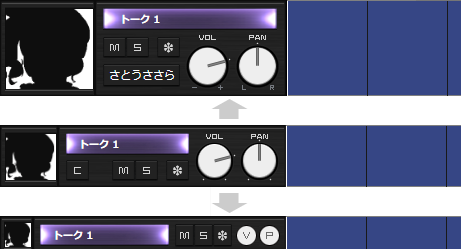
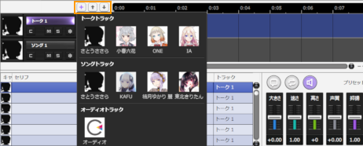

Original article: [CeVIO AI ユーザーズガイド ┃ トラックヘッダ](https://cevio.jp/guide/cevio_ai/operation/trackhead/)

---

### Track Name

Click on the track name to select a track.

Double-click to change the track name.

### Volume

Drag the knob left/right or up/down to adjust the volume of a track.

Hold down the ++shift++ key while dragging for fine-tuning.

Press ++ctrl++ and left-click the knob to reset it to the default value (0db); double-click the knob to enter the value manually.

Master volume setting affects the listening, playback, and WAV export volume.

If the master volume is changed manually, it will be memorised and reflected in new projects.

\* +6 dB doubles the volume. Excessively high volumes will cause clipping.

### PAN

Drag the knob left/right or up/down to adjust the pan of a track.

Hold down the ++shift++ key while dragging for fine-tuning.

Press ++ctrl++ and left-click the knob to reset it to the default value (Centre); double-click the knob to enter the value manually.

PAN setting affects the listening, playback, and WAV export volume.

\* It does not affect the export of ["Audio Files per Each Line"](../menu#audio-files-per-each-line) and ["Audio File of Song"](../menu#audio-file-of-song), as they export in monaural WAV format.

### Mute

Mute the specified track. Muted tracks will not be play.

### Solo

Play the specified track only. When specify solo, all tracks will be muted except for this specified track.

### Freeze

Freeze the audio of this track (output to a temporary file) to reduce the CPU and memory load during playback.

If the sound has gaps during playback of multiple tracks, it may be improved by freezing all the tracks except for the one being edited.

(If the sound has gaps even on one track due to insufficient CPU performance, please freeze all tracks before playback.)

It will unfreeze automatically once editing the track contents.

### Character Setting

Choose a character voice for this track.

Once the character for the talk track is changed, the character for all lines in that track will be changed.

### Track Header Size

The track header size can be scaled in three sizes by vertically zooming with the [+] [-] buttons at the right end of the timeline.

### Add Track, Sort Track

You can easily add tracks from the cast list with the [+] button, and sort them with the [↑] [↓] buttons.

### Position Cursor

Drag it left or right automatically moves the position cursor in that direction. Hold down ++alt++Alt and drag to attach the position cursor to the closest second (or bar, depending on the time base of the ruler).

### Time

Right-click on the ruler to toggle between the "Minutes: Seconds" and "Bars: Beats" time bases.
