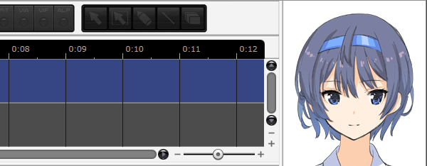
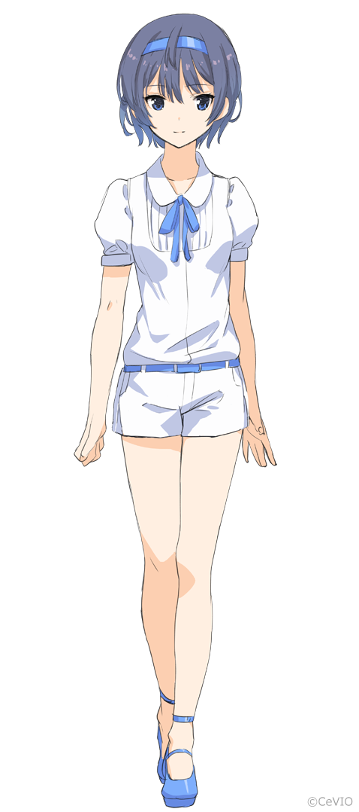

Original article: [CeVIO AI ユーザーズガイド ┃ ユーザー画像の表示](https://cevio.jp/guide/cevio_ai/option/characterimage/)

---

Drag and drop an image (JPEG/PNG/GIF) into the character portrait at the upper right of the screen to display this image.

If the above is followed, or if the image is dragged and dropped into the option "Right Side Image", the image will be registered as a user image and it can then be selected in "Image display" and ["Image Settings"](../option#image-settings).



- The user image will be copied to the folder given in the character portrait right-click menu "Open Image Folder".
- To delete a user image in the "Display Image" list, delete it in the image folder.
- Via the `filename.extension.ini` file, you can finely control the image. The format of the ini file is shown below.
- After modifying the user image or setting file, please restart the software.

```ini title="The format of setting file"
; ・The file name should follow the format of "filename.extension.ini".
; ・The semicolon ";" at the beginning is a comment and will be ignored automatically.
; ・It is not necessary to specify every setting of the setting file. Default value will be used when not set.

[Image]
Title=title
; Title displayed in the list
; (default: filename)

Center=0.5,0
; The center point of the display. Specify in the order of horizontal direction and vertical direction, separated by commas.
; If the specified value is between 0.0~1.0, the default unit is percentage; if the specified value is integer, the default unit is pixel.
; (default: 0.5,0)

Reducible=true
; Specify true to allow scaling, or false to disallow.
; (default: true)

Preview=50,50,100,100
; Select the preview range of the screen. Specify in the order of [X,Y,Width,Height], separated by commas.
; (default: whole image)

Message=Hello
; Information displayed when the mouse is hovered over the image. Multiple lines are allowed.
; (default: filename)
```

## A Sample of User Image and Setting File

After downloading the file from the link below, drag the image to the portrait on the upper right, and it will be set as the character image of the current character. (You can also open the folder where the user images are stored from the right-click menu of the character image on the upper right, and then put the sample image in the folder. Then you can select it from "Right Side Image" and "Image Settings".)

[setting file sample](https://cevio.jp/storage/cevio_ai/CeVIO_user_image_sample2.png.ini)

\* A sample of user image (Suzuki Tsuzumi / すずきつづみ). Click or right-click the image to save it.

[](https://cevio.jp/storage/cevio_ai/CeVIO_user_image_sample2.png)
