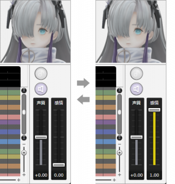

Original article: [2022.04.27 『CeVIO AI』ソングエディタの感情パラメータについて](https://cevio.jp/archives/17155/)

---

Before the release of "MUSICAL ISOTOPE SEKAI", we would like to introduce the "Emotion" parameter that is on board for the first time.

The Song Voice of "CeVIO AI" authentically reproduces the timbre, habit, singing style of the original singer through deep learning and other AI technologies.

Normally, vocal expressions are automatically reproduced according to the content of the song (as a result of learning). However, this time, since the virtual singer ヰ世界感情, which is the vocal source provider of "MUSICAL ISOTOPE SEKAI", has a very wide range of vocal expressions, so we have learnt two vocal expressions and made them into "Emotion" parameters for creators to use.

For the "MUSICAL ISOTOPE SEKAI", turning up the "Emotion" parameter gives a handsome feeling and turning down the "Emotion" parameter gives a cute feeling. Please try to find the right vocal style for your song.

Therefore, the existing Voices will not add emotion parameter. Voices released in the future will only be implemented if they perform as expected.

In addition, for the "Emotion" parameters of the Talk Voice, taking the "元気" and "怒り" parameters as an example, adjusting them greatly changes the timbre and speaking style, but the "Emotion" parameter of the Song Voice changes the vocal expression in a very subtle way.
