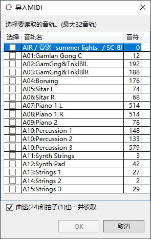

Original article: [CeVIO AI ユーザーズガイド ┃ MIDI／MusicXML](https://cevio.jp/guide/cevio_ai/songtrack/fileimport/)

---

## Import MIDI Files

You can import MIDI files created by external software.

Select "MIDI File" under "Import" in the "File" menu and specify the MIDI file.

You can also drag and drop a MIDI file from the Explorer onto a song track.

The track structure of the MIDI file will then be displayed, select the track you want to import and press OK.

Up to eight tracks can be loaded at once.

If "Import Tempo and Time Signature" is also checked, the tempos and time signatures set in the MIDI file will be reflected in all the song tracks.

!!! tip "Correcting MIDI files"
    When importing MIDI files, the position and length of notes that are too short (notes shorter than 32 cents) will be automatically corrected.

    Entering the notes as the original score can get a more natural voice, rather than leaving the tiny gaps between the notes.

    Including the sokuon (っ, small tsu) in the lyrics and adjusting the timing of the vocalization in the Timing adjustment screen will get a better song.

## Export MIDI Files

MIDI files can be exported for use with compatible external software.

"Export" in the timeline right-click menu makes it easy to export a single selected track.

"Export' in the "File" menu allows multiple tracks to be combined into a single file and exported together.

\* When multiple tracks are selected, the key signature will be reflected in the "Conductor Track" generated from the first track selected.

\* Adjustment values such as timing and pitch will not be exported.

## Importing MusicXML files

You can import MusicXML files created by external software.

Select "MusicXML File" under "Import" in the "File" menu and specify the MusicXML file.

MusicXML files can also be dragged and dropped from the Explorer onto song tracks.

If the MusicXML contains more than one track, only the first track will be loaded.

## Export MusicXML Files

MusicXML files can be exported for use with compatible external software.

"Export" in the timeline right-click menu makes it easy to export a single selected track.

"Export' in the "File" menu allows multiple tracks to be combined into a single file and exported together.

\* Adjustment values such as timing and pitch will not be exported.

!!! info "About encoding"

    MIDI files can be read/written in "Shift-JIS" and MusicXML files can be read/written in "UTF-8".
