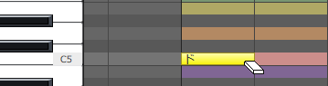
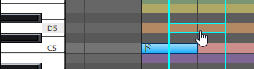

Original article: [CeVIO AI ユーザーズガイド ┃ 音符の入力と編集](https://cevio.jp/guide/cevio_ai/songtrack/song_02/)

---

Notes can be input and edited using the adjustment tool in the "Edit Score" state.

## Input Note

To input a note, select the draw tool from the edit tools.

On the piano roll, move to the right from where you want to place the note (hold down the left mouse button) to determine the length of that note.

When performing a note input, move or paste operation, if a note overlaps with another note on the same track, that note will be automatically shortened. (Optional. You can select "Do not erase existing notes when entering notes" in the options.)

The very first bar (bar 0) does not allow notes input.

When a note is entered, the phoneme and vocal time of the lyrics are displayed below it. The timing can be adjusted here.

Click on the scale and character assigned to this track will sing this key.

!!! tip "hint for note input"
    It is not recommended to use the tiny gaps between the notes to express the sokuon (っ, small tsu), or to use the position of the notes to express the timing of the vocalisation.

    Including the sokuon in the lyrics and adjusting the timing of the vocalisation in the Timing adjustment screen will get a better song.

## Delete Note

Select the eraser tool from the edit tool and click on a note to erase it.

Alternatively, when using a tool other than the eraser tool, select the note and press ++del++ can also delete it.

## Adjust Note Length

Note length can be changed by selecting the selection tool or draw tool from the edit tool and dragging the right or left edge of the note.

## Move Note

Select the selection tool or the draw tool from the edit tool and drag the note to move it.

Hold down the ++shift++ key while dragging to move the note horizontally or vertically.

When multiple notes are selected at the same time, you can move them together.

Alternatively, hold down ++alt++ while dragging to copy the selected note.

Moving note to bar 0 is not allowed.

!!! tip "Move Note with Parameters"

    After selecting notes, drag with the mouse or move them with ++up++ or ++down++ keys, and the pitch will automatically follow their change.

    Use the [Collectively Selection Tool](../song_05) to specify the range, and then move them, the notes in the selection range will move together with their parameters.

    If you move notes which have been adjusted parameters, they will automatically be collectively selected and the parameters will follow, even if you move them with a tool other than the collectively selection tool. At this time, if you hold down the ++alt++ key and move a note vertically, this note will not be collectively selected, and the adjusted pitch will remain in the original place.

## Copy and Paste Note

Choose the select tool or the draw tool from the edit tool and click on the note to be copied.

Multiple notes can be selected by holding down the ++rctrl++ or ++shift++ keys and clicking on the notes.

It is also possible to select multiple notes within the dragging range by dragging in the piano roll while using the selection tool.

After selecting the notes, select "Copy" from the context menu.

Then, select "Paste" from the right-click menu to paste the notes at the cursor position.

!!! tip "Copy and Paste Note with Parameters"

    By using the [Collectively Selection Tool](../song_05) to specify the range and copy, you can also copy the note adjustment value, beat, dynamics marks and other parameters within the range. Afterwards, by specifying the position with the cursor and pasting, you can easily reproduce the original notes and adjustment values.
