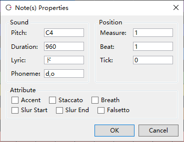

Original article: [CeVIO AI ユーザーズガイド ┃ 音符のプロパティ](https://cevio.jp/guide/cevio_ai/songtrack/song_03/)

---

Display detailed information about the notes.

If multiple notes are selected, the common content will be displayed, and you can change the content collectively or use `+` and `-` to change the relative values.

## Sound

### Pitch

Display the pitch of the note.

Enter `+12` to raise all selected notes by one octave.

### Duration

Display the length of the note. The length of a quarter note is 960 tick.

### Lyric

The lyric assigned to the note.

### Phoneme

Phonemes of the lyric. Entered phonemes have a higer priority than lyrics.

## Position

### Measure

Display the measure in which the note is located.

### Beat

Display the beat in which the note is located.

### Tick

Display the tick in which the note is located.

## Attribute

### Accent

Assign accent to the note.

### Staccato

Assign staccato to the note.

### Breath

Breath after the note.

### Slur Start / Slur End

Sing more smoothly from the start to the end of the slur.

You can also set the slur range by selecting multiple notes on the Edit Score screen and pressing ++ctrl+r++.

!!! hint "hint about slur"

    When the following lyric (or long note) has the same vowel with the previous note, setting a slur will smooth down the volume connection.

    For smoother singing, use the adjustment screen to smoothly connect the pitch and volume lines.

### Falsetto

Add a falsetto symbol to the note.

\* Depending on the character and the pitch of the note (e.g., a note with a low pitch), it may not be falsetto.
