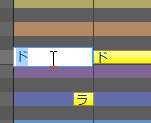
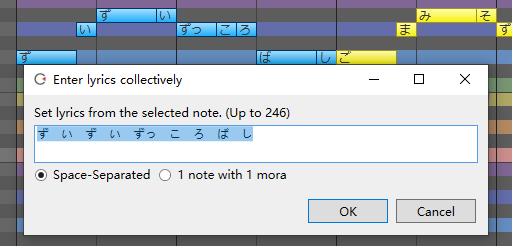
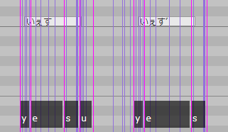
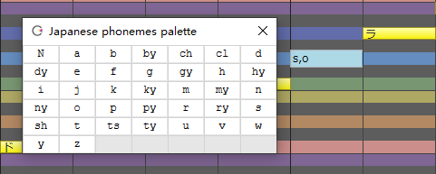
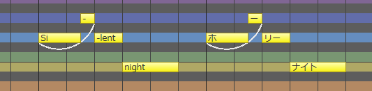

Original article: [CeVIO AI ユーザーズガイド ┃ 歌詞の入力（日本語ボイス）](https://cevio.jp/guide/cevio_ai/songtrack/song_04/)

---

Notes lyrics are assigned to "ドレミファソラシ" (Do Re Mi Fa So La Ti) according to the scale by default.

(You can change the default lyrics, for example to "ら", via "Default lyrics" in "Song Settings" of Options.)

Lyrics can be input for each note, or for all notes at once.

## Input Lyrics

Double click on a note in the "Edit Score" of adjustment tool to enter the note.

You can also use the ++f2++ key to enter the selected note. After entering lyrics in the input state, press ++enter++ to submit the lyrics.

If you press ++tab++ instead of ++enter++ after entering lyrics, you can continue entering lyrics for the next note.

The characters that can be input are full-angle hiragana/katakana and half-angle English characters, and multiple characters can be input to a single note.

\* Characters that cannot be sung out are shown in red. Special symbols such as vowel devoicing symbol and falsetto are allowed.

## Enter Lyrics Collectively

This can be called from the "Song" menu, the right-click menu on the piano roll or the shortcut key ++f8++ .

When "Space-Separated" is selected, a note can assigned multiple characters by entering characters separated by half spaces.

When "1 note with 1 mora" is selected, one letter will be assigned to one note. But if it is followed by a lowercase letter (ぁぃぅぇぉっゃゅょ) like "しゃ", this note will assign two letters (a mora unit).

## Vowel Devoicing Symbol

If the lyrics contain `’` (full-width quotation mark), the vowel in the mora (kana) before it will be dropped, and only the sound of the consonant will be pronounced.

For example, typing `いぇす` will pronounce "yesu", and the sound of the last "す" is very clear; but typing `いぇす'` will devoice the vowel "u" and pronounce a more natural "yes" sound.

\* You can enter `’` at places other than the end, such as `す’ぺーす’`, but the actual effect depends on the mora to which `’` is attached. Invalid for a row (あいうえお).

## Falsetto Symbol

If the lyrics contain a `※`, the note will be sung in falsetto.

Depending on the character and the pitch of the note (e.g., a note with a low pitch), it may not be falsetto.

[Other Special Symbols](../song_symbol)

## Input Phoneme Symbols

In phoneme input mode, vocalizations can be specified in phoneme units.

When entering lyrics, you can switch to phoneme input mode by using "Enter Lyrics with Phoneme" in "Other Operations" via the piano roll right-click menu, the "Song" menu, or using the shortcut key ++ctrl+p++ .

In phoneme input mode, the background of the lyrics input field changes to a blue-grey colour and keeps this colour in subsequent input.

The "English phonemes palette" is displayed in phoneme input mode. Click on a character in the palette to enter a phoneme symbol, then press ++enter++ or close the phoneme palette to commit the change.

Phonemes are separated by a 1-character wide space ` ` or a 1-character wide `,`. If there is confusion between syllables, use `|` to divide them (e.g. `y,e,s|a,i`).

\* If a character that does not exist in the phoneme palette is entered, the character will be treated as the wrong symbol (shown in red) and the note will not be sung.[^1]

## English Lyrics

If the lyrics are entered in half-angle English characters, the phonemes of the Japanese Voice will be assigned to the English phonemes for singing. English and Japanese can be mixed in the same song.

English lyrics will also be automatically divided by syllable and assigned to notes when "Automatically split English lyrics with syllables" in the "Song" menu is turned on.

!!! new

    From version 8.5.4.0, "Song" menu has been reorganized. "Auto Split English Lyrics" was moved to the menu and removed from the options.

\* English syllables can be divided automatically even when "Space-Separated" is selected in "Enter Lyrics Collectively" and Japanese and English lyrics are mixed.

\* The falsetto symbol `※` entered in English lyrics is automatically converted to `$` used in the English Voice.

\* Since Japanese phonemes are assigned, the pronunciation will be different from the original English pronunciation.

[^1]:Translator's note: As of version 8.2.8.0, uppercase Japanese vowel characters (`A` , `I` , `U` , `E` , `O`) in the Japanese Voice are now played normally as exceptions in phonemes that are not present in the palette. See [Change Log](../../intro/change-log#2022512-8280).
