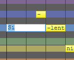

Original article: [CeVIO AI ユーザーズガイド ┃ 歌詞の入力（英語ボイス）](https://cevio.jp/guide/cevio_ai/songtrack/song_04english/)

---

For English Voices, notes lyrics are assigned to "Do Re Mi Fa So La Ti" according to the scale by default.

(You can change the default lyrics, for example to "La", via "Default lyrics" in "Song Settings" of Options.)

Lyrics can be input for each note, or for all notes at once.

## Input Lyrics

Double click on a note in the "Edit Score" of adjustment tool to enter the note.

You can also use the ++f2++ key to enter the selected note. After entering lyrics in the input state, press ++enter++ to submit the lyrics.

If you press ++tab++ instead of ++enter++ after entering lyrics, you can continue entering lyrics for the next note.

The characters that can be input are half-angle English characters, `.`, `'`, `-` and `$` (falsetto symbol).

\* Characters that cannot be sung out are shown in red.

`-` can be used to divide a word (and its phonemes) into multiple notes.

For example, `holy` can be divided into two parts `ho` and `-ly`; `tenderly` can be divided into four parts `ten`, `-der`, `-ly` and `-`.

\* Only `-` extends the preceding phoneme. Alternatively, inputting `tenderly` as two notes, such as `tenderl` and `-y`, will automatically assign phonemes. [^1]

## Enter Lyrics Collectively

This can be called from the "Song" menu, the right-click menu on the piano roll or the shortcut key ++f8++ .

When "Space-Separated" is selected, the lyrics will be assigned to multiple notes by entering characters separated by half spaces.

When "1 note with 1 syllable" is selected, words separated by half spaces will be automatically divided by syllables again, and one syllable will be assigned to one note.

!!! new "Improved "Enter Lyrics Collectively""
    　All subsequent lyrics are displayed if only one note is selected (when Space-Separated).

!!! new "Paste Lyrics Only"

    Since version 8.3.13.0, after copying a note, you can select "Paste Lyrics Only" from the right-click menu of the note.

    The lyrics will be applied to the note whose relative time matches that of the source note.

## Falsetto Symbol

If the lyrics contain a `$`, the note will be falsettoed.

\* Depending on the character and the pitch of the note (e.g., a note with a low pitch), it may not be falsetto.

## Input Phoneme Symbols

In phoneme input mode, vocalizations can be specified in phoneme units.

When entering lyrics, you can switch to phoneme input mode by using "Enter Lyrics with Phoneme" in "Other Operations" via the piano roll right-click menu, the "Song" menu, or using the shortcut key ++ctrl+p++ .

In phoneme input mode, the background of the lyrics input field changes to a blue-grey colour and keeps this colour in subsequent input.

The "English phonemes palette" is displayed in phoneme input mode.[^2] Click on a character in the palette to enter a phoneme symbol, then press ++enter++ or close the phoneme palette to commit the change.

Phonemes are separated by a 1-character wide space ` ` or a 1-character wide `,`. If there is confusion between syllables, use `|` to divide them (e.g. `y,e,s|a,i`).

If a character that does not exist in the phoneme palette is entered, the character will be treated as the wrong symbol (shown in red) and the note will not be sung.

[^1]:Translator's note: (if the understanding is correct) Specifically, when `tenderly` is divided into `tenderl` and `-y`, if the phoneme is not automatically divided, the phoneme assigned to the previous note would be "t,eh,n,d,axr,l" and the latter note would be "iy". However, because the phonemes are automatically divided, the phonemes assigned to the previous note are actually "t,eh,n,d,axr", and the phonemes assigned to the latter note are "l,iy". In addition, in this example, the phonemes that are automatically divided are the correct division, because the segmentation point of the word "tenderly" is ten·der·ly, and the divided position should be ly, pronounced "l,iy".

[^2]:Translator's note: For a comparison table of the phonemes used in CeVIO with IPA, see the section ["List of Pronunciation Symbols"](../../talktrack/talk_01_english/#list-of-pronunciation-symbols) from Words Registration and Pronunciation (English Voice).
