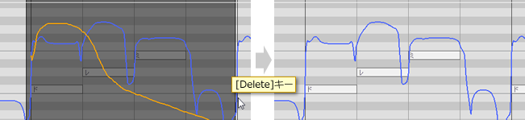
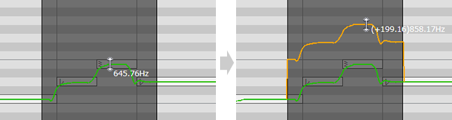
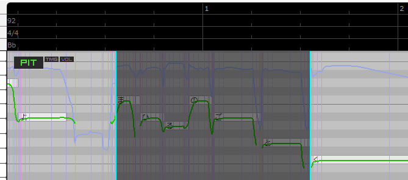
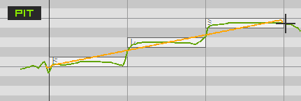

Original article: [CeVIO AI ユーザーズガイド ┃ 歌声の調整①（編集ツール）](https://cevio.jp/guide/cevio_ai/songtrack/song_05/)

---

The editing mode can be switched through the edit tool in the toolbar or the right-click menu of the piano roll.

Hold down the ++ctrl++ key to temporarily switch edit tools.

## Selection Tool

Drag (hold down the left mouse button and move) to specify the range to copy or delete.

After specifying the range, use the ++ctrl+c++ keys to copy the adjustment value within the range of the adjustment screen. The copied content can be pasted to the position of the cursor by using ++ctrl+v++ keys.

After specifying the range, use the ++del++ key to delete the adjusted value within the range and restores it to its original value.

### Copy and Paste Timing Adjustment Values (TMG)

When copying TMG, the number of the five lines of the phoneme is also stored.

For example, if you copy the third line, when you paste it will be pasted on the third line after the position cursor.

The quantize correction will be released when the ++alt++ is held down, making it easier to specify a detailed range.

### Move up and down the adjustment value

In the adjustment screens other than timing, dragging the parameter value up or down after specifying the range will move the value in this range up or down as it is. It's useful when overall increasing or decreasing vibrato over a range.

The quantize correction will be released when the ++alt++ is held down

### Edit Score Screen{#edit-score-screen-selection}

After selecting the note (with selection tool or collectively selection tool), use mouse to drag or use ++up++ or ++down++ key to move it and its pitch adjustment value will automatically follow its change.

## Collectively Selection Tool

By specifying the range and copy, you can copy the note adjustment value, beat, dynamics marks and other parameters within the range. Afterwards, by specifying the position with the cursor and pasting, you can easily reproduce the original notes and adjustment values.

### Paste in Measure Unit

If a measure is selected and pasted with the position cursor to the very first measure 0, it will be pasted as "paste in measure unit", except for the tempo and dynamics mark that would have been pasted by default, the time signature and key signature will also be pasted together. If the tempo from the pasted measure differs from the original measure, the measure will be expanded or contracted. [^1]

\* For example, if you copy a 4/4 measure and paste it into a 3/4 measure,  an extra beat will be add automatically.

\* When the copied unit is not a measure, or when the cursor position is not at the measure 0, the pasting of the beat and key signature and the expansion/contraction of the measure will not occur.

### Tempo and Time Signature Changes

All the song tracks share the same tempo and time signature settings. So if the tempo or time signature is changed by deleting/cutting/pasting after collectively selection, all song tracks in the project will be affected.

### Edit Score Screen{#edit-score-screen-collectively-selection}

On the edit score screen, specify the range and drag, the notes within the selected range will move along with their parameters.

\* Holding ++shift++ when dragging can move notes horizontally or vertically.

## Draw Tool

Drag to adjust values. Adjusted values are shown in orange.

\* During superimposed display or connection adjustment, only the valid values (the adjusted part is the adjusted value) are displayed.

### Connection Adjustment Mode

When adjusting pitch, volume or vibrato, hold down the ++alt++ keys while dragging to draw a line that is neatly connected to the original value.

* When you hold down ++alt++ and drag the mouse, the draw tool will draw a red line. When ++alt++ is released, the red line drawn and the original line will be automatically connected and used as the new value.

* When ++alt++ is held down, a single line reflecting the adjusted value will be displayed. You can use it to check the current status easily.

    \* If you release ++alt++ without dragging, the focus will shift to the menu[^2], but you can check it again by holding down ++alt++.

## Line Tool

Drag to draw a straight line.

Hold down ++shift++ at the same time when dragging to draw a horizontal line.

Note that you cannot drag lines in timing editing screen, when it works in the same way as the draw tool.

## Eraser Tool

Drag to delete the adjusted value and back to the original value.

In pitch/vibrato editing screen, hold down ++shift++ at the same time when dragging to delete the original value.[^3]

[^1]: Translator's note: You can try to set random values on the ruler, then use the collectively selection tool to drag in the piano roll, and observe the colour changes of the labels on four rows when dragging a measure.
[^2]: Translator's note: Actually this is a shortcut for Windows to use the keyboard to invoke the menus, and the letters that follow in the text of the menus are the keys that invoke them. For example, try pressing ++alt++ in CeVIO and then pressing ++f++ (
[^3]: Translator's note: A trick: deleting the original pitch value with eraser tool can make a death growl.
