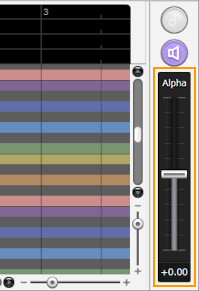

Original article: [CeVIO AI ユーザーズガイド ┃ 歌声の調整③（声質）](https://cevio.jp/guide/cevio_ai/songtrack/song_06/)

---

By adjusting the alpha, you can change the voice into a more adult-like or child-like voice.

Drag (hold down the left mouse button and move) the Alpha slider (knob) to change the timbre of the selected track.

You can also hover the mouse cursor over the slider and adjust it by moving the mouse wheel up or down.

\* The degree of voice change depends on the cast. For example, the change of "Kafu" is relatively small.

## Fine-tune Timbre

Timbre can be fine-tuned (in units of 5 ms minimum) by switching to the adjustment screen via the "ALP" button on the toolbar or the menu.

Adjustments are relative to the overall timbre of the track, and as you move the alpha slider up or down, the adjustment value will also move up or down accordingly.

