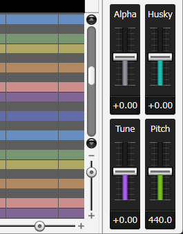
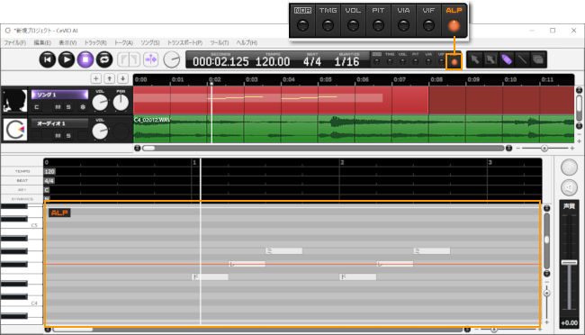

Original article: [CeVIO AI ユーザーズガイド ┃ 歌声の調整③（声質ほか）](https://cevio.jp/guide/cevio_ai/songtrack/song_06/)

---

Drag (hold down the left mouse button and move) the sliders (knobs) to adjust the overall singing voice of the selected track. You can also adjust them by hovering the mouse cursor over the slider and using the mouse wheel to move it up or down, or double-clicking the number and directly inputting the desired value.

### Alpha / Timbre

Lower it to change the voice into a childish voice; raise it to an adult voice.

\* The degree of voice change depends on the cast. For example, "KAFU" "SEKAI" have less changes.

### Husky

The higher it is raised, the huskier the voice becomes. It won't affect the Adjustment Screen.

### Tune

The higher it is raised, the more faithfully (and more mechanically) character sings to the pitch of the score.

### Pitch

Shift the pitch of the output audio with 440 Hz reference. It won't affect the Adjustment Screen.

### Emotion

In "Suzuki Tsudumi", "SEKAI", and "COKO", there is an additional emotion slider available.

!!! info "About Emotion"

    The Song Voice of "CeVIO AI" uses AI technologies such as deep learning to realistically reproduce the timbre, habits and singing style of the original singer.

    Normally, singing expressions are automatically reproduced according to the content of the song (as a result of learning), but in the case of singers with a wide range of singing expressions or have different singing expressions, they are specially learnt as two singing expressions, and it is possible to select the singing style with an Emotion slider.

    

## Fine-tune Timbre

Timbre can be fine-tuned (in units of 5 ms minimum) by switching to the adjustment screen via the "ALP" button on the toolbar or the menu.

Adjustments are relative to the overall timbre of the track, and as you move the alpha slider up or down, the adjustment value will also move up or down accordingly.

