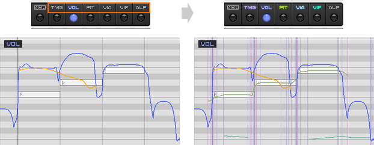
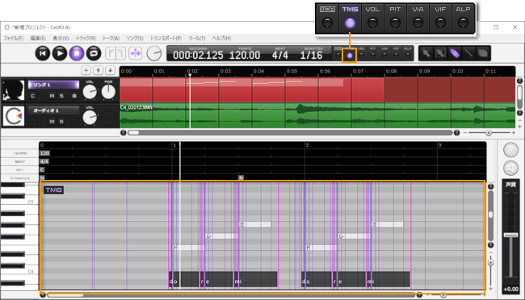
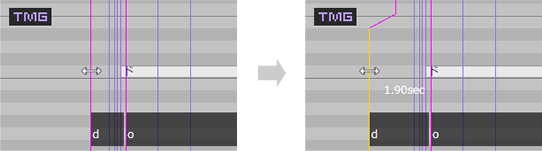
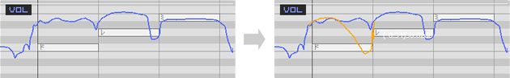
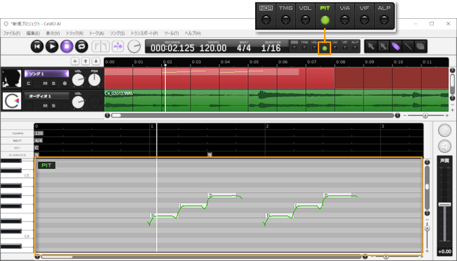
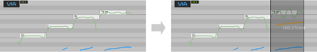

Original article: [CeVIO AI ユーザーズガイド ┃ 歌声の調整②（調整画面）](https://cevio.jp/guide/cevio_ai/songtrack/song_07/)

---

You can finely adjust parameters (values) like the timing of the vocalization and pitch in the adjustment screens.

### Superimposed Display of Adjustment Values

When an adjustment item is selected using the round button of the adjustment tool on the toolbar, the adjustment screen will be displayed.

Clicking the text above the button (such as "PIT") can superimpose other screens on the current adjustment screen.

※When switching to an adjustment item that is being superimposed, the superimposed display state will remain.

### Numerical Display

You can select the value display when hovering the mouse cursor over a parameter in "Numeral Display on Adjustment Screen" in the "Song Settings" option.

By default, only the current value is displayed, but you can select "Current value + Difference" to display it in detail in the format of "(difference) current value"; or hide it.

## Edit Timing

Adjust the timing and duration of the phoneme voicing here.

Adjusting the time will automatically recalculate pitch, volume, vibrato amplitude and frequency to match the timing change. So it is more efficient to adjust the timing first and then other items.

Select draw tool and drag line to change timing.

Move the line forward to advance the time, and move it backward to delay the time.

### Adjust in Phoneme Units

Press ++ctrl+shift+p++ to toggle between phoneme units and note units. Hold down the ++alt++ key to toggle temporarily.

When adjusting by note, the original length ratio of consonant and vowel is automatically maintained.

### Timing Status line

Originally, timing consists of five lines for each phoneme in a lyric (e.g., "d" or "o" for "ド"), one reddish-purple **phoneme line** to indicate the beginning of the phoneme, and four light-purple **status lines** to indicate the change of sound within the phoneme.

These status lines can be display by pressing the ++ctrl+i++ key or by turning on "Timing Status Lines" under "Line View" in the "Song" menu. Normally it is fine to hide them, but you can show or adjust them as needed.

\* The default setting is hidden. When hidden, the status lines are automatically adjusted to maintain the ratio between the lines.

When the status line is displayed, the timing can be adjusted in units of one status line.

When the status line is displayed, it is convenient to drag the phoneme line in the black area where the phonemes are displayed in the lower part of the piano roll to automatically adjust the status line in phoneme units (or note units).

!!! info "About parameter changes"
    Because "CeVIO AI" infers the singing style from the score as a whole, when adding or deleting notes, changing or editing the note length and scale, the parameters of each part of the score - such as timing and pitch - will change.

    Since the timing adjustment value is relative to the original value, when the parameter changes, the adjustment value also changes. In this case, each timing line that crosses adjacent lines will be reset.

    (Adjustment values other than timing, such as pitch, are absolute values.)

## Edit Volume

Adjust the volume of the note here.

\* You can also use [dynamic marks](../songtrack) to adjust the volume easily.

Select the Draw Tool and drag a line to modify the volume.

The unit of volume is dB (decibels).

## Edit Pitch

Adjust the pitch of a note here. Only base pitch is adjusted, vibrato is not included.

Outside of the pitch adjustment page, when the pitch is superimposed, the pitch affected by the vibrato will also be displayed.

In the pitch adjustment page, when the amplitude or frequency of the vibrato is superimposed, the pitch affected by the vibrato will also be displayed.

Select the Draw Tool and drag a line to modify the pitch.

The unit of pitch is Hz (Hertz).

## Edit Vibrato Amplitude

Vibrato can be adjusted by amplitude and frequency, adjust the amplitude of vibrato here.

Superimposed display pitch will show the pitch with vibrato for easy adjustment.

To add vibrato to an area that doesn't have vibrato, you need to draw both amplitude and frequency in that area.

Select the Draw Tool and drag a line to modify the amplitude.

The unit of amplitude is Cent, and 100Cent represents a half-tone up or down.

## Edit Vibrato Frequency

Vibrato can be adjusted by amplitude and frequency, adjust the frequency of vibrato here.

Superimposed display pitch will show the pitch with vibrato for easy adjustment.

To add vibrato to an area that doesn't have vibrato, you need to draw both amplitude and frequency in that area.

Select the Draw Tool and drag a line to modify the frequency.

The unit of period is Hz (Hertz), which means the number of shakes per second.

