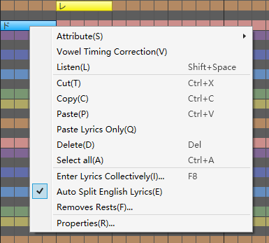
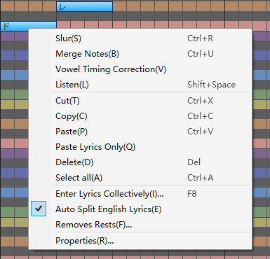
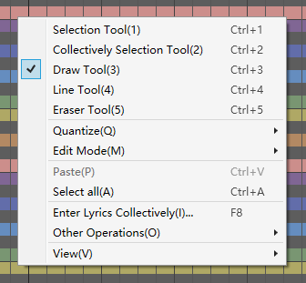
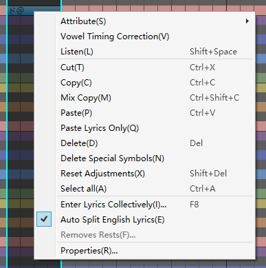

原文：[CeVIO AI ユーザーズガイド ┃ ソングトラックの説明](https://cevio.jp/guide/cevio_ai/songtrack/)

---
Put the notes in the piano roll and enter lyrics, then fine-tune in the adjustment screen.

By selecting "Add Track" from "Track" menu or the right-clicking on a track, up to 32 song tracks can be added.

### Position Cursor

Click on the ruler to move the cursor to the position where you want playback to begin.

\* The piano roll is usually automatically position-corrected by quantize, but clicking when holding down ++alt++ will not correct it.

### Ruler (Tempo / Time Signature / Key Signature / Dynamics Mark)

In the Measure Row, you can drag the mouse horizontally (hold down the left mouse button) to perform a quick  scroll.

In the Tempo, Time Signature, Key Signature, and Dynamics Mark Rows, you can add, edit, and delete tempo and other information within the middle of the song.

In any of these rows, you can drag the mouse vertically to perform a quick zoom in/out.

### Listening

Play a simple interval of the selected note. In the adjustment screen, play the selected area as a interval.

You can also use the shortcut key ++shift+space++ to listen.

### Automatic Listening

Toggle whether or not the notes are automatically played after they are entered or moved.

### Piano Keyboard

Click on the scale and character assigned to this track will sing this key.

### Simple TIMING Display

Check and adjust the phonemes and vocalization timing of the lyrics. If the screen is narrow, you can hide it in the "Talk Settings" in the [Options](../../option/option).

### Scrollbar

When the scrollbar is at the right end, you can add measures by pressing the right scroll button or press ++shift++ with mouse scroll down.

\* By holding down the middle mouse button while moving the mouse in the piano roll, you can perform a quick scroll.

### Zoom Slider

You can drag the slider or use the [+] and [-] buttons to easily zoom in or out, making the piano roll display more visually accessible in both horizontal and vertical dimensions.

Hold down the ++ctrl++ button and left-click the slider to reset the zoom level to the default.

## Right-click Menu

Right-click (or hold down on the touchscreen) on the Piano Roll to open the menu.

\* When you right-click on a single selected note:

### Attribute

Allow you to set accent, staccato, breath, slur start, slur end and falsetto for the notes.

For the characters that support [special symbols](../song_symbol), you can input these symbols from the "Special Symbols" in the "Attribute".

### Vowel Timing Correction

Adjust vowel timing automatically to the beginning of the note.

\* Consonants are moved the same amount as vowels (if it can't move, using ratio to adjust instead; if there's no space for it, pass).

\* Please use it as an auxiliary tool, as the mechanical correction may lose its original good listening feel.

### Listen

Perform a quick playback of the selected notes the selected note(s). \* In the adjustment screen, the selected range will be played back as a section.

### Cut

Cut the selected note(s).

### Copy

Copy the selected note(s).

### Paste

Paste the copied/cut note(s) to the position of the position cursor.

### Paste Lyrics Only

After copying a note, the lyrics will be applied to the note whose relative time matches that of the source note. \* Displayed after copying note(s).

### Delete

Delete the selected note(s).

### Select All

Select all the notes on the current track.

### Enter Lyrics Collectively

Input the lyrics at a time from the currently selected note (or from the beginning if it is not selected).

### Auto Split English Lyrics

Automatically divide into one syllable per note when entering English lyrics.

\* The division position in the notation may be incorrect due to automatic estimation.

### Remove Rests

Removes tiny gaps (rests) caused by MIDI import, etc.

### Properties {#single-note}

View the details of the notes and set attributes such as breath and slur.

\* When you right-click while multiple notes are selected:

### Slur

Set the slur begin and end within the selectedn range to achieve a smoother singing performance.

\* When multiple notes are selected, you can also use the shortcut key ++ctrl+r++ to set slurs.

### Merge Notes

Merge the lyrics and attributes of notes within the selected range into the first note in the selected range.

\* When multiple notes are selected, you can also use the shortcut key ++ctrl+u++ to merge notes.

### Properties {#multiple-notes}

When multiple notes are selected, you can set attributes such as lyrics and falsetto collectively.

\* When you right-click in an empty area:

### Selection / Collectively Selection / Draw / Line / Eraser Tool

Toggle between the edit tools.

[Edit Tool](../edittool)

### Quantize

Change quantize.

[Quantize is](../infopanel#Quantize)

### Edit Mode {#edit-mode-song}

Toggle between the Score editing mode for entering notes and lyrics, and the modes for adjusting timing, volume, pitch and vibrato.

"Disable Vibrato" allows you to disable the amplitude and frequency of vibrato for the selected track.

### Other Operations

#### Insert Measures

Insert measures at the specified position and length for the currently selected track or all song tracks.

You can also append measures to the end by pressing the right scroll button on the scroll bar at the right end of the piano roll; or by pressing ++shift++ + scroll the mouse wheel down.

#### Delete Measures

Delete measures at the specified position and length for the currently selected track or all song tracks.

#### Remove Rests

Removes tiny gaps (rests) caused by MIDI import, etc.

#### Enter Lyrics with Phoneme

Enter lyrics with phonemic symbol.

When this option is on, the input mode switches to phoneme input mode, and the background of the lyrics input field changes to blue-grey.

#### Auto Split English Lyrics

Automatically divide into one syllable per note when entering English lyrics.

\* The division position in the notation may be incorrect due to automatic estimation.

#### Auto Collectively Selection

When dragging a note, if there are any adjustments within the range, they are automatically collectively selected.

\* Vertical movement is triggered by pitch (PIT) and horizontal movement is triggered by parameters other than timing (TMG).

#### Common Key Signatures

When this option is enabled, the Key Signature set on the selected track will be applied to all song tracks and will remain synchronized thereafter.

### View

#### Other Track Notes

Select whether or not to display notes from other song tracks in the Score editing screen.

#### Tempo Row / Time Signature Row / Key Signature Row / Dynamics Mark Row

Select whether or not to display Tempo / Time Signature / Key Signature / Dynamics Mark on the ruler.

#### Beat Line / Quantize Line

Select whether or not to display Beat / Quantize Lines in the piano roll.

#### Line Display on Adjustment Screen

the Beat and Quantize Lines will be also displayed on the Adjustment screen.

#### Timing Status Line

Display state change lines within phonemes on the Timing editing screen. Hold down ++alt++ to toggle temporarily.

#### Guide Cursor

Select whether or not to display the Quantize guide cursor.

\* It will be also displayed on the Score editing screen when using Collectively Selection / Draw / Line Tool.

#### Color Settings

Freely customize the colour of the lines such as TIMING and pitch on the Adjustments Screen.

\* Menu in other situations:

### Mix Copy

After selecting a range using the Collectively Selection Tool (or the Selection Tool in the adjustment screen), you can copy the parameters, including the default values, by using the "Copy Mix" option in the right-click menu or by using the shortcut key ++ctrl+shift+c++.

With Collectively Selection + Mix Copy, you can easily duplicate some or all of the notes and parameters of a track to another position/track. For example, you can adjust the singing of a song for one cast and then paste it onto another cast to let they sing.

\* Due to the reflected adjustment value, there may be instances where applying parameters to a different cast may result in suboptimal singing quality. Even the same cast may not perform identically in a different location as the original copy source. Therefore, it is recommended to readjust the parameters as necessary to achieve the desired outcome.

### Paste Lyrics Only

After copying a note, the lyrics will be applied to the note whose relative time matches that of the source note.

### Delete Special Symbols

Special symbols other than falsetto can be deleted all together.

When there are special symbols other than falsetto in the selected range, it can be executed from the right-click menu.

\* You can delete falsetto all together in the Property.

### Reset Adjustments

The adjustment values in the specified range can be deleted all together.

\* By combining it with "Delete Special Symbols", you can easily revert the specified range back to its unadjusted state.
