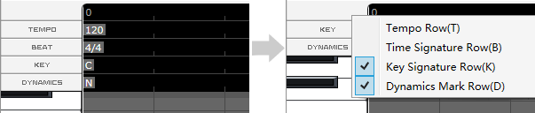
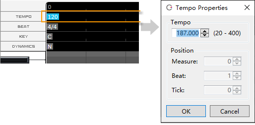
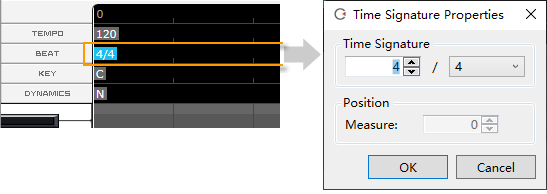
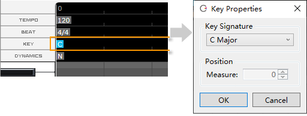
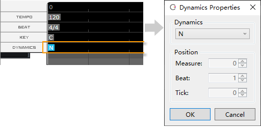

Original article: [CeVIO AI ユーザーズガイド ┃ テンポ／拍子／調号／強弱記号](https://cevio.jp/guide/cevio_ai/songtrack/songtrack/)

---

In the ruler of piano roll, you can change, add and delete tempo/time signature/key signature/dynamic mark.

In a new project, there is a default setting for each, located at the beginning of bar 0.

You can switch between showing and hiding each of these from the right-click menu in the ruler header.

\* Tempo and beat are hidden by default. Set to display if you want to change them in the middle of a song.

## Tempo Setting

Select the selection tool or the draw tool from the edit tool and double-click on the tempo to change tempo.

If you want to change the tempo in the middle of a song, select the draw tool and double-click on the tempo row at the position where you want to change the tempo to place the new tempo.

You can also move the tempo (except for the first tempo) by dragging it left or right (hold down the left mouse button and move it) or by specifying the position directly in the Tempo Properties. The tempo position is corrected by Quantize.

\* If you change the tempo from the info panel, it will change the previous tempo closest to the cursor.

\* All the song tracks share the same tempo settings.

## Time Signature Setting

Select the selection tool or the draw tool from the edit tool and double-click on the time signature(beat) to change beat.

If you want to change the beat in the middle of a song, select the draw tool and double-click on the beat row at the position where you want to change the beat to place the new beat.

You can also move the beat (except for the first beat) by dragging it left or right (hold down the left mouse button and move it) or by specifying the position directly in the Time Signature Properties.

\* If you change the beat from the info panel, it will change the previous beat closest to the cursor.

\* All the song tracks share the same beat settings.

!!! info "Change Tempo and Time Signature"

    Editing the tempo or beat will affect all song tracks.

    If the parameters have already been adjusted, they will also be converted automatically.

    It is important to note that if, for example, the tempo is changed from 120 to 180, 1/3 of the time data per hour will be lost, so changing the tempo to 120 again will not completely restore the original state (although the data will be stretched).

    In this case, you can use undo to completely restore the original state.

## Key Signature Setting

Select the selection tool or the draw tool from the edit tool and double-click on the key signature to change key.

If you want to change the key in the middle of a song, select the draw tool and double-click on the key row at the position where you want to change the key to place the new key.

You can also move the key (except for the first key) by dragging it left or right (hold down the left mouse button and move it) or by specifying the position directly in the Key Properties.

\* You can set different key signatures for each song track.

## Dynamic Mark Setting

Setting a dynamic mark can naturally strengthen or weaken the vocalization from this position.

The effect becomes stronger in the order [mf] → [f] → [ff], weaker in the order [mp] → [p] → [pp], with [N] being normal.

\* The effect continues from the specified position to the next dynamic mark. The volume will also change.

!!! new

    From version 8.3.2.0, you can set new dynamic marks "ffff" "ffff" "ppp" "pppp".

    \* Depending on the character and score, the effect may not be as obvious compared to "ff" and "pp".

Select the selection tool or the draw tool from the edit tool and double-click on the dynamic mark to change dynamic mark.

If you want to change the dynamic mark in the middle of a song, select the draw tool and double-click on the dynamic mark row at the position where you want to change to place the new dynamic mark.

You can also move the dynamic mark (except for the first dynamic mark) by dragging it left or right (hold down the left mouse button and move it) or by specifying the position directly in the dynamic mark Properties.

\* You can set different dynamic marks for each song track.
