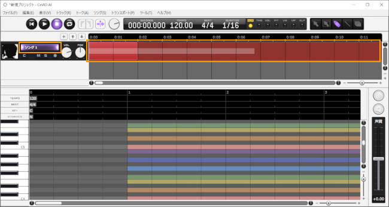
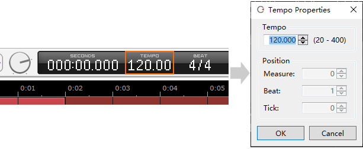
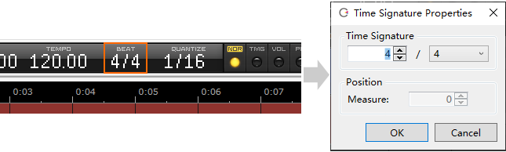
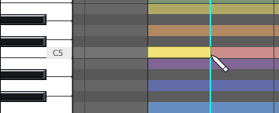
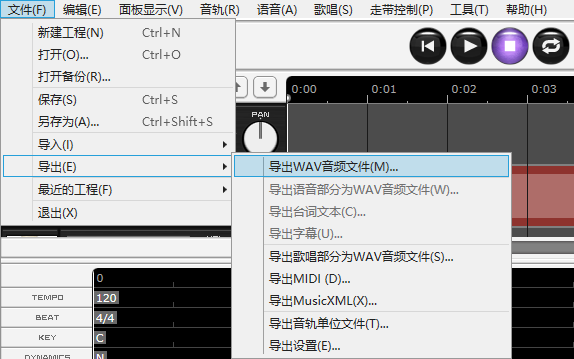

Original article: [CeVIO AI ユーザーズガイド ┃ はじめてのソング作成](https://cevio.jp/guide/cevio_ai/tutorial_song/)

---
Place notes to create a melody, then input lyrics to create a natural singing voice.

With intuitive editing operations using the piano roll, you can also create multiple song tracks and make them chorus.

## 1. Start the application

After starting the application, the tracks will be displayed at the top of the screen.

If there are multiple tracks, click on the track name (or timeline) labeled "Song 1" to display the piano roll at the bottom of the screen.

\* Right-click on the character image on the right and turn on "View Larger" to enlarge the image vertically.

## 2. Set the tempo and time signature

Click the tempo or beat on info panel to display the properties window.

\* If you want to change the tempo or time signature in the middle of a song, add a time signature from the ruler in piano roll.

## 3. Enter notes

When entering notes, select the Draw Tool in the edit tool.

On the piano roll, move to the right from where you want to place the note (hold down the left mouse button) to determine the length of that note.

## 4. Enter lyrics

Default lyrics will be assigned to「ドレミファソラシド」(Do Re Mi Fa So La Ti Do) when placing notes.

Double-click a note to enter lyrics.

## 5. Play

Press the Start button on transport to start playback from the position cursor.

Playback will stop when it play to the end of all tracks or you press the Stop button.

## 6. Output the audio file

From the menu, go to File > Export > Audio Mixdown to combine all tracks and export them as a single file in stereo WAV format (48kHz 16bit).

You can also output the selected track in mono only by Audio File of Song (Sample Rate and Bit Depth can be specified in [Option](../../option/option)). By using shortcut key ++ctrl+w++, you can easily export the selected track.

