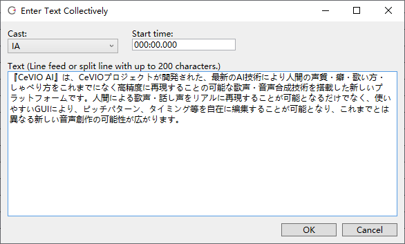
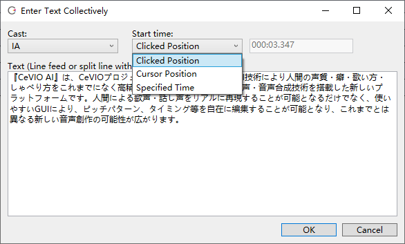

Original article: [CeVIO AI ユーザーズガイド ┃ 文のまとめ入力](https://cevio.jp/guide/cevio_ai/talktrack/longsentence/)

---
The "Enter Text Collectively" option is convenient when you want to enter lines at once rather than one line at a time, or when you want to insert text on a selected row.

It can be quickly called up via the right-click menu in the Speech List or shortcut key ++f8++.

Text from external sources such as browsers can also be copied and pasted in, making it easier to import long text.

When the "Enter Text Collectively" is called up through the right-click menu on the timeline, the line is inserted at the point where the mouse click or cursor is located.

### Cast

The character who speaks the line.

### Start time

Insert text at the specified point in time. The default value is the start time of the selected row (min:sec.microseconds).

### Start time (called up through the right-click menu on the timeline)

#### Clicked Position

Insert text at the right-click position.

#### Cursor Position

Insert text at the cursor position.

#### Specified Time

Inserts text at the specified point in time. The default value is the position of the right-click.

### Text

The text to say by the character. Lines will be automatically split into new lines when the line breaks.

When text exceeds 200 characters, it will be split to less than 200 characters based on punctuation first.

!!! tip "Condition and emotion"

    The condition (volume, speed, pitch, alpha/timbre, intonation) and emotion of the selected row are applied to the line.

    Lines can be easily made batch settings by pre-setting parameters or presets and then inputting the text.
    
    Even after inputting, it is still possible to batch set presets for the character of that track by holding down ++alt++ when selecting a preset.
