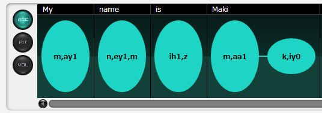
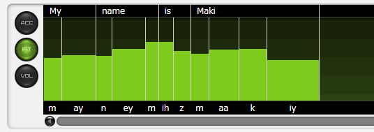
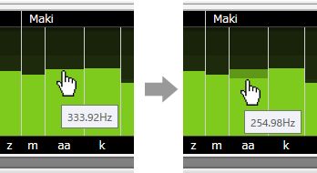
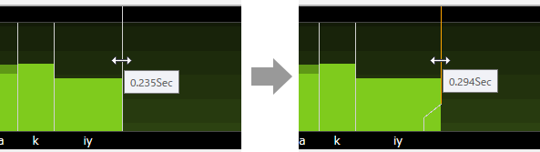
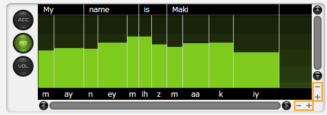
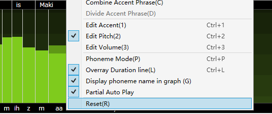

Original article: [CeVIO AI ユーザーズガイド ┃ 音素グラフ（英語ボイス）](https://cevio.jp/guide/cevio_ai/talktrack/phoneme_english/)

---

Correct stresses of words and adjust pitch, length and volume of each phoneme here.

## Adjust Stress

The screen displayed by the "ACC" button is used to adjust the accent(stress) of the English language in three levels.

Each time the ellipse is clicked, the stress changes in the order of 0→1→2→0.

## Adjust Pitch/Length/Volume

The screen displayed by the "PIT" button is used to adjust the pitch and length.

The screen displayed by the "VOL" button is used to adjust the volume and length.

The background of the PIT screen has a fade every octave and the background of the VOL screen has a fade every 10 dB.

### Adjust Pitch or Volume

Drag the mouse up or down (hold down the left mouse button) on the bar graph and the graph will change according to the movement of the mouse. The graph can also be adjusted horizontally by dragging left and right, or by holding down the ++shift++ key and moving left (or right).

Adjustments can also be made by hovering the mouse cursor over the graph and rolling the mouse wheel up and down.

\* Adjustments can be made with the mouse wheel up/down while holding down the ++alt++ key during magnified display.

\* The change unit of pitch is 100 Cent, and the change unit of volume is 1dB.

Dragging up and down from the text area above allows you to adjust the pitch/volume in word units.

### Adjust Length

Drag the white vertical line (orange after adjusting) to adjust the length of the vocalization.

Double-click on the vertical line, or hold down the ++ctrl++ key while clicking or dragging to bring it back to its original length.

Dragging left and right from the text area above allows you to adjust the length in word units.

In addition to dragging the vertical line, the length can also be adjusted by dragging the text area or by rolling the mouse wheel up and down on the text area.

The word or phoneme to be adjusted turns orange when the mouse cursor is over it.

When adjusting the length in word units, the ratio of consonants to vowels is automatically maintained.

!!! tip

    Turning off "Overlay Duration Lines" in the right-click menu prevents you from accidentally dragging the length while trying to adjust the pitch or volume. 
    
    (Even if hidden, the length can still be adjusted via the text area above and below the phoneme graph)

    

### Zoom Display

On the PIT and VOL screens, you can zoom in/out with the "+" and "-" buttons at the bottom right of the phoneme graph.

This is useful when the screen is narrow or when you want to fine-tune.

You can also use the shortcut keys ++ctrl++ + mouse wheel up/down to zoom vertically, and ++ctrl+shift++ + mouse wheel up/down to zoom horizontally.

## Reset to Default Value

Selecting "Reset" from the right-click menu of the phoneme graph restores the accent, pitch, length and volume to the state before adjustment.

Double-clicking on an adjusted phoneme graph will restore only that part of the graph to its default value. Holding down the ++ctrl++ key and dragging the mouse restores the area where the mouse passes to its default value.

## Scrolling Display

The phoneme graph can be scrolled not only by the scroll bar, but also by holding down the middle mouse button and dragging.

It can be also scrolled horizontally by holding down the ++shift++ key and then dragging the mouse wheel up and down; dragging the mouse wheel up and down when the display is zoomed in is vertical scrolling.

## Listen

Clicking in the phoneme graph will start the playback from the clicked position. Clicking again during the playback will stop the playing.

The "Auto Play" function, which automatically starts playback after adjustment, can be activated/deactivated using the "Auto Play button".

If "Partial replay with Phoneme Graph" from the "Talk settings" in [Options](../../option/option) is checked, it will automatic play the section of the phoneme graph from the previous pause before the adjustment point (e.g. punctuation) to the next pause after the adjustment point.
