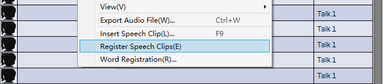
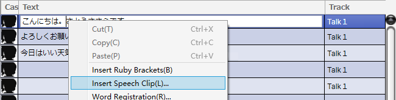
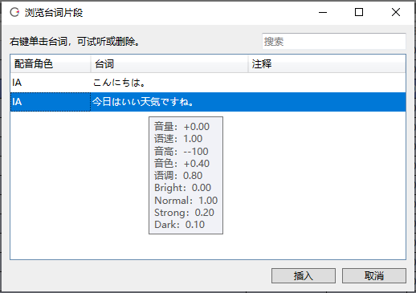

Original article: [CeVIO AI ユーザーズガイド ┃ セリフクリップ](https://cevio.jp/guide/cevio_ai/talktrack/phrasececlip/)

---

## Register Speech Clip

By registering the adjusted lines as speech clips, you can easily reuse them later.

The "Register Speech Clips" in the right-click menu allows you to register the lines of the selected row.

Conditions (volume to intonation), emotions, and phoneme graph adjustments are also registered.

You can register multiple different adjustments with the same line and use them properly, or you can overwrite the previous registration.

!!! info "Relationship to Word Registration"

    When registering a speech clip, adjustments to the phoneme map are registered along with it, but the accents of the original words change with Word Registration.
    
    \* It may change due to the update of the system dictionary at the time of update.

## Insert Speech Clip

The "Insert Speech Clip" in the right-click menu allows you to select a registered speech clip and insert it into the selected line.

You can insert a speech clip at the cursor position by right-clicking and selecting "Insert Speech Clip" from the menu, even if you are entering a line.

\* The as condition and emotion values of the line will be changed to the value of the speech clip.

## View Speech Clip

In the list of speech clips, you can select a line and insert it by pressing the "Insert" button.

The right-click menu allows you to play or delete the selected line.

Click on a column heading (Cast/Text/Memo) to temporarily reorder it.

### Cast

The character who speaks the line.

### Text

The content of the line. Mouse over the column will show the condition and emotion values of the line.

### Memo

Used for notes, for example, distinguish between different adjustments of the same line. Blank is allowed.

### Search Word

Narrow the display to lines that partially match the spelling or reading of the line.

OR search is used when entering multiple words separated by spaces. Wildcards (`*` and `?`) are allowed to use.

\* To transfer the speech clips to another computer, please go to [FAQ](../faq/faq.md).
