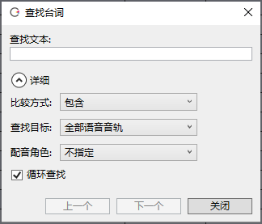

Original article: [CeVIO AI ユーザーズガイド ┃ セリフの検索](https://cevio.jp/guide/cevio_ai/talktrack/search/)

---

If you have a large number of lines, you can quickly find the line you need by keyword.

The search window can be called up from the "Find Text" in the "Voice" menu, in the right-click menu of the Speech List or using the shortcut key ++ctrl+f++.

Press ++f3++ to continue searching for the next line ("Next") using the keyword and conditions of the previous search.

### Text

Enter the text to be searched here.

### Details

#### Methods

By default, the search results in rows containing the search text. It is also possible to search only for lines that exactly match the search text.

#### Search Target

Choose whether to search in all talk tracks or current track only.

When "Other Track Lines" is turned on in the Speech List, all talk tracks are the default search target; when it is turned off, the current track is the default search target.

#### Cast

Unspecified by default. It is also possible to search only for lines of the specified character.

#### Search again after rotation

When checked, once the search reaches the end (beginning), it will return to the beginning (end) and continue the search.

#### Previous, Next

"Previous" searches up from the selected row.

"Next" searches down from the selected row (default).
