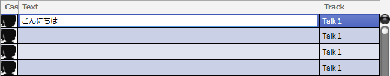
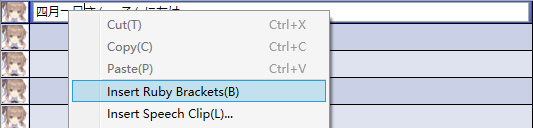
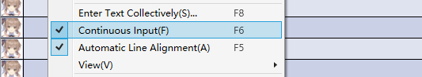
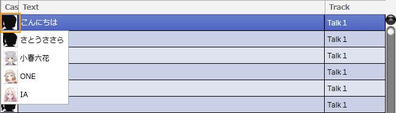
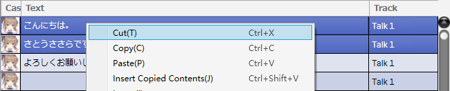
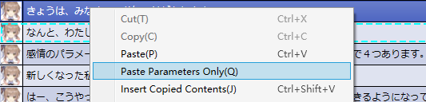
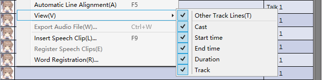
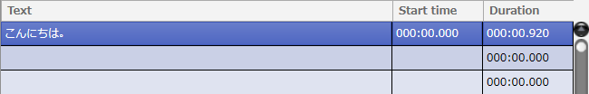

Original article: [CeVIO AI ユーザーズガイド ┃ セリフの入力と編集](https://cevio.jp/guide/cevio_ai/talktrack/talk_01/)

---

## Input Line

Click to select a row, then click on the row again to enter the text input state.

After entering a line in the input state, press ++enter++ to submit.

You can also use the keyboard alone. Press ++enter++ or ++down++ to move to the next line; press ++up++ to move to the previous line; press ++f2++ to enter in the selected row.

(Text can be entered directly without pressing ++f2++ in non-input states.)

The lines of the Japanese Voice can use natural sentences in full-width hiragana/katakana/kanji.

The lines in the English Voice can use English in half-width letters and numbers.

The text limit for each line is 200 for the Japanese Voice and 500 for the English Voice.

!!! tip "Tips for Japanese lines input"

    Pronunciation is determined by the entire sentence of a line. The question mark (？, 疑問符) or exclamation mark (！, 感嘆符) at the end of a sentence is also added to the judgment of pronunciation.

    Long texts without commas (、, 読点) and sentences that were originally one sentence but are divided into multiple lines cannot be pronounced correctly.

    In sentences like "こんにちは。○○さん。", the period (。, 句点) in the middle will be replaced with a comma.

    Even if the pronunciation is the same, you can find the pronunciation you want by changing it to homophones, hiragana or katakana.

    You can use the [Word Registration](../talk_06) function to register the correct pronunciation of the names of people or places that are easy to be mispronounced.

### Insert Ruby Brackets

When inputting a line, the "Insert Ruby Brackets" in the right-click menu can insert a reading-specified brackets in this position.

- For Japanese Voice, `《》` is inserted at the cursor position.  
    
    If text is selected, an additional `|` will be inserted to indicate the start of reading specification.

- For English Voice, `[]` is inserted at the end of the word at the cursor position.

!!! info "Japanese ruby input (reading specification)"

    Specify the reading by writing hiragana/katakana in the `《》`.

    (Example) 今朝｜四月一日《わたぬき》さんに会った。　\* `|` indicates the object to be specified reading.

    (Example) こんにちは、四月一日《わたぬき》さん。　　\* When `|` is omitted, the reading specification will be assumed to start from the beginning. [^1]

    Like [Word Registration](../talk_06), you can also use `'` in `《》` to devoice the vowel.

!!! info "English ruby input (phonetic symbol specification)"

    Enter phonetic symbols in the `[]` following a word to specify the pronunciation.

    Use `|` to separate syllables; use `,` to separate phonemes within a syllable.

    The vowel should be followed by a number indicating stress (0 if omitted).

    0: no stress 1: primary stress 2: secondary stress

    (Example) Sasara[s,ah1\|s,ah0\|r,ah0]

    (Example) Ando[ah1,n\|d,ow0]

    To view the list of phonetic symbols, [please see here](../talk_01_english).

### Continuous Input

Turn on "Continuous Input" from the right-click menu to enter continuous line input mode.

Use this function if you want to continuously input and play lines.

- Press ++enter++ to end editing on this line, move to the next line and enter editing automatically.

- Press ++shift+enter++ to end editing on this line, move to the last line and enter editing automatically.

- Press ++ctrl+enter++ to end editing on this line, ++esc++ to cancel editing, ++enter++ on a blank line to end editing.

## Cast Setting for Lines

Click in the Cast column to select the character who will speak the line in that row.

\* You can change the cast for all lines in a track at once by selecting "Cast" from the "Track" menu, or by changing the cast in the track header.

## Cut/Copy/Paste

You can select a line for cutting or copying, and then paste it into another line.

These operations can be performed via the right-click menu, or the shortcut keys ++ctrl+x++ (cut), ++ctrl+c++ (copy) and ++ctrl+v++ (paste).

Condition, emotion and phoneme graph are also pasted along with it, allowing easy reuse of adjusted lines.

\* When "Other Tracks Lines" is turned on, only the selected line will be cut/copied.

\* Text from other software can also be pasted from the clipboard.

### Paste Parameters Only

After cutting or copying lines, right-click on the line to which the parameter to be applied (multiple selections allowed) and select "Paste Parameters Only" to paste only the speed, pitch, emotion and other parameters without pasting the text of line.

\* Same with normal pasting. Parameters can be filled in even if the line field is empty.

### Multiple Rows Select

After selecting a row, hold down the ++shift++ key and click another row to select multiple rows.

In addition, ++ctrl+a++ can select all rows. [^2]

It can be used to cut or copy multiple rows, or to set presets for multiple rows at the same time.

\* Presets will only be applied to rows where the cast matches.

## Delete Row

++del++ or select "Delete" in the right-click menu to delete selected rows.

## Insert Row

"Insert" in the right-click menu can insert a new row at the position of the selected row.

When cutting/copying, the row on which the operation was performed is inserted, otherwise a blank row is inserted.

Text from the clipboard copied from another software can also be inserted.

\* If you want to insert a blank row, you can use the ++esc++ key to clear the clipboard first.

## Add Blank Line

"Add Blank Line" in the "Talk" menu allows you to add 10 blank rows at the end of the Speech List.

## Change Display

The "View" in the right-click menu allows you to change the display of the Speech List.

Check "Other Track Lines" to choose whether to display lines from all talk tracks in the Speech List.

Each column in "Cast, Start Time, End Time, Duration, Track" can be individually selected to be displayed or hidden.

### Other Track Lines

Displays lines other than the currently selected track together in the Speech List.

### Cast

The character who speaks the line.

### Start time

The time when the line starts (min:sec.microseconds). Enter the time directly to move the line.

### End time

The time when the line ends (min:sec.microseconds). You can keep track of the elapsed time of a line.

### Duration

Length of the line (min:sec. microseconds).

### Track

The talk track of the line. You can easily move the line to another track by entering it and then selecting another track.

\*Here is an example where the cast and track are hidden and only the start time and length are shown.

[^1]:Translator's Note: The actual situation is to start from the previous pause (such as punctuation mark) of `《》`.
[^2]:Translator's Note: Only lines within this track will be selected.
