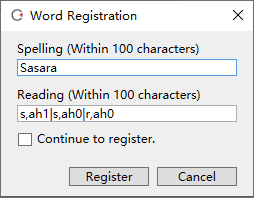
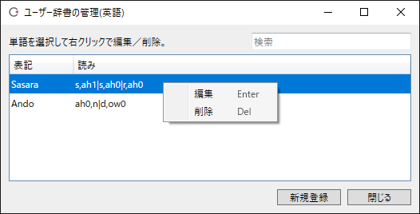

原文：[CeVIO AI ユーザーズガイド ┃ 単語の登録と発音記号（英語ボイス）](https://cevio.jp/guide/cevio_ai/talktrack/talk_01_english/)

---
容易读错的人名或地名可以使用注册单词功能登记正确的读音。

## 注册单词

在「语音」菜单中，在台词列表中或在输入对话时，右键单击并选择「注册单词」。

（如果正在使用多个语种的声库，请在台词列表中选择英语声库。）

从台词列表选中一整行时，选择的句子会作为「写作」的范围；输入台词时则是选择范围内的词。

### 写作

以半角字符输入待注册单词的写法（最长 100 字）。

### 读作

输入待注册单词的发音符号（最长 100 字）。

音节（syllable）间使用 `|` 分割；音节内的音素使用 `,` 分割。

元音后面应有一个表示重音（stress）的数字（如果省略则为 0）。

0：非重音   1：主重音  2：次重音

### 连续注册

启用时，按下“注册”按钮后会移动到下一个单词的注册。关闭时按按钮后注册结束。

## 用户词典管理

从「语音」菜单中选择「词典管理」，可以编辑或删除已注册的单词。

点击列的标题（写作/读作），可以暂时重新排序。

### 编辑与删除单词

双击一个单词就可以编辑。

也可以从右键菜单中编辑或删除选中的单词。

++del++ 键可以删除选中的单词，++enter++ 键可以编辑选中的单词。

按住 ++ctrl++ 键或 ++shift++ 键可以多选单词，++ctrl+a++ 可以全选单词，然后便能将选中的单词全部删除。

### 搜索单词

将显示范围缩小到与写法或读法部分匹配的单词。

输入由空格隔开的多个单词时会使用 OR 搜索。可以使用通配符（`*` 和 `?`）。例如，`Sa*` 和 `?a?ara` 可以搜索到 `Sasara`。

若要将已注册单词的用户字典转移到另一台电脑上，请移步[常见问题](../faq/faq.md)。

## List of Pronunciation Symbols

在注册单词和[插入注音](talk_01.md#_2)中，可以使用下列发音记号。

| 发音记号 | 备注 |
| :---: | --- |
| aa | IPA 记号的 ɑ, a
| ae | IPA 记号的 æ
| ax | IPA 记号的 ə
| axr | IPA 记号的 ər
| ah | IPA 记号的 ʌ
| ao | IPA 记号的 ɔ, o
| aw | PA 记号的 ɑʊ, aʊ
| ay | IPA 记号的 ɑɪ, aɪ
| b | IPA 记号的 b
| ch | IPA 记号的 tʃ
| d | IPA 记号的 d
| dh | IPA 记号的 ð
| eh | IPA 记号的 e，ɛ，ɜ
| ey | IPA 记号的 eɪ，ɛɪ，ɜɪ
| f | IPA 记号的 f
| g | IPA 记号的 g
| hh | IPA 记号的 h
| ih | IPA 记号的 ɪ
| iy | IPA 记号的 i
| jh | IPA 记号的 dʒ
| k | IPA 记号的 k
| l | IPA 记号的 l
| m | IPA 记号的 m
| n | IPA 记号的 n
| ng | IPA 记号的 ŋ
| ow | IPA 记号的 ɔʊ，oʊ
| oy | IPA 记号的 ɔɪ, oɪ
| p | IPA 记号的 p
| r | IPA 记号的 r
| s | IPA 记号的 s
| sh | IPA 记号的 ʃ
| t | IPA 记号的 t
| th | IPA 记号的 θ
| uh | IPA 记号的 ʊ
| uw | IPA 记号的 u
| v | IPA 记号的 v
| w | IPA 记号的 w
| y | IPA 记号的 j
| z | IPA 记号的 z
| zh | IPA 记号的 ʒ
| tt | IPA 记号的 t 闪音（better, little等）
| dd | IPA 记号的 d 闪音（middle等）