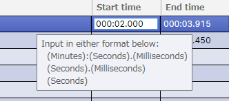
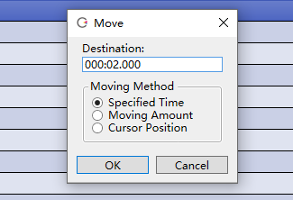
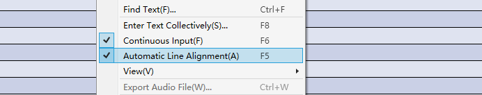

Original article: [CeVIO AI ユーザーズガイド ┃ 発声タイミングの調整](https://cevio.jp/guide/cevio_ai/talktrack/talk_02/)

---

## Adjust on the Timeline

After entering a line, an element of the line will appear on the timeline.

Drag (left mouse button pressed and moved) the element to change the vocalization timing.

Hold down ++alt++ and drag to attach the left or right edge of the line element to the closest second (or bar, depending on the time base of the ruler).

Hold down ++shift++ and click on a line element to multi-select and move these lines at the same time.

### Align Track Element

After selecting "Align Track Element" from the "Track" menu or right-clicking on the talk track, all the lines in that track will automatically be spaced at equal intervals. (The position of the first line will not change.)

\* The distance between lines can be modified in [Options](../../option/option) in "Talk Settings".

## Adjust in Speech List

Double-click in the "Start time" column of the Speech List to enter the time of the vocalization directly.

You can set whether to display "Start time" in the "View" in the right-click menu of the Speech List.

"Move" in the right-click menu of the Speech List can move the selected line in the specified method.

### Specified Time

Directly specify the destination time.

### Moving Amount

Move to specifies relative time from the current position.

### Cursor Position

Move to the current Cursor position.

## Automatic Line Alignment

When this option is on, subsequent lines will automatically move backwards and forwards after the line is entered (to maintain spacing).

It will also automatically align after changing a cast or adjusting speed, emotion or the LEN of phoneme graph.

Uncheck to turn it off. At this time, editing or moving a line does not change the position of other lines, and the lines can be moved to overlapping positions.

(When turned off, even if a new line is entered or a blank line is inserted, the original lines will not be moved.)

!!! tip

    It is recommended to start editing lines with automatic alignment and turn it off when you don't want to change the position of the lines.

    \* If you want to overlap lines with lines from other tracks, turn off the "Automatic multi-track alignment" option in the "Talk Settings" in the Options.

