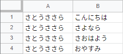

Original article: [CeVIO AI ユーザーズガイド ┃ セリフのインポート](https://cevio.jp/guide/cevio_ai/talktrack/talk_04/)

---

You can create a text file with lines in advance and import it.

Select the talk track you want to import, then select File > Import > Import Text from the menu and specify the file.

!!! info "About the format of files"

    In addition to CSV files generated by the spreadsheet software, plain text files with only lines per row are also accepted, as well as plain text files written by "cast name,line" or "cast name,line,preset name".

    * You can use `Tab` and half-width comma `,` as separators (mixed usage is allowed).
    * When specifying characters, you should use the cast name such as "さとうささら" as listed below.
    * If the content of the first column (before the first separator) matches a cast name, it will be read in as a cast setting, otherwise it will be treated as a line.
    * If the content of the third column (after the second separator) matches a preset name, it will be read in as a preset setting, otherwise it will be treated as a line containing a comma.
    * A sentence with more than 200 characters will be automatically split. Up to 1000 lines can be read.
    * The file extension should be saved as `.txt` or `.csv`.

!!! example "Data example"

    sheet：

    

    plain text：

    ```txt
    『CeVIO AI』は、CeVIOプロジェクトが開発された、最新のAI技術により人間の声質・癖・歌い方・しゃべり方をこれまでになく高精度に再現することの可能な歌声・音声合成技術を搭載した新しいプラットフォームです。人間による歌声・話し声をリアルに再現することが可能となるだけでなく、使いやすいGUIにより、ピッチパターン、タイミング等を自在に編集することが可能となり、これまでとは異なる新しい音声創作の可能性が広がります。
    ```

    ```txt
    さとうささら,こんにちは
    さとうささら,さよなら
    さとうささら,さおはよう
    さとうささら,おやすみ
    ```

    ```txt
    IA,天気が良いから、散歩しましょう。,Smile
    ONE,天気が良いから、散歩しましょう。,Smile
    ```

!!! info "About cast name"

    The following cast names can be used when specifying characters.

    |  |  |  |
    | --- | --- | --- |
    | さとうささら | 小春六花 | 弦巻マキ (日) |
    | IA | 夏色花梨 | 弦巻マキ (英) |
    | OИE | フィーちゃん | ロサ (ROSA) |
    
    \* "ONE" can be also used as the name of "OИE".

!!! info "About encoding"

    Notepad and Google Spreadsheet are "UTF-8". Excel CSV is "Shift-JIS", but you can also select "CSV UTF-8". If necessary, select Tool > Options > Talk Settings > Text File Character Code > Import to specify the character encoding of the file to be read.

!!! tip "Condition and emotion"

    If no preset is specified in the file to be imported, the emotion and volume, speed, etc. of the selected row will be applied to the line. Pre-setting the parameters makes the import easier.
    
    Even after inputting, it is still possible to batch set presets for the character of that track by holding down ++alt++ when selecting a preset.
