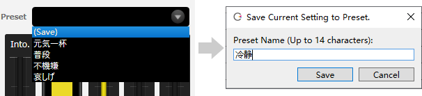

Original article: [CeVIO AI ユーザーズガイド ┃ セリフの表情設定](https://cevio.jp/guide/cevio_ai/talktrack/talk_05/)

---

Each line has various parameters (values) such as volume, speed and emotion.

Adjusting these parameters to create the voice you want.

## Condition Setting

You can adjust the volume, speed etc. of the voice by dragging (left mouse button pressed and moved) the knob.

It can also be adjusted in steps of 1 by hovering the mouse cursor over the knob and scrolling the mouse wheel up and down.

Holding down the ++alt++ key while dragging or scrolling the mouse wheel will apply the value to all characters within that track at the same time.

### Volume

Adjust the volume of the voice.

### Speed

Adjust the speed of reading line.

### Pitch

Adjust the pitch of the voice.

### Alpha

Change the voice to a mature or childlike voice.

### Into. (Intonation)

Make the voice more energetic or a little calmer.

## Emotion Setting

By dragging the knob such as Bright or Angry (*), multiple emotions can be mixed at the desired proportion.

It can also be adjusted in steps of 1 by hovering the mouse cursor over the knob and scrolling the mouse wheel up and down.

Holding down the ++alt++ key while dragging or scrolling the mouse wheel will apply the value to all characters within that track at the same time.

\* The picture shows the emotion of "IA" and "OИE".

### Emotion Graph

The emotion graph shows the percentage of emotion composites. For example, if Bright and Angry are both 1.00 / 100 (old parameter), the percentages will be 50% each.

("Bright 1.00 + Angry 1.00" has the same effect as "Bright 0.50 + Angry 0.50")

The percentage can also be changed directly by dragging the knobs in the emotion chart.

!!! info "Emotion of each character"
    
    Emotion parameters vary from character to character, as shown in the examples below.

    - Sato Sasara (さとうささら) … 元気，普通，怒り，哀しみ

    - IA … Bright, Normal, Strong, Dark

    - Koharu Rikka (小春六花) … 嬉しい，普通，怒り，哀しみ，，落ち着き

## Preset

With a single click, you can apply a preset emotion for a line, or add a favorite preset.

When a preset is applied with multiple lines selected, the preset is applied to the line that the character matches.

Holding down the ++alt++ key while applying a preset will apply the value to all characters within that track at the same time.

### Save Preset

Select (Save) to name the current parameter setting and add it to the preset.

\* When overwriting an existing preset, the changes are applied to all lines where the preset is used.

### Delete Preset

Click on the "×" to the right of the preset name to delete the preset.

### Default Preset

Frequently used presets can be set as "Default Preset" in the "Talk Settings" in [Options](../option/option.md), so that it will become the default setting for a blank row for use conveniently.
