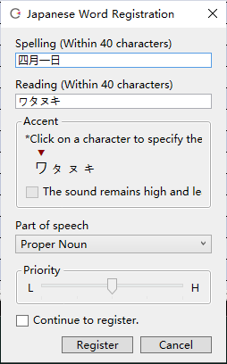
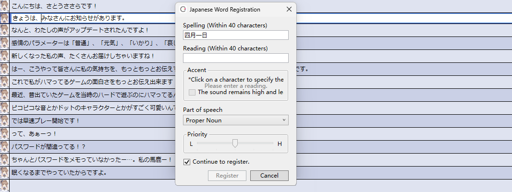

Original article: [CeVIO AI ユーザーズガイド ┃ 単語の登録と辞書の管理（日本語ボイス）](https://cevio.jp/guide/cevio_ai/talktrack/talk_06/)

---

You can use the Word Registration function to register the correct pronunciation of the names of people or places that are easy to be mispronounced.

## Word Registration

Select "Word Registration" from the "Talk" menu, the right-click menu of the speech list or by right-clicking while entering a line.

(When multiple language Voices are in use, selecting an Japanese Voice in the speech list.)

When a whole line is selected from the speech list, the selected sentence is used as the range for "Spelling"; when entering a line, the words within the range are selected.

### Spelling

Enter the spelling of the word to be registered in full-width characters (maximum 40 characters).[^1]

### Reading

Enter the pronunciation of the word in full-width katakana (maximum 40 characters).

For example, enter "トオキョオ" as the pronunciation of "東京".

!!! info "Vowel Devoicing"

    For example, typing `いぇす` will pronounce "yesu", and the sound of the last "す" is very clear; but typing `いぇす'` will devoice the vowel "u" and pronounce a more natural "yes" sound.

    Voiceless vowels are displayed in capital letters in the adjustment screen of the phoneme chart.

    \* The actual effect depends on the mora to which `’` is attached. It has little effect on the a column (あ段), e column (え段) and o column (お段).

### Accent

Click on a character to specify the position of the accent. Large text is where the accent is.

This can be specified by entering the Reading and then using the ++tab++ or ++enter++ keys.

!!! info "The detail of accent"

    The position of the change in pitch accent from high to low is indicated by the number of mora.

    (As in haiku and other form of 5-7-5, both "a (ア)" and "kya (キャ)" are in 1 mora.)

    The basic pattern is: the first mora is low, the second mora is high, and the position of the continuation of the high position is specified.

    For example, "山梨 (ヤマナシ, Yamanashi)" is "low-high-low-low", so the position of the accent is designated as the 2nd mora.

    "一之瀬 (イチノセ, Ichinose) is "low-high-low", so it is in the 3rd mora.

    However, there are also patterns like "安藤 (アンドオ, Ando)" where the first mora is at the high position.

### The sound remains high and le

(The following title are missing)

Specify whether the word that is in high position from the second mora and no longer changes, the particle ("~は" "~が" etc.) followed remains in high position.

This can only be specified when the accent is at the last mora.

For example, if you apply the item to "東京", "東京は (ト オ キョ オ ハ)" is pronounced "low-high-high-high-high".

### Part of speech

Select the part of speech of the word to be registered.

### Priority

If the registered pronunciation is not accepted after registering the word, use the slider to increase the priority.

For example, if you register "四月一日 (ワタヌキ)" and register "一日 (ツイタチ)" with a higher priority, "四月一日" will be pronounced as "シガツツイタチ".

Conversely, if you register "一日 (ツイタチ)" and register "四月一日 (ワタヌキ)" with a higher priority, "四月一日" will be pronounced as "ワタヌキ".

### Continue to register

When it is on, click the "Register" button to move on to the next word. When it is off, registration ends when the button is pressed.

## User Dictionary Management

Select "Dictionary Management" from "Talk" menu allows you to edit or delete registered words.

Click on a column heading (Spelling/Reading/Part of speech) to temporarily reorder it.

### Edit and Delete Word

Double-click a word to edit.

Selected words can also be edited or deleted from the right-click menu.

The ++del++ key can delete the selected word, and the ++enter++ key can edit the selected word.

Hold down ++ctrl++ or ++shift++ to select multiple words, ++ctrl+a++ to select all words, and then delete all selected words.

### Search Word

Narrow the display to words that partially match the spelling or reading of the word.

OR search is used when entering multiple words separated by spaces. Wildcards (`*` and `?`) are allowed to use. For example, `四*日` and `?月?日` will match `四月一日`.

To transfer the user dictionary of registered words to another computer, please go to [FAQ](../faq/faq.md).

[^1]:Translator's note: Full-width English input is allowed here.
