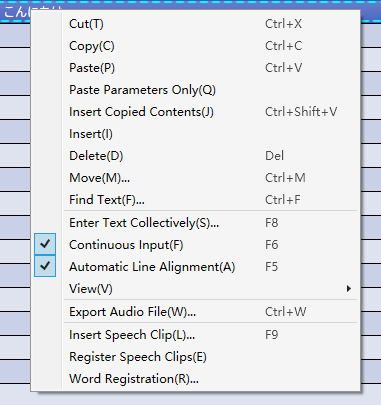

Original article: [CeVIO AI ユーザーズガイド ┃ トークトラックの説明](https://cevio.jp/guide/cevio_ai/talktrack/)

---

Enter text in the speech list on the left, then adjust it in the condition and emotion controller on the right as well as in the phoneme graph.

By selecting "Add Track" from "Track" menu or the right-clicking on a track, up to 32 talk tracks can be added.

### Listen

Listen to the currently selected line in the speech list. Press again to stop listening.

Left-click on a phoneme graph to listen to it from a specific position.

### Cycle

Enable or disable playback looping.

### Auto Play

Toggle whether or not the lines are automatically played after they are entered or adjusted in the condition controller/emotion controller/phoneme graph.

If ["Partial replay with Phoneme Graph"](../../option/option/#partial-replay-with-phoneme-graph) is enable, the phoneme graph will automatic play the section from the previous pause before the adjustment point (e.g. punctuation) to the next pause after the adjustment point.

!!! tip "Use of auto play"

    Pressing ++enter++ after entering a line will automatically play the text of that line, so that it can be used in combination with "Continuous Input": input scripts in advance and play them back in sequence; as a real-time speech synthesis tool for live broadcasts; and so on.

## Right-click Menu

Right-click (or hold down on the touchscreen) on the Speech List to open the menu.

### Cut

Cut the lines of the selected row.

### Copy

Copy the lines of the selected row.

### Paste

Paste the copied/cut lines of the selected row to the position of the position cursor.

### Paste Parameters Only

Paste only the parameters from the copied (cut) lines to the selected row. \* Only displayed after copying lines.

### Insert Copied Contents

Insert the copied lines at the selected line. \* Only displayed after copying lines.

### Insert

Inserts a blank row at the selected row.

### Delete

Delete the selected row.

### Move

Moves the lines of the selected row in the specified way.

### Find Text

Search lines by keywords.

### Enter Text Collectively

Insert text collectively into the selected line.

### Continuous Input

When this option is on, after editing a line, it will automatically move to the next line.

### Automatic Line Alignment

When this option is on, subsequent lines will automatically move backwards and forwards after the line is entered (to maintain spacing).

### View

#### Other Track Lines

Select whether or not to display all lines of the talk track in the speech list.

#### Cast / Start Time / End Time / Duration / Track

Show/hide the columns in speech list.

### Export Audio File

Export the lines of the selected row to a file in monaural WAV format.

\* Sampling rate and bit depth can be specified in [Option](../../option/option).

### Insert Speech Clips

Select a line from the already registered speech clips and insert it into the selected row.

### Register Speech Clips

Register the lines of the selected row to the speech clips.

### Word Registration

Register the word in the user dictionary.
