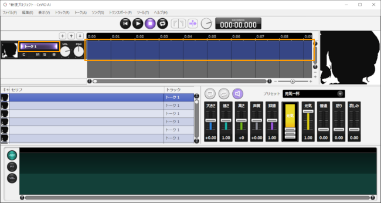
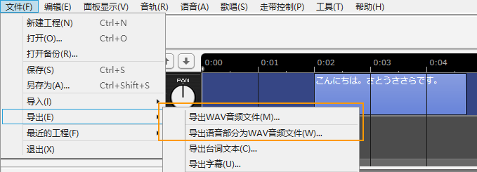

Original article: [CeVIO AI ユーザーズガイド ┃ はじめてのトーク作成](https://cevio.jp/guide/cevio_ai/tutorial_talk/)

---

Whether dialogue or narration, you can use CeVIO to create the suitable sound.

With a single click, you can use emotion presets such as "元気一杯" and "哀しげ"[^1], and adjust the volume and speed in detail.

## 1. Start the application

After starting the application, the tracks will be displayed at the top of the screen.

\* If there are multiple tracks, click on the track name (or timeline) labeled "Talk 1" to display the talk editing screen at the bottom of the screen.

## 2. Input Lines

Select a line in talk editing screen, then click this line and enter text.

## 3. Vocalization Timing of Lines

After entering a line, an element (box) of the line will appear in the timeline. Drag (left-click and hold) the element to change the timing of its vocalization.

## 4. Select Cast

If there are multiple available casts, you can choose the character who will speak that line in the Cast column.

## 5. Set the emotion

The presets on the right side of the talk edit screen allow you to set emotions with a single touch.

You can also mix multiple emotions using the emotion control (bar graph knob).

## 6. Listen

You can listen to the selected line by clicking Listen/Stop button.

## 7. Output the audio file

All tracks can be combined and output as a file by using File > Export > Audio Mixdown in the menu.

You can also output output separate files for each line by Audio File per Each Line.

[^1]: Translator's note: Both of these are Sasara's emotion preset names, "元気" in 100 and "哀しみ" in 100 respectively.
