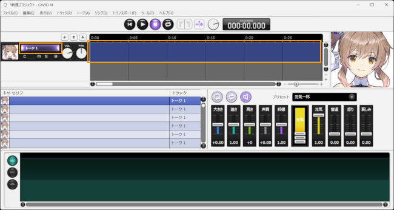
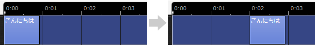

Original article: [CeVIO AI ユーザーズガイド ┃ はじめてのトーク作成](https://cevio.jp/guide/cevio_ai/tutorial_talk/)

---

无论是对话，抑或是旁白，都可以利用 CeVIO 创作出适合的声音。

轻轻一点就可以使用诸如「元気一杯」「哀しげ」等预设好的情绪[^1]，并更进一步地调整音量和语速等细节。

Whether dialogue or narration, you can use CeVIO to create the suitable sound.

With a single click, you can use preset emotions such as "元気一杯" and "哀しげ"[^1], and adjust the volume and speed in detail.

## 1. Start the application

After starting the application, the tracks will be displayed at the top of the screen.

\* If there are multiple tracks, click on the track name (or timeline) labeled "Talk 1" to display the talk editing screen at the bottom of the screen.

## 2. Input Lines

Select a line in talk editing screen, then click this line and enter text.

## 3. Vocalisation Timing of Lines

After entering a line, an element (box) of the line will appear in the timeline. Drag (left-click and hold) the element to change the timing of its vocalisation.

## 4.选择角色

拥有多个可使用的角色时，可以在配音角色栏选择说出这一行台词的角色。

## 5.情绪的设置

轻轻一点语音编辑界面右侧的预设就能设置角色的情绪。

也可以使用情绪控制（条形图的推子）来混合多种情绪。

## 6.试听

按下试听按钮可以试听选中的台词。

## 7.导出声音文件

通过菜单的「文件」→「导出」→「导出WAV音频文件」，可以将全部音轨合成一个文件并导出。

另外，也可以通过「导出语音部分为WAV文件」，将每句台词分别导出。

[^1]: 译者注：这两个都是莎莎拉的情绪预设名，分别是「元気」拉满和「哀しみ」拉满

*[「语音 1」]: トーク１ / Talk 1

--8<-- "includes/abbreviations.md"
