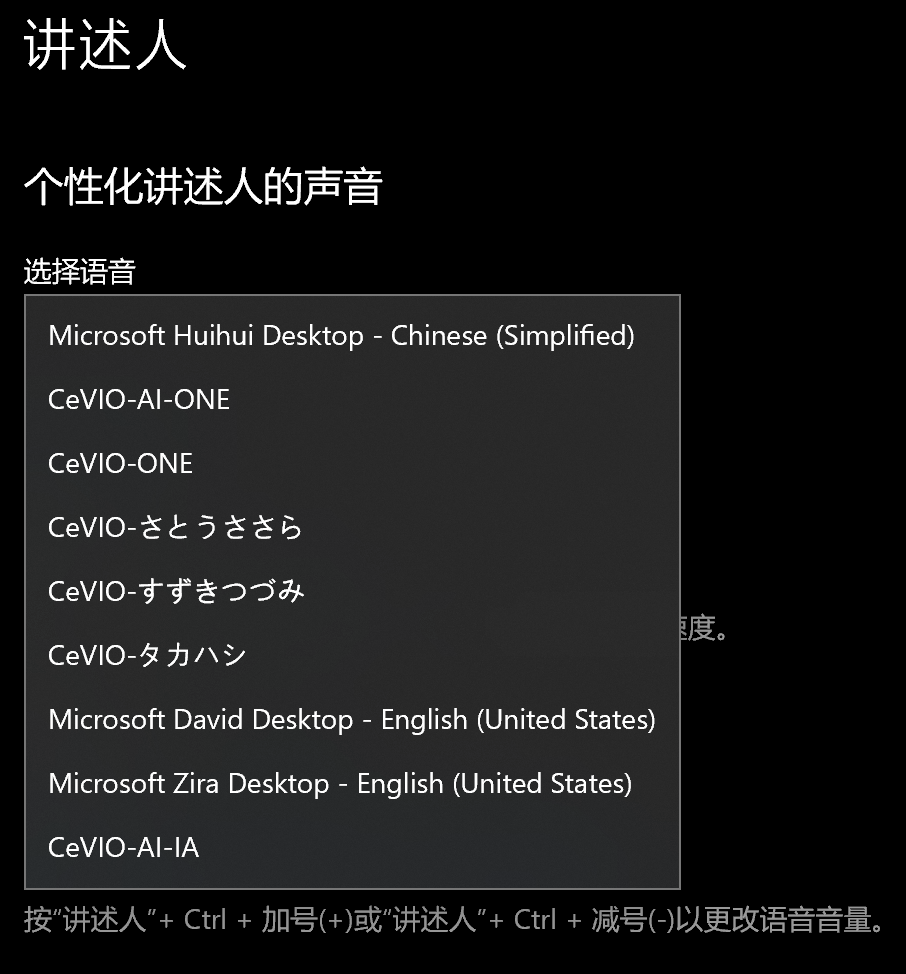

原文：[CeVIO AI ユーザーズガイド ┃ 外部連携インターフェイス](https://cevio.jp/guide/cevio_ai/interface/)

---

!!! caution
    译者注：
    
    - 理解本章节的内容需要一定的编程知识。
    - 在使用 API 前，请仔细地阅读本页面末尾的注意事项。

可以通过外部软件调用读说引擎的文本转语音功能。

有三种可用的方法供不同的应用调用。

## 从 SAPI5 调用

可与支持 SAPI5 的软件链接后朗读文字。

CeVIO AI 可与 64 位的软件链接，也能用作 Windows 10 的「讲述人」。在 Windows 设置的「个性化讲述人的声音」的「选择语音」中，可以选择作为讲述人的角色。[^1]

- 不支持 Word、Excel 等 Microsoft Office，Acrobat Reader 的朗读功能。
- 「CeVIO AI」是 64 位应用，所以它不能与 32 位的外部软件（「棒読みちゃん」等）直接链接。（可以通过外部软件将「棒読みちゃん」等与「CeVIO AI」链接起来。）

!!! hint "默认预设"
    外部调用时将使用选项里「读说设定」的「默认的预设」。

    在 SAPI5 中，「语速」由链接方的设置决定，「音量」和「音高」由链接方和本软件的设置共同决定，其他设置由本软件决定。

    如果想在链接时提高音量，或者想用喜欢的感情设置读出信息，请将该设置添加到预设中，然后将其作为默认预设。

!!! info "在项目中使用"
    - 支持使用以下 SAPI XML TTS 标记的参数规范。
      
        `<pitch>` `<volume>` `<rate>` `<silence>`

        `pitch`、`volume`、`rate` 只支持用标签括起来的格式（不支持在句子中说明）。

    - 支持 SAPI5 的 `Volume` 属性和 `Rate` 属性。

## 用作 COM 组件

通过 C++ 等程序，使用专用 API 精细地控制感情、状态等。

[详情请见这里。](com.md)

## 用作 .NET 程序集

通过 C# 等 .NET 程序，使用专用 API 精细地控制感情、状态等。

[详情请见这里。](dotnet.md)

!!! caution "注意事项"
    - Song 新手包等不具备读说功能的产品，不能使用外部调用接口调用。
    - ① 是使用 ② 的 API 的简单实现。不保证兼容所有的 SAPI5 软件。
    - 使用 ② 或 ③ 时，请首先调用启动『CeVIO AI』的 API。
    - ①～③ 全体可同时使用外部调用接口的应用程序数量均为 1。
    - 在 ①～③ 的任意一种情况下，使用条款和限制均为产品附带的许可协议。
        - 外部调用接口不能用于商业用途。如果您需要用于商业用途的实时语音合成，请通过[此页面](http://cevio.jp/contact_others/)与我们联系。[在此范围内](http://cevio.jp/commercial/)可以免费使用。

[^1]: 译者注：也可以通过快捷键 ++ctrl+windows+n++ 直接打开“讲述人”的设置。
