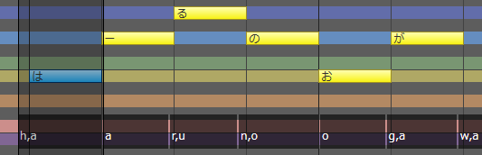

## 2022/7/7 更新（版本号 8.3.5.0）

- 再次提高了撤销 / 重做的速度。
- 修复了一个移动音符时偶尔会出现的错误。

## 2022/6/30 更新（版本号 8.3.4.0）

▼歌唱相关

- 移动音符时，按下 ++shift++ 键可以暂停音高的自动追踪。
- 修复了在停止播放后撤消时可能导致无法操作的错误。

## 2022/6/29 更新（版本号 8.3.3.0）

▼歌唱相关

- 添加了下列快捷键。
    - ++ctrl+left++、++ctrl+right++：切换编辑工具。※现在请使用 ++g++ ++h++ 进行钢琴卷帘的水平缩放。
    - ++ctrl+u++：合并音符。
- 「合并音符」变为合并到选区的第一个音符上。
- 在选中音符时的右键菜单里添加了「自动分割英语歌词」和「消除休止符」的选项。
- 「消除短空白」变更为「消除休止符」。
  改进后，即使只选择了一个音符，也可以填补与下一个音符的空白。
  修复了在特定情况下执行有时会不起作用的错误。

▼语音相关

- 添加了下列快捷键。
    - ++ctrl+tab++：切换到下一个调整页面。
    - ++ctrl+shift+tab++：切换到上一个调整页面。

▼其他变化

- 其他错误改进与修复。

## 2022/6/22 先行公开更新（版本号 8.3.2.0）

随着导出 24 位 / 32 位 float 的 WAV 文件、实装歌唱引擎的新功能与改善操作性、改良语音引擎的音素图等大量改进的追加，版本 8.3 现变得更易使用。

▼歌唱 / 语音共通

- 在「选项」的「环境」中添加了「WAV导出格式」。
  
    WAV 现支持以 24 位 / 32 位 float 的比特深度导出，可以用于混音以外的场合。
    

    ※音频解析度会随比特深度变化，而非像以前一样使用 16 位变换。

    ※未来的计划包括支持 44.1kHz 等指定的采样率，指定混音文件的格式和 24 位音频文件的导入。

▼歌唱相关

- 歌唱引擎更新到 6.1.3。音质没有变化。
- 现支持设置重音 (Accent) 和断音 (Staccato)。
    
    
    可以通过「音符属性」，或者选中单个音符时从右键菜单中选择「选项」来设置。
    
    ※受角色和乐谱的影响，可能会有效果不明显的情况。

- 现支持设置新的强弱记号「ffff」「fff」「ppp」「pppp」。
  
    ※受角色和乐谱的影响，跟「ff」「pp」相比，可能会有效果不明显的情况。

- 实装了「合并音符」的功能。
    
    
    选中多个音符时，通过右键菜单可以将其合并。
    
    选择范围的音符的歌词和属性将合并到选区的最后一个音符上。

- 右键菜单现在会依情况而变，这让设置音符变得更为容易。
    
    - 选中单个音符时，可以设置它的属性（重音、断音、连音、呼吸、假音）并试听。
    - 选中多个音符时，可以设置连音，合并音符并试听。
    - 「属性」一项只有在选中音符或节奏等才会显示。其他地方的菜单与以往一致。
- 现在，使用范围选择工具以外的工具移动音符时，若乐谱的参数已调整过，则这些参数也会自动随之移动。
    
    ※音高以及其他调整参数会自动追踪音符的移动。使用范围选择工具可以任意指定范围。

- 加快了下列操作的速度以提高操作反馈。
    - 读取项目。
    - 撤销 / 重做。
    - 使用范围选择工具复制后粘贴、使用范围选择工具移动 / 剪切 / 删除音轨。
    - 插入 / 删除小节。
    - 节奏和拍子的追加 / 修改 / 删除。
    - 使用方向键上下移动音符（开启自动试听时）。

- 改进了音素单位 / 音符单位的时间（TMG）的清除。
    
    ※当擦除音素/音符单位时，状态线不一定被初始化，而是按前一个/音素/音符的比例内插（调整时也是如此）。以前擦除后只保留部分状态线调整的情况现在已经得到改善，更容易在隐藏状态线的情况下使用。

- 「连续输入歌词」现在可以使用 ++enter++ 键提交歌词。
- 添加了下列快捷键。
    - ++ctrl+tab++：切换到下一个调整页面。
    - ++ctrl+shift+tab++：切换到上一个调整页面。
    - ++shift+q++：切换到下一个量化值。
    - ++shift+w++：切换到上一个量化值。
    - ++shift+t++：开启 / 关闭三连音。
- 调整了右键菜单等处「量化」的顺序。三连音现在放在下面。
- 现在支持导入扩展名为 `.midi` 的 MIDI 文件。
- 在试听时打开右键菜单时，试听现在会自动停止。
- 修复了乐谱编辑页面的调整时间无法用橡皮擦擦除的错误。
- 修复了当鼠标光标移出调整屏幕然后返回时，鼠标光标不会变回笔等的错误。
- 修复了使用范围选择工具复制小节单位后，在特定情况下无法正确地粘贴节奏 / 拍子 / 调号 / 强弱记号的错误。

▼语音相关

- 语音引擎更新到 6.0.18。音质没有变化。
- 日语语音字典更新到 3.0.14。
- 改进了音素图。
    
    
    
    - 在 PIT 和 VOL 中，鼠标光标所在的长条柱现在会被垂直线所包围，以更容易理解操作的目标。
    - PIT 或 VOL 的长条柱上方现在会显示音素名，以更容易调整。
      通过音素图右键菜单的「在图内显示音素名」可以隐藏音素。

▼其他变化

- 缩小了时间轴默认的缩放率。现在更容易看到时间轴。
- 在导入窗口中，现在默认显示对应下列扩展名的所有文件。
    - 「导入台词文本」的 `.txt` 和 `.srt`
    - 「导入字幕文件」的 `.srt` 和 `.sbv`
    - 「导入MIDI音轨」的 `.mid` 和 `.midi`
    - 「导入MusicXML」的 `.xml` 和 `.musicxml`
- 「文件」菜单的「最近的工程」显示的文件上限现在扩大到 10 个。
- 修复了文件名中的 `_`（下划线）在「最近的工程」部分不显示的问题。
- 「トラックの固定」变更为「トラックのフリーズ」。
- 其他错误改进与修复。

## 2022/5/25 更新（版本号 8.2.9.0）

▼歌唱相关

- 歌唱引擎更新到 6.1.1。音质没有变化。
- 现在在乐谱编辑屏幕上将显示调整过的时间调整线（与 TMG 调整屏幕一致）。
  
  

- 修复了即使在时间调整屏幕中隐藏状态线，状态线也能被橡皮擦工具擦掉的错误。
- 修复了使用 ++space++ 键停止播放后，未调整过的乐谱无法修改速度的错误。
- 修复了当乐谱编辑屏幕没有音符时，单击时间调整屏幕会弹出错误信息的错误。
- 修复了导入与当前编辑的乐曲速度不同的 MusicXML/MIDI/CCST 文件后，其他歌唱轨道的参数没有随之更新的错误。

▼语音相关

- 现在即使开着「注册单词」的窗口也能编辑台词。

    - 通过台词列表或「语音」菜单调出「注册单词」就可以边注册边编辑台词。如果是从「词典管理」中调出它的，则只能像以前一样单纯注册单词。
    - 若启用了「连续注册」，则按下「注册」按钮后窗口也不会关闭。这样一来便可在输入一句台词后立刻注册单词。
    - 若想修改正在查看的窗口中的已注册单词的「读作」或重音，请从「写作」中输入。

▼其他变化

- 其他错误改进与修复。

## 2022/5/12 更新（版本号 8.2.8.0）

▼歌唱相关

- 现支持在乐谱编辑页面最下方以双击音素的方式直接编辑音素。
  
    

    - 修改音符属性，或通过按下 ++ctrl+p++ 切换到按音素输入歌词来编辑音素的方式依旧可用。

- 在错误的音素（以红色显示）中，日语声库中大写的日语元音字符 (`A` , `I` , `U` , `E` , `O`) 现作为特例正常播放。
    - 尽管这些音素存在，但它们并不用于学习，只会生成噪音，但考虑到 8.1 以前使用的乐谱，我们依旧为其添加了播放支持。但是，这些音素不在官方规范范围内，所以它们均显示为错误的音素。
    - 删除了版本 8.2.3.0 增加的用于测试的音素 `xx`。
- 乐谱编辑屏幕中的试听部分应与歌词的发声时间相匹配。

    

    - 与此同时，废除了选项中的设定「试听前后的空白」。
- 将自动试听的默认设置改为开启。点击、输入或移动一个音符后可以自动试听。

    
  
    - 修改的是安装时的设置。如果在版本更新之前就已在使用 CeVIO，请根据自己的喜好设置。

- 在钢琴卷帘的右键菜单中添加了「自动分割英语歌词」的设置。
    - 用于在设置之间快速切换。和以前一样，也可以通过选项进行设置。
- 改进了一些快捷键的响应，例如使用 ++ctrl++ 键切换编辑工具。
- 现支持 ++ctrl+space++ 的快捷键。
    - 效果是将位置光标移至鼠标光标所在的位置。
- 修复了如果选定的多个音符之间有调号或强弱符号，则使用 ++ctrl+r++ 会产生错误的错误。
- 修复了在出现音素错误的音符后，显示的音符音素错位，且修复该音素后，时间没有更新的错误。

▼语音相关

- 在音素图的右键菜单中添加了「部分自动试听」的设置。（注：对应的选项设置是「音素图调整部分自动试听」）
- 改进了使用 ++ctrl++ 键切换编辑工具的响应。
- 修复了「导入台词文本」功能的一些错误。

▼其他变化

- 在语音轨道和音频轨道的右键菜单中添加了「多音轨自动排列」的设置。
  
    

    - 用于在设置之间快速切换。和以前一样，也可以通过选项进行设置。
    - 开启「自动排列台词」后，不同轨道的台词会自动调整位置以避免重叠。 
    开启「自动排列音频」后，音频会自动调整位置以避免重叠。
    - 如果你不想移动台词或来自另一轨道的音频（让它们重叠），请关闭该选项。

- 在屏幕右侧角色图的右键菜单中添加了「大图」选项。
    - 用于在设置之间快速切换。和以前一样，也可以通过选项进行设置。
- 其他错误改进与修复。

*[「在图内显示音素名」]: グラフ内に音素名を表示 / Display phoneme name in graph
