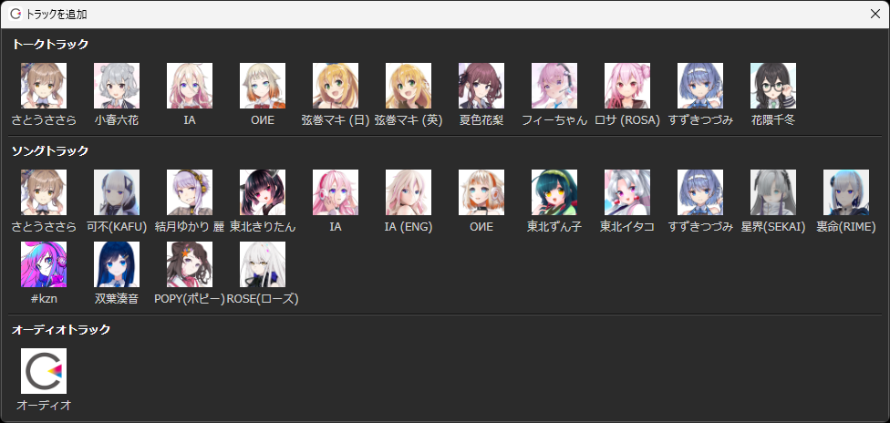
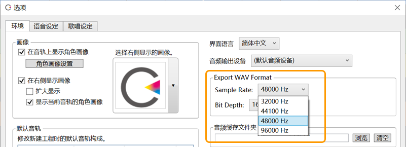
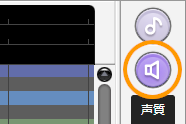

原文：

- [CeVIO AI ユーザーズガイド 最新情報](https://cevio.jp/guide/cevio_ai/)
- [CeVIO AIアップデート情報 ┃ CeVIO Official Site](https://cevio.jp/archives/category/news/cevio-ai-update/)

---

## 9.0

### 2023/12/12 更新（版本号 8.7.2.0）

▼歌唱相关

- 修复了在显示声音波形且显示颤音时进行调整，“忙”鼠标指针会出现并反复闪现的问题。
- 修复了在反复切换歌唱声库时应用强制中止的问题。
- 修复了在选中语音轨道的情况下切换歌唱轨道的角色时，角色图片不更换的问题。
- 修复了在播放过程中切换音轨时，直到滚动为止，切换前的音轨内容会一直显示的问题。

▼其他变化

- 其他错误改进与修复。

### 2023/12/7 更新（版本号 8.7.1.0）

▼歌唱相关

- 修复了获取波形时播放歌曲，可能会暂时无法操作或在播放中途停止的问题。

▼语音相关

- 修正了在英语声库的重音调整界面点击试听时的起始播放位置。将从重音句的起始处播放。

▼其他变化

- 当鼠标光标位于滚动条上方时，滚轮滚动现在遵循滚动条的垂直/水平方向。
- 其他错误改进与修复。

### 2023/12/5 更新（版本号 8.7.0.0）

版本 8.7 实装了歌唱的音频波形显示、语音的自由重音模式等新功能。我们还进行了颤音调整等各种改进，使其更加易于使用。

▼歌唱相关

- 现支持音频波形显示。它显示在调整界面上。
  
    

    - 可以通过歌唱菜单的「其他显示」或右键菜单的「显示」来开启/关闭。
    - 显示时，CPU 和内存负载会增加，因此如果有操作卡顿的情况，请关闭该选项。
    - 在 VOL 调整界面上可以调整“作为声音来源的声带振动量”，并利用声音波形确认听上去的音量。

- 改进了颤音调整界面。以前的 VIA（振幅）和 VIF（周期）整合到了 VIB 调整界面。

    

    - 现在可以在钢琴卷帘的上半部分调整振幅（AMP），下半部分调整周期（FRQ），而无需切换调整界面。
    - 使用画笔或橡皮擦工具调整振幅参数时，周期也会自动补充完整（反之亦然）。
    - 当切换到 VIB 调整屏幕时，现在将自动显示带有颤音的音高。

- 由于 VIA/VIF 集成到了 VIB，下列快捷键已更改。
    - ++6++：显示音色调整界面（ALP）。
    - ++shift+6++：叠加显示音色调整界面（ALP）。
    - ++7++：显示沙哑度调整界面。
    - ++shift+7++：叠加显示沙哑度调整界面。

- 现在可以在「颜色设定」中设置音频波形的显示颜色、不透明度和抗锯齿。

    

    - 可以通过右键菜单的「显示」或选项中的「歌唱设置」来调用。
    - 仅当显示放大率为 100% 时才会显示「抗锯齿」设置。 右键菜单中的该选项已删除。

- 在 MIDI 导入中添加了「歌词的文字编码」。也可以选择「UTF-8」。

    

    - 如果选择「ANSI (Shift-JIS)」时歌词变为了乱码，请选择「UTF-8」。

- 调整了音高线的显示，现在 PIT 调整界面的音高线在 440Hz 时会穿过 A4 音符的正中间。

    

- 「删除小节」现在支持最多删除 999 小节。
- 改善了在长乐谱（如 200 小节）末端滚动速度较慢的问题（因电脑性能而异）。
- 修复了使用上下方向键移动音符时，有时会显示错误的错误。
- 修复了在音色调整界面，默认值用橡皮擦拖动时会变成调整值（橙色）的问题。
- 「歌唱」菜单的「显示网格线」变更为「其他显示」。「光标指示器」也移入其中。

▼语音相关

- 语音引擎更新到 6.3.4。音质没有变化。
- 日语词典更新到 3.0.21。

    \* 添加了 CeVIO AI 歌唱声库的角色名等。

- 实装「自由重音模式」。在调整日语声库的重音时可以不应用任何重音型。

    

    \* 可以通过「语音」菜单的「音素图」或右键菜单来开启/关闭。

    \* 通常关闭，必要时再开启。初始设定为关闭。

- 修复了调整不属于重音型的日语重音时，未调整的重音短语会应用重音型，或者在撤消过程中应用重音型的问题。
- 修复了音素图上部的单词用鼠标滚轮上下滚动调整长度时，音素长度不变化的问题。
- 修正了根据多显示器环境，预渲染中的进度显示有偏差或不显示的问题。

▼其他变化

- 删除了「选项」里「歌唱设置」和「语音设置」的「声库版本」。
    - 这是《CeVIO CS》的功能，但在《CeVIO AI》中，“最新”有时会错误地显示。
    - 请通过「帮助」菜单中的「版本信息」来检查声库版本。
- 其他错误改进与修复。

## 8.6

### 2023/9/5 更新（版本号 8.6.10.0）

▼歌唱相关

- 修复了在特定条件下，冻结或导出音轨失败的错误。

▼语音相关

- 语音引擎更新到 6.3.0。音质没有变化。
- 日语词典更新到 3.0.20。添加「田中傘」。

▼其他变化

- 改善在多显示器环境下，窗口未在上次关闭的位置显示的情况。

### 2023/8/15 更新（版本号 8.6.7.0）

▼歌唱相关

- 减少播放过程中的 CPU 负载和绘图负载。
  
    \* 由于帧速率的提高，某些电脑的 GPU 使用率可能会略有增加。

    \* 在播放或拖动过程中，由于绘制方法不同，画面可能会略有变化。

▼语音相关

- 日语词典更新到 3.0.19。添加「タカハシ」「アマト」。
- 更改了「选项」中「语音设定」下，「文本文件的编码」的一部分描述。含义不变。

    「Shift JIS」→「ANSI (Shift-JIS)」

    「Unicode」→「UTF-16 LE」

▼歌唱 / 语音共通

- 允许选择工具栏上数字字体的样式。

    

    \* 可以通过「面板显示」菜单和工具栏空白处的右键菜单更改。

- 将工具栏的显示位置和时间基准的设置从「走带控制」菜单移动到了「面板显示」菜单。
- 其他错误改进与修复。

### 2023/7/31 更新（版本号 8.6.6.0）

▼歌唱相关

- 修复了在音色、沙哑度的详细调整界面上，选择范围的参数上下移动的问题。
- 修复了在乐谱编辑界面中，调号发生两次变化时无法正确绘制的问题。

▼语音相关

- 语音引擎更新到 6.3.3。音质没有变化。
- 现支持「タカハシ」语音声库 1.0.0。

▼歌唱 / 语音共通

- 修改了工具栏的数字字体的样式，以提高在高分辨率显示屏等情况下的可视性。

    

- 其他错误改进与修复。

### 2023/7/19 更新（版本号 8.6.5.0）

▼歌唱相关

- 现支持使用快捷键 ++ctrl+shift+tab++ 来切换到沙哑度详细调整界面。
- 当乐谱编辑界面的背景为彩虹或蜡笔时，调整界面的背景也会根据调号变化而变化。

    \* 在版本 8.6.3.0 中，修复了调整界面背景绘制不正确的问题。

- 现在可以使用橡皮擦工具批量删除多个选定的音符。
- 修复了 MIDI 导入时可能导致音高错误地高了 1 个八度的问题。
- 其他错误改进与修复。

### 2023/7/12 更新（版本号 8.6.3.0）

▼歌唱相关

- 现支持使用快捷键 ++ctrl+tab++ 来切换到沙哑度详细调整界面。添加了下列快捷键。
    - ++8++：显示沙哑度调整界面。
    - ++shift+8++：叠加显示沙哑度调整界面。
- 修复了在沙哑度详细调整界面中，复制、粘贴的错误。
- 修复了在音色调整界面中，无法执行混合复制（包括默认值）的问题。
- 修复了在音色和沙哑度详细调整界面中，当调整线的末端超出屏幕时无法绘制的问题。
- 修复了在进行抗锯齿绘制时，在灰色背景等情况下可能会出现不必要的水平线的问题。

▼语音相关

- 语音引擎更新到 6.3.1。音质没有变化。
- 现支持「弦巻マキ」日语语音声库 1.0.0。

▼其他变化

- 在「选项」的「环境」中重新添加了「位置光标的位置校正」。

    \* 当光标位置明显偏移时，请将其关闭（默认设置为开启）。

- 其他错误改进与修复。

### 2023/7/4 更新（版本号 8.6.1.0）

版本 8.6 实装了沙哑度的详细调整，以歌曲表达的范围更广泛，并进行了各种改进。

（7/4 版本 8.6.1.0 先行公开。7/21 版本 8.6.5.0 正式公开。）

▼歌唱相关

- 歌唱引擎更新到 6.3.2。音质没有变化。
- 实装沙哑度的详细调整。点击工具栏的「HUS」按钮即可显示调整界面。

    

    \* 可以在时间轴上微调沙哑度。向上或向下移动沙哑度滑块也会向上或向下移动详细调整值。

- 在右键菜单中添加了「导出为 WAV」选项。可以轻松地将文件导出为 WAV 格式。
- 为右键菜单「特殊符号」的每个项目添加了诸如「@ Whisper」的描述。
- 在右键菜单的「显示」中添加了「抗锯齿」（仅限缩放率设为 100% 时）。

    

    \* 当缩放率设为 100% 时，启用抗锯齿可以使钢琴窗口的渲染更加平滑。

    \* 默认情况下，抗锯齿是关闭的，提供传统的清晰渲染。当缩放率设置为 100% 以外的任何值时，抗锯齿将始终处于开启状态。

- 当缩放率设置为 100% 以外的任何值时，调整屏幕上的锯齿线现在会以更平滑的方式渲染。
- 从右键菜单中删除了「试听」。

    \* 按快捷键 ++shift+space++ 和点击试听按钮，仍然可以试听所选范围的内容。

- 在 TMG 调整屏幕上使用选择工具时，现在可以指定 TIMING 的参考范围。

    \* 在其他屏幕中也可以通过按下 ++shift++ 键切换量化和 TIMING 的设置。

    \* 在屏幕底部的 TIMING 显示区域点击并拖动，也可用于以音符或音素选择范围。

    

    \* 利用这一特性，便可以轻松地按音素单位重置调整；或是在音量调整屏幕上，通过选择休止符区间来降低呼吸音的音量。

- 在 TMG 调整屏幕上使用选择工具和范围选择工具时，++alt++ 键现在只能用于解除量化限制。

    \* 画笔工具等其他工具与以往一致，按住 ++alt++ 键仍然可以暂时在音符/音素单位之间切换。

- 在新项目的默认设置中，现在默认启用「全轨道共用调号」。

    \* 每个项目的设置是单独保存的。当打开以前未保存为「开启」的项目时，设置将仍为「关闭」。

- 修复了「导出歌唱部分为WAV文件」可能会出现剪切部分出现很大的噪音的问题。

    \* 编辑器内的播放、「导出WAV音频文件」和语音轨道的 WAV 导出没有问题。

- 修复了使用「合并音符」合并带英文和日语歌词的音符并保存后，后续的 TIMING 调整被重置的问题。

    \* 编辑器内的播放、「导出WAV音频文件」和语音轨道的 WAV 导出没有问题。

- 修复了在「元音时间修复」中，在某些情况下 TIMING 会崩坏的问题。
- 修复了混合复制 TIMING 时，与通常的粘贴相比 TIMING 未粘贴为绝对值的问题。
- 修复了因小节长度和曲速，而叠加显示 PIT 和 VIA/VIF 时，可能不显示带颤音的音高的问题。
- 修复了在特定操作步骤后单击调整屏幕时，叠加显示和状态线会消失的问题。
- 在「双叶凑音」的「特殊符号」菜单中，将「いきり」（恼怒）的显示更改为「吐き捨て」（吐气）。

    \* 为了与其他歌手的「いきり」（恼怒）区分开来。效果与以前一致。

▼语音相关

- 现支持使用快捷键 ++f4++ 来「导出语音部分为WAV文件」。
- 修复了在重音调整界面，按下鼠标左键开始试听后，松开鼠标左键时试听会停止的错误。

    \* 对于英语语音，也已修复在重音调整界面中，在没有音节的部分按下鼠标左键时，会立即进行试听的问题。

▼其他变化

- 实装在仅安装了旧版声库的场合下显示声库升级消息的功能。

    \* 该功能将在版本 8.6 正式公开后等待一段时间才实装，以确保广泛普及。

- 现支持使用快捷键 ++f1++ 来显示帮助（用户指南）。
- 「选项」中的「オーディオフォルダ」（音频文件夹）变更为「テンポラリオーディオフォルダ」（临时音频文件夹）。

    译者注：对中文补丁没有影响，因为一开始的翻译就是「音频缓存文件夹」，没有歧义，不需要改。

- 其他错误改进与修复。

## 8.5

### 2023/5/17 更新（版本号 8.5.4.0）

▼歌唱相关

- 歌唱引擎更新到 6.3.1。音质没有变化。
- 改善自动范围选择。
  
    ※垂直移动时调整音高，水平移动时调整时间（TMG）以外的参数。
  
- 现支持开启 / 关闭自动范围选择。
  
    ※可以通过歌唱菜单或右键菜单的「其他操作」来设定。
  
- 整理了「歌唱」菜单。
  
    ※将「自动分割英语歌词的音节」移动到了该菜单下，同时从选项中删除了该项。
  
- 将音素单位允许调整的时间（TMG）最小间隔回退到了版本 8.3 以前的设置。
- 修复了范围复制音符到第 0 小节时，音符消失的错误。

▼语音相关

- 现在在音素图的重音调整界面中，在没有音拍（假名）的地方使用鼠标左键单击，可以立刻试听。
  
    ※由于 PIT/VOL 调整界面在为空的情况下也能拖拽，所以试听会在松开鼠标左键的时候开始。

- 变更了「歌唱」菜单和台词列表右键菜单的「搜索」的位置。

▼其他变化

- 其他错误改进与修复。

### 2023/5/9 更新（版本号 8.5.3.0）

▼歌唱相关

- 在选项中的「歌唱设置」中添加了「调整界面的颜色设定」。
  
    ※调出的功能与右键菜单「显示」的「颜色设定」相同。

- 废除了调整时间（TMG）后（重叠表示时）显示的「参数计算中」字样。
- 从长远考虑，将感情参数改回了原先的样式。
- 修复了范围选择音符时无法水平拖拽移动的问题。

▼语音相关

- 使用 ++f5++ 停止播放时，位置光标会移动到停止时所在台词的起始处，并选中该台词。
  
    ※可以使用 ++f5++ 代替 ++space++ 播放，或是用于以台词为单位朗读台词。

- 修复了全屏显示时，播放预渲染窗口会显示在屏幕的右下角的问题。
- 修复了感情图和各个推子无法像以前缩小的问题。

▼其他变化

- 离线启动时会显示一条消息。

### 2023/5/1 更新（版本号 8.5.2.0）

版本 8.5 实装了大量提升歌唱表现力的新调整滑块。另外还改进了歌唱·语音功能，使其更易于使用。

▼歌唱相关

- 歌唱引擎更新到 6.3.0。
    
    ※抑制了在罕见情况下，全休止符区间内响起的声音。

    ※提升了一部分计算精度。波形与以前相比会有细微差别。

    ※若想再现过往版本生成的声音，请利用[过往版本](https://cevio.jp/guide/cevio_ai/archive)下载过往版本的编辑器。

- 实装了 3 个新的调整滑块「沙哑度」「精准音高」和「音高偏移」。
    
    - 「沙哑度」滑块向上推得越多，声音越沙哑。※不影响调整界面。
    - 「精准音高」滑块向上推得越多，歌手将越忠实地按照乐谱的音程（即更机械地）演唱。※影响音高调整界面。
    - 「音高偏移」滑块以 440Hz 为基准偏移导出的声音。※不影响调整界面。

- ~~更新了「すずきつづみ」「星界」和「狐子(COKO)」感情图的样式。~~
    ~~~~

- 实装调号的全音频轨道共通模式。
    
    ※通过歌唱菜单或右键菜单「其他操作」的「全轨道共用调号」来设定。默认关闭。

    ※开启后，选中轨道的调号将反映到其他轨道上，之后全部轨道的调号将会同步。

- 实装「设置颜色」。可以自由修改调整界面的时间、音高等线条的颜色。
    
    
    ※通过右键菜单的「显示」来调用。

- 实装「特殊符号」菜单。
    
    ※对于支持 `@` 等特殊符号的角色，可以通过音符右键菜单「属性」里的子菜单「特殊符号」来输入特殊符号。（对于不支持特殊符号的角色，菜单没有变化。）

- 实装「删除特殊符号」菜单。
    
    ※选择范围内存在假声以外的特殊符号时，可以从右键菜单选择该选项，从而批量删除假声以外的特殊符号。（假声符号可以通过音符属性批量删除。）

- 实装「重置调整」菜单。
    
    ※在使用范围选择工具指定范围的状态下，可以从右键菜单选择该选项，批量删除范围内的调整值。

    ※与「删除特殊符号」组合，便可简单地将指定范围回退到未调整的状态。

- 更改角色时将重置音色和感情。
    
    ※重新讨论了版本 8.4.5.0 不重置参数的难用点后，决定回复原有设置。

- 使用范围选择工具复制时，TIMING 将使用混合复制（用绝对值复制）。
    
    ※粘贴后的 TIMING 将更难以崩坏。

- 在调整界面复制调整值时，删除的调整值（白色线的部分）也将一并复制。
- 改善英语歌词。
    - 英语歌词的场合，特殊符号会自动变换为英语使用的版本。
    - 修复了歌词中只有一个 `-` 时，在日语声库下其显示为错误的歌词的错误。※如果 `-` 前为日语歌词，其将显示为错误的歌词。
- 钢琴卷帘中标尺栏的默认设置修改为全部（速度、拍号、调号和强弱符号）开启。
    
    ※在歌唱菜单里选择「显示标尺」，或在标尺栏中右键打开菜单，可以修改显示设定。

    ※修改的是安装时的设置。如果在版本更新之前就已在使用 CeVIO，设置不会发生任何变化。

- 撤销 / 重做时，不再清除选择范围。
- 强化打开项目时对错误音素的检查。
- 修复了打开内含多条歌唱音频轨道的项目后，轨道无法绘制时间线的音符的错误。
- 修复了对多条轨道执行「插入小节 / 删除小节」后，以插入 / 删除前的状态播放的错误。
- 修复了在音符与音符间存在呼吸记号时，在钢琴窗下部显示如 「d,o,」中多余的 `,` 的错误。
- 修复了输入滑块数值时，左键点击后取消编辑被取消的情况。

▼语音相关

- 语音引擎更新到 6.3.0。
    
    略微修复阅读的推算。提升了一部分计算精度。波形与以前相比会有细微差别。

    ※若想再现过往版本生成的声音，请利用[过往版本](https://cevio.jp/guide/cevio_ai/archive)下载过往版本的编辑器。

- 日语词典更新到 3.0.18。
- 实装「从这里开始播放」功能。与位置光标的关系无关，从选择中的台词位置开始播放。

    

    ※可以通过快捷键 ++f5++ 或者台词列表的右键菜单运行该功能。

- 整理了台词列表的右键菜单，删除了「自动排列台词」，变更了「搜索」的位置。

    ※「自动排列台词」可以通过「语音」菜单和时间轴的右键菜单来设定。

- 从现在开始可以取消处理播放时的预渲染。
    
    
    
    ※由于台词单位的处理，有可能无法立刻中断。

    ~~※目前已确认，当全屏显示时，上述窗口会显示在屏幕的右下角。将于日后修复。~~

- 「文件」>「导出」>「导出语音部分为WAV文件」>「按音轨建立文件夹，按序号命名文件」的默认设置改为关闭。
    
    ※修改的是安装时的设置。如果在版本更新之前就已在使用 CeVIO，设置不会发生任何变化。

- 使用英语声库输入台词时，自动将 `&` 变换为 `and`，`<` 变换为 `(`，`>` 变换为 `)`。

    ※修复了含有以上符号时无法正确朗读文本的错误。

▼其他变化

- 限制了离线启动时的 WAV 导出功能 / 轨道冻结功能 / 语音轨道预渲染功能。

    ※此举是为了应对离线启动功能的滥用。还请谅解。

    ※离线启动时仍然可以编辑、播放、保存项目。

- 微调了每个窗口的按钮尺寸与布局。
- 其他错误改进与修复。

## 8.4

### 2023/2/2 更新（版本号 8.4.5.0）

### 2022/12/20 更新（版本号 8.4.0.0）

版本 8.4 改进了歌唱的 TIMING 调整界面，同时对角色列表做了些使用性上的小改进。

（12/15 版本 8.3.22.0 提前公开。12/20 版本 8.4.0.0 正式公开。）

▼歌唱相关

- 歌唱引擎更新到 6.2.0。修复了在歌曲开始 / 末尾的空白小节，VOL 有时会突然变得太大的错误。
    
    ※减弱的仅是歌曲开始 / 末尾的空白小节的噪音，其他的声音没有变化。

- 实装了新功能「元音时间修复」。

    将元音的发声时间自动调整到音符的起始处。※版本 8.4.0.0 更新（方法变更）

    

    - 选择音符（或在 TMG 调整界面选择范围）后，从右键菜单中选择。
    - 辅音会随元音移动相同的数值（如果辅音无法移动，请使用比率调整它。如果没有足够的空间留给辅音则跳过）。

    ※鉴于机械修复可能会失去原先良好的听感，请将其用作辅助手段。

- 在音符编辑页面调整 TMG 时，也会同时显示音符内包含的音素的线条。
- 在 TIMING 调整界面中，音符/音素单位的两个调整模式现已合并。
    
    下方的黑带以音符为单位调整，上方的线以音素为单位调整。
    
    

    ※删除了切换音符 / 音素单位调整模式的快捷键 ++ctrl+shift+p++。

- 在 TIMING 调整界面按住 ++alt++ 键可以暂时显示或隐藏状态线。

    ※++ctrl+i++ 可以永久显示或隐藏状态线。

    ※切换状态线为显示时，按 ++alt++ 键可以暂时以音符为单位调整。

- 在以音符为单位调整时，不再移动前一个音符的元音。※版本 8.4.0.0 更新
- 现支持在歌词中输入特殊符号 `^` 和 `＾`。※版本 8.4.0.0 更新
- 现支持「夢ノ結唱 POPY(ポピー)」歌唱声库 1.0.0。
- 现支持「夢ノ結唱 ROSE(ローズ)」歌唱声库 1.0.0。

▼语音相关

- 在重音调整界面内，当在没有音拍的地方按下鼠标左键时，将立刻开始试听。
- 修复了当导出歌曲、台词为 WAV 时，对话框内「导出文本台词」或「导出时间数据」的勾选状态被清空的错误。
- 修复了当导出路径包含双字节字符时，在外部链接界面使用特定 API 操作英语声库时，无法导出音频的错误。

    .NET 接口：Talker2.OutputWaveToFile()

    COM 接口：ITalker2::OutputWaveToFile()　ITalker2V40::OutputWaveToFile()

    ※修复了在《Recotte Studio》中指定说话人为「弦巻マキ (英)」时无法生成音频波形的问题。给您带来的不便我们深感抱歉。

▼其他变化

- 「添加轨道」显示角色列表时，每隔 12 个角色会换一次行，以提升显示体验。

    

    ※变更角色排列顺序的功能现在正在开发中。

- 放宽了打开项目时对歌曲引擎 / 语音引擎的版本检查，以减少警告。

    ※比如说，版本 6.2.0 和 6.2.1 之间最后一位数字的差别（波形没有变化）现在不会再显示警告，从而减少在支持新声库时频繁出现的警告信息。

- 将音频轨道右键菜单的「自动排列音频」的初始设定改为了“关闭”。

    ※修改的是安装时的设置。如果在版本更新之前就已在使用 CeVIO，设置不会发生变化。

    ※想让音轨重叠时请关闭；想自动排列音频时请开启。

- 改进了在准备播放时间轴时因错误而导致应用程序终止时，项目的最终备份。
- 当 5 分钟一次的项目备份被跳过时（例如在导出 WAV 时），现在会以 1 分钟一次的间隔再次重试。
- 修复了在未安装 vc_redist.x64.exe 的环境中启动应用时，启动画面不显示提示信息的错误。
- 其他错误改进与修复。

## 8.3

### 2022/10/12 更新（版本号 8.3.17.0）

▼歌唱 / 语音共通

在「选项」的「环境」中添加了「采样率」。

新支持以 32kHz/44.1kHz/96kHz 的采样率输出，用于混音之外的 WAV 输出。

※以 96kHz 输出的音质与 48kHz 没有区别。

※未来的计划包括支持指定混音的格式和导入 24 位音频文件。

▼歌唱相关

- 歌唱引擎更新到 6.1.5。音质没有变化。
- 支持显示 9 条以上的来自其他轨道的音符。
- 修复了「星界」「すずきつづみ」保存到工程文件的感情参数无法复原的错误。

▼其他变化

- 其他错误改进与修复。

### 2022/9/6 更新（版本号 8.3.13.0）

▼歌唱相关

- 改善了「长段音符输入」。
    
    
    ※选中一个音符时，所有的歌词都会显示。选中多个音符时，只有选中音符的歌词才会显示（选择「按空格分割」时）。
    
    ※修复了粘贴后鼠标总会移至开始处的现象。

- 使用日语歌唱声库编辑歌词时，如果输入的是英文歌词，则不会打开输入法。
- 修复了在仅粘贴歌词、合并音符、移动音符等特定情况下会弹出错误窗口的错误。

▼语音相关

- 语音引擎更新到 6.0.20。仅添加了新声库的支持，音质没有变化。
- 在耗时较长的过程中显示“忙”鼠标指针，例如在输入台词或调整感情之后。
- 现支持「CeVIO AI すずきつづみ」语音声库 1.0.1。

▼其他变化

- 修订了《CeVIO AI终端用户许可协议》。[详情请看这里](../others/revised_license_agreement.md)
- 「最近使用的项目」中打开的文件位置现在将会作为下一次使用「打开」时的默认文件路径。
- 其他错误改进与修复。

### 2022/8/7 更新（版本号 8.3.10.0）

▼歌唱相关

- 歌唱引擎更新到 6.1.4。音质没有变化。
- 实装「仅粘贴歌词」功能。

    

    ※复制音符后，请在想要粘贴歌词的音符上调出鼠标右键菜单。
    
    ※歌词将反映在相对开始时间与复制源一致的音符上。请活用该功能，例如，使用该功能来创建合唱轨道。

- 音符属性中追加了「假声」。支持为多个音符批量设置假声。

    

    ※选择多个音符，打开「属性」，打开或关闭「假声」以批量设置假声。
    
    ※「重音」「连音」等参数同样可以在音符属性中批量设置。

- 修复了打开一个有多条歌唱轨道的项目后，从未调整过时间的轨道未显示在播放或导出 WAV 中的错误。

▼语音相关

- 修复了播放前的预渲染耗时超过一分钟时，应用会结束的错误。

▼其他变化

- 改进了未安装启动所需的 Windows 库时对微软下载页面的引导。
- 其他错误改进与修复。

### 2022/8/4 更新（版本号 8.3.7.0）

▼歌唱相关

- 垂直移动音符时暂停音高的自动追踪，启用该操作的按键改为 ++alt++ 键（之前为 ++shift++ 键）。

    ※使用 ++up++ ++down++ 移动音符时，按住 ++alt++ 键同样也会暂停音高的自动追踪。
    
    ※++shift+lbutton++ 拖拽为水平 / 垂直移动音符。++shift+up++ ++shift+down++为将所选音符移动一个八度。

- 现在「长段歌词输入」功能可以粘贴换行的文本。。
- 添加了下列快捷键。
    - ++shift+2++：叠加显示时间调整界面（TMG）。
    - ++shift+3++：叠加显示音量调整界面（VOL）。
    - ++shift+4++：叠加显示音高调整界面（PIT）。
    - ++shift+5++：叠加显示颤音的振幅调整界面（VIA）。
    - ++shift+6++：叠加显示颤音的周期调整界面（VIF）。
    - ++shift+7++：叠加显示音色调整界面（ALP）。

▼语音相关

- 语音引擎更新到 6.0.19。音质没有变化。
- 日语语音字典更新到 3.0.15。追加了单词。
- 修复了对含有特定文本的台词做感情调整时应用程序强制结束的错误。
    
    给您带来的不便我们诚挚地表示歉意。

▼其他变化

- 其他错误改进与修复。

### 2022/7/11 更新（版本号 8.3.6.0）

▼歌唱相关

- 修复了使用空格键停止播放后，无法执行撤销等操作的错误。
    
    给您带来的不便我们诚挚地表示歉意。

### 2022/7/7 更新（版本号 8.3.5.0）

- 再次提高了撤销 / 重做的速度。
- 修复了一个移动音符时偶尔会出现的错误。

### 2022/6/30 更新（版本号 8.3.4.0）

▼歌唱相关

- 移动音符时，按下 ++shift++ 键可以暂停音高的自动追踪。
- 修复了在停止播放后撤消时可能导致无法操作的错误。

### 2022/6/29 更新（版本号 8.3.3.0）

▼歌唱相关

- 添加了下列快捷键。
    - ++ctrl+left++、++ctrl+right++：切换编辑工具。※现在请使用 ++g++ ++h++ 进行钢琴卷帘的水平缩放。
    - ++ctrl+u++：合并音符。
- 「合并音符」变为合并到选区的第一个音符上。
- 在选中音符时的右键菜单里添加了「自动分割英语歌词」和「消除休止符」的选项。
- 「消除短空白」变更为「消除休止符」。
  改进后，即使只选择了一个音符，也可以填补与下一个音符的空白。
  修复了在特定情况下执行有时会不起作用的错误。

▼语音相关

- 添加了下列快捷键。
    - ++ctrl+tab++：切换到下一个调整界面。
    - ++ctrl+shift+tab++：切换到上一个调整界面。

▼其他变化

- 其他错误改进与修复。

### 2022/6/22 先行公开更新（版本号 8.3.2.0）

随着导出 24 位 / 32 位 float 的 WAV 文件、实装歌唱引擎的新功能与改善操作性、改良语音引擎的音素图等大量改进的追加，版本 8.3 现变得更易使用。

▼歌唱 / 语音共通

- 在「选项」的「环境」中添加了「WAV导出格式」。
  
    WAV 现支持以 24 位 / 32 位 float 的位深度导出，可以用于混音以外的场合。
    

    ※音频解析度会随位深度变化，而非像以前一样使用 16 位变换。

    ※未来的计划包括支持 44.1kHz 等指定的采样率，指定混音文件的格式和 24 位音频文件的导入。

▼歌唱相关

- 歌唱引擎更新到 6.1.3。音质没有变化。
- 现支持设置重音 (Accent) 和断音 (Staccato)。
    
    
    可以通过「音符属性」，或者选中单个音符时从右键菜单中选择「选项」来设置。
    
    ※受角色和乐谱的影响，可能会有效果不明显的情况。

- 现支持设置新的强弱记号「fff」「ffff」「ppp」「pppp」。
  
    ※受角色和乐谱的影响，跟「ff」「pp」相比，可能会有效果不明显的情况。

- 实装了「合并音符」的功能。
    
    
    选中多个音符时，通过右键菜单可以将其合并。
    
    选择范围的音符的歌词和属性将合并到选区的最后一个音符上。

- 右键菜单现在会依情况而变，这让设置音符变得更为容易。
    
    - 选中单个音符时，可以设置它的属性（重音、断音、连音、呼吸、假音）并试听。
    - 选中多个音符时，可以设置连音，合并音符并试听。
    - 「属性」一项只有在选中音符或节奏等才会显示。其他地方的菜单与以往一致。
- 现在，使用范围选择工具以外的工具移动音符时，若乐谱的参数已调整过，则这些参数也会自动随之移动。
    
    ※音高以及其他调整参数会自动追踪音符的移动。使用范围选择工具可以任意指定范围。

- 加快了下列操作的速度以提高操作反馈。
    - 读取项目。
    - 撤销 / 重做。
    - 使用范围选择工具复制后粘贴、使用范围选择工具移动 / 剪切 / 删除音轨。
    - 插入 / 删除小节。
    - 节奏和拍子的追加 / 修改 / 删除。
    - 使用方向键上下移动音符（开启自动试听时）。

- 改进了音素单位 / 音符单位的时间（TMG）的清除。
    
    ※当擦除音素/音符单位时，状态线不一定被初始化，而是按前一个/音素/音符的比例内插（调整时也是如此）。以前擦除后只保留部分状态线调整的情况现在已经得到改善，更容易在隐藏状态线的情况下使用。

- 「连续输入歌词」现在可以使用 ++enter++ 键提交歌词。
- 添加了下列快捷键。
    - ++ctrl+tab++：切换到下一个调整界面。
    - ++ctrl+shift+tab++：切换到上一个调整界面。
    - ++shift+q++：切换到下一个量化值。
    - ++shift+w++：切换到上一个量化值。
    - ++shift+t++：开启 / 关闭三连音。
- 调整了右键菜单等处「量化」的顺序。三连音现在放在下面。
- 现在支持导入扩展名为 `.midi` 的 MIDI 文件。
- 在试听时打开右键菜单时，试听现在会自动停止。
- 修复了乐谱编辑页面的调整时间无法用橡皮擦擦除的错误。
- 修复了当鼠标光标移出调整屏幕然后返回时，鼠标光标不会变回笔等的错误。
- 修复了使用范围选择工具复制小节单位后，在特定情况下无法正确地粘贴节奏 / 拍子 / 调号 / 强弱记号的错误。

▼语音相关

- 语音引擎更新到 6.0.18。音质没有变化。
- 日语语音字典更新到 3.0.14。
- 改进了音素图。
    
    
    
    - 在 PIT 和 VOL 中，鼠标光标所在的长条柱现在会被垂直线所包围，以更容易理解操作的目标。
    - PIT 或 VOL 的长条柱上方现在会显示音素名，以更容易调整。
      通过音素图右键菜单的「在图内显示音素名」可以隐藏音素。

▼其他变化

- 缩小了时间轴默认的缩放率。现在更容易看到时间轴。
- 在导入窗口中，现在默认显示对应下列扩展名的所有文件。
    - 「导入台词文本」的 `.txt` 和 `.srt`
    - 「导入字幕文件」的 `.srt` 和 `.sbv`
    - 「导入MIDI音轨」的 `.mid` 和 `.midi`
    - 「导入MusicXML」的 `.xml` 和 `.musicxml`
- 「文件」菜单的「最近的工程」显示的文件上限现在扩大到 10 个。
- 修复了文件名中的 `_`（下划线）在「最近的工程」部分不显示的问题。
- 「トラックの固定」变更为「トラックのフリーズ」。
- 其他错误改进与修复。

## 8.2

### 2022/5/25 更新（版本号 8.2.9.0）

▼歌唱相关

- 歌唱引擎更新到 6.1.1。音质没有变化。
- 现在在乐谱编辑屏幕上将显示调整过的时间调整线（与 TMG 调整屏幕一致）。
  
  

- 修复了即使在时间调整屏幕中隐藏状态线，状态线也能被橡皮擦工具擦掉的错误。
- 修复了使用 ++space++ 键停止播放后，未调整过的乐谱无法修改速度的错误。
- 修复了当乐谱编辑屏幕没有音符时，单击时间调整屏幕会弹出错误信息的错误。
- 修复了导入与当前编辑的乐曲速度不同的 MusicXML/MIDI/CCST 文件后，其他歌唱轨道的参数没有随之更新的错误。

▼语音相关

- 现在即使开着「注册单词」的窗口也能编辑台词。

    - 通过台词列表或「语音」菜单调出「注册单词」就可以边注册边编辑台词。如果是从「词典管理」中调出它的，则只能像以前一样单纯注册单词。
    - 若启用了「连续注册」，则按下「注册」按钮后窗口也不会关闭。这样一来便可在输入一句台词后立刻注册单词。
    - 若想修改正在查看的窗口中的已注册单词的「读作」或重音，请从「写作」中输入。

▼其他变化

- 其他错误改进与修复。

### 2022/5/12 更新（版本号 8.2.8.0）

▼歌唱相关

- 现支持在乐谱编辑页面最下方以双击音素的方式直接编辑音素。
  
    

    - 修改音符属性，或通过按下 ++ctrl+p++ 切换到按音素输入歌词来编辑音素的方式依旧可用。

- 在错误的音素（以红色显示）中，日语声库中大写的日语元音字符 (`A` , `I` , `U` , `E` , `O`) 现作为特例正常播放。
    - 尽管这些音素存在，但它们并不用于学习，只会生成噪音，但考虑到 8.1 以前使用的乐谱，我们依旧为其添加了播放支持。但是，这些音素不在官方规范范围内，所以它们均显示为错误的音素。
    - 删除了版本 8.2.3.0 增加的用于测试的音素 `xx`。
- 乐谱编辑屏幕中的试听部分应与歌词的发声时间相匹配。

    

    - 与此同时，废除了选项中的设定「试听前后的空白」。
- 将自动试听的默认设置改为开启。点击、输入或移动一个音符后可以自动试听。

    
  
    - 修改的是安装时的设置。如果在版本更新之前就已在使用 CeVIO，设置不会发生变化。

- 在钢琴卷帘的右键菜单中添加了「自动分割英语歌词」的设置。
    - 用于在设置之间快速切换。和以前一样，也可以通过选项进行设置。
- 改进了一些快捷键的响应，例如使用 ++ctrl++ 键切换编辑工具。
- 现支持 ++ctrl+space++ 的快捷键。
    - 效果是将位置光标移至鼠标光标所在的位置。
- 修复了如果选定的多个音符之间有调号或强弱符号，则使用 ++ctrl+r++ 会产生错误的错误。
- 修复了在出现音素错误的音符后，显示的音符音素错位，且修复该音素后，时间没有更新的错误。

▼语音相关

- 在音素图的右键菜单中添加了「部分自动试听」的设置。（注：对应的选项设置是「音素图调整部分自动试听」）
- 改进了使用 ++ctrl++ 键切换编辑工具的响应。
- 修复了「导入台词文本」功能的一些错误。

▼其他变化

- 在语音轨道和音频轨道的右键菜单中添加了「多音轨自动排列」的设置。
  
    

    - 用于在设置之间快速切换。和以前一样，也可以通过选项进行设置。
    - 开启「自动排列台词」后，不同轨道的台词会自动调整位置以避免重叠。 
    开启「自动排列音频」后，音频会自动调整位置以避免重叠。
    - 如果你不想移动台词或来自另一轨道的音频（让它们重叠），请关闭该选项。

- 在屏幕右侧角色图的右键菜单中添加了「大图」选项。
    - 用于在设置之间快速切换。和以前一样，也可以通过选项进行设置。
- 其他错误改进与修复。

### 2022/4/28 更新（版本号8.2.4.0）

▼歌唱相关

- 修复了在乐谱编辑屏幕上停止播放后撤消时有时会导致无法操作的错误。

▼语音相关

- 修复了含有半角括号的台词无法注册到台词片段中的错误。

▼其他变化

- 其他错误改进与修复。

### 2022/4/26 更新（版本号8.2.3.0～8.2.4.0）

▼歌唱相关

日语声库现支持输入英语歌词。

通过将日语声库的音素分配给英语音素来实现歌唱。英语和日语能在同一首歌中混杂出现。

英文歌词会自动按音节分割并分配给音符。※需要在选项中打开「English lyrics are automatically divided by syllable」

即使在「连续输入歌词」中选择「以空格划分」，并混合输入日语和英语歌词时，英语音节也可以自动划分。

英文歌词中输入的假声符号「※」会自动转换为英文的「$」。※更新版本 8.2.4.0。

由于分配的是日语音素，发音会与原始的英语发音有所不同。

实现了一个新功能“在音符编辑页面调整 TMG”。

在音符编辑页面的下方能对音素时长做简单的确认与调整。

默认以音符为单位调整。按下 ++ctrl+p++ 或在歌唱菜单栏里选择「以音素输入歌词」，可以将 TMG 的单位切换为音素。按住 ++alt++ 键可以暂时切换。

以音符为单位调整时，会自动保持辅音和元音的原始长度比例。

在「设置」的「Song」的选项卡中加入了「在音符编辑页中调整 TMG/Timing Edit on Score」选项。
　关闭该选项后，界面将恢复到 8.1 版本的样子。

TMG 调整界面现在可以隐藏状态线。

现在的默认设置为隐藏状态线，让其更容易看清，更方便操作。

在隐藏状态线的情况下，调整时会自动保证状态线之间的原始比率。

按下 [Ctrl I] 或在 Song 的菜单栏里选择「Line View→Timing Status Line」，可以切换状态线的显示状态。
　打开该选项后，界面将恢复到 8.1 版本的样子（以音素为单位调整时）。

TMG 调整界面现在支持以音符为单位调整。

按下 [Ctrl Shift P] 可以将 TMG 的单位切换为音符。

按住 [Alt] 键可以暂时切换。

连音现在以弧线的方式在钢琴卷帘里显示。
　※嵌套的连音、无法匹配起始点与结束点的连音现已禁用，并会以红色的弧线显示。废除了标尺栏的连音显示。

角色名「KAFU」变更为「可不（KAFU）」。

为提高试听和自动试听按钮可见度的颜色改进。

修改了钢琴卷帘中标尺栏的默认设置。现在，默认开启速度和拍号，默认关闭调号和强弱符号
　※在 Song 的菜单里选择「Ruler View」，或在标尺栏中右键打开菜单，可以修改显示设定。
　※修改的是安装时的设置。如果在版本更新之前就已在使用 CeVIO，设置不会发生任何变化。

修复了带有音素错误（红色字母）的音符有时会错误地播放而不会失效的 bug。 ※更新版本 8.2.4.0

※可以将错误音素“xx”输入引擎中测试，但不会听到正确的声音。

修复了 [F8] 无法调出「连续输入音符」页面的 bug。

修复了跨小节的音符在小节边界处改变速度和时间符号时不能正确发声的 bug。

修复了在多个歌曲轨道的第一个轨道中调整后，改变速度和拍号，则在第一个轨道以外的其他轨道中无法反映的 bug。

▼与谈话引擎有关的变化

按住 [Alt] 键可以暂时切换 PIT / VOL / Length 的调整模式（以一个音素/音拍为单位）。

　※以前只是部分支持 [Alt] 键。现在包括旧式音素在内，全部添加了对 [Alt] 键的支持。
　※也可以像以前一样通过 [Ctrl P] 进行切换。

从“文本文件”导入现在可以指定预设。

如果一行中有第二个逗号，例如“角色名称,对话内容,预设名称”，则将其视为预设。

例：『さとうささら,こんにちは、いい天気ですね,普段』

如果找不到对应的预设名称，则视为包含逗号的一行。

未指定预设名称（如『こんにちは』）或有换行（如『さとうささら,こんにちは』）的文本也能读取。

角色“ONE”现在也可以接受“OИE”的命名。
　※角色名变更为「OИE」后，「ONE」无法再被识别，但改进后，现在两个名字都能识别。

修复了在播放多个谈话轨道的对话时，角色图像只切换到选定轨道的角色的问题。

为提高试听和自动试听按钮可见度的颜色改进。

修改了「选项」中「Talk」选项的「文本文件字符编码」的默认设定。
　导入：UTF-8 (BOM auto)
　导出：UTF-8
　※从传统的 Shift JIS 改为 UTF-8 是目前的主流，例如记事本。
　※修改的是安装时的设置。如果在版本更新之前就已在使用 CeVIO，设置不会发生任何变化。

▼其他变化

在“选项”的“环境”中加入了“鼠标滚轮/Mouse wheel”。

　※现在可以改变时间轴、钢琴卷帘和音素图（当 PIT / VOL 展开时）默认的滚动方向（纵向/横向）。

鼠标滚轮在时间轴标尺上的移动被固定为水平滚动。

添加了对「可不」限时免费试用版的支持。

「音乐的同位体 星界」Starter Pack初回版中包含了「可不」声库的限时免费试用版。

8.1.38.0 或更早版本无法验证许可证与使用。

限时免费试用版无法离线使用。

改进了使用 [Alt] 键切换调整模式的响应。 ※更新版本 8.2.4.0

其他错误改进与修复。

*[「在图内显示音素名」]: グラフ内に音素名を表示 / Display phoneme name in graph
