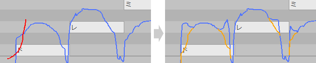

原文：[CeVIO AI ユーザーズガイド ┃ 編集ツール（ソング）](https://cevio.jp/guide/cevio_ai/operation/edittool/)

---

切换歌唱轨道的编辑模式。

（无法在语音轨道或音频轨道中使用。）

### 选择工具

*選択ツール / Selection Tool*

乐谱编辑页面：选择音符、曲速等。拖动以选择音符。

调整界面：拖动以指定复制或删除的范围。按下 ++alt++ 键时将脱离量化限制。

\* 按住 ++lctrl++ 键时，它将变成画笔工具。

### 范围选择工具

*まとめ選択ツール / Collectively Selection Tool*

选择选中范围内的音符以及它们的全部参数。按下 ++alt++ 键时将脱离量化限制。

\* 按住 ++lctrl++ 键时，它将变成画笔工具。

### 画笔工具

*ペンツール / Draw Tool*

乐谱编辑页面：选择音符、曲速等。拖动以输入歌词 / 音素或移动音符。

调整界面：拖动以调整参数。按下 ++alt++ 键时进入连接调整模式。

\* 按住 ++lctrl++ 键时，它将变成橡皮擦工具。

!!! info "连接调整模式"

    
    
    * 按住 ++alt++ 并拖动鼠标时，画笔工具将会画出红色的调整线。此时放开 ++alt++ 键时，画出的红线和原始的参数线将会自动连接，并以此作为新的参数。
    * 按住 ++alt++ 键，会出现一条参考线，它反映的是已调整的参数值。可以依此确认当前的状态。

        \* 如果在画线前就放开了 ++alt++ 键，则焦点会切到菜单上[^1]，但可以通过长按 ++alt++ 键的方式再次确认。
    
    * 出于横坐标（时间）的内部数据处理原因，屏幕上的原始值和调整值，二者的连接可能会出现略微错位的情况。

### 直线工具

*ラインツール / Line Tool*

乐谱编辑页面：同画笔工具。

调整界面：（时间调整界面除外）拖动以画出一条直线。同时按下 ++shift++ 键可以画出水平线。

\* 按住 ++lctrl++ 键时，它将变成橡皮擦工具。

### 橡皮擦工具

*消しゴムツール / Eraser Tool*

乐谱编辑页面：删除音符、曲速等。

调整界面：删除已调整的参数值。（音高 / 颤音调整界面）同时按住 ++shift++ 键时可以删除原始值。[^2]

\* 按住 ++lctrl++ 键时，它将变成选择工具。

[^1]: 译者注：这个其实是 Windows 系统使用键盘调用菜单的快捷键，菜单的文字里后面跟着的字母就是调用它们的键。比如说你现在试试看在 CeVIO 里按 ++alt++ 再按一下 ++f++（
[^2]: 译者注：算是个小技巧，用橡皮擦删掉原始音高值可以做出黑嗓。
