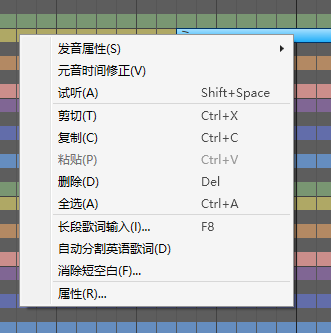

原文：[CeVIO AI ユーザーズガイド ┃ ソングトラックの説明](https://cevio.jp/guide/cevio_ai/songtrack/)

---
在钢琴卷帘中填入音符输入歌词，然后在调整界面进行细微调整。

菜单的「音轨」或者右键点击轨道选择「添加歌唱轨道」，最大可以添加 32 个轨道。

### 位置光标

点击标尺，可以移动想要开始播放的位置。

\* 钢琴卷帘通常通过量化自动进行位置补正；按住 ++alt++ 键再点击则不会补正。

### 标尺（曲速行/拍子行/调号行/强弱记号）

在小节行中，可以水平拖动鼠标（按住左键移动）来快速滚动。

曲速行/拍子行/调号行/强弱记号行的任意一行都可以在歌曲中间添加、编辑和删除信息，如在曲速行中间添加新的曲速。

在任意一行中垂直拖动都可以快速缩放。

### 试听

播放选择的音符前后的简单区间。在调整界面中则是播放选择范围的区间。

使用快捷键 ++shift+space++ 也可以进行试听。

### 自动试听

选择是否在输入音符后或移动音符后自动进行试听。

### 键盘

点击音阶，该轨道的角色会唱出这个音。

### 简易 TIMING 显示

可以确认、调整歌词的音素和发声时机画面。画面过于狭窄时，可以通过[选项](../option/index.md)的「歌唱设定」将其隐藏。

### 滚动条

当滚动条位于右端时，按住钢琴卷帘底部的滚动条的向右滚动按钮，或按住 ++shift++ 再向下滚动鼠标滚轮，可以往末尾追加小节。

\* 在钢琴卷帘上用鼠标中键按住并移动，可以快速滚动。

### 缩放条

可以通过拖动缩放条或点击 [+] [-] 以调整钢琴卷帘的缩放倍率。

按住 ++ctrl++ 键后点击缩放条，可以恢复默认的缩放倍率。

## 右键菜单

在钢琴卷帘上右键单击（或在触摸屏上长按）来打开右键菜单。

\* 在只选择了一个音符的情况下右键单击时：

### 发音属性

*属性 / Attribute*

可以为音符指定重音 / 断音 / 呼吸记号 / 连音开始 / 连音结束 / 假声。

支持[特殊符号](song_symbol.md)的歌手，可以通过「属性」的「特殊符号」输入特殊符号。

### 元音时间修正

*母音のタイミング補正 / Vowel Timing Correction*

将元音的发声时间自动调整到音符的起始处。

※辅音会随元音移动相同的数值（辅音无法移动时使用比率调整。如果没有足够的空间留给辅音则跳过）。

※鉴于机械修正可能会失去原先良好的听感，请将其用作辅助手段。

### 试听

*試聴 / Listen*

播放选中的音符。\* 在调整界面则播放选择范围内的内容。

### 剪切

*切り取り / Cut*

切取选择的音符。

### 复制

*コピー / Copy*

复制选择的音符。

### 粘贴

*貼り付け / Paste*

在光标当前的位置粘贴复制（剪切）的音符。

### 仅粘贴歌词

*歌詞のみ貼り付け / Paste Lyrics Only*

复制音符后，歌词将反映在相对开始时间与复制源一致的音符上。\* 复制音符后显示。

### 删除

*削除 / Delete*

删除选择的音符。

### 全选

*すべて選択 / Select All*

选择钢琴卷帘内的所有音符。

### 长段歌词输入

*歌詞のまとめ入力 / Enter Lyrics Collectively*

一次性从当前选中的音符开始（若未选定的话则从头开始）插入歌词。

### 自动分割英语单词

*英語歌詞の自動分割 / Auto Split English Lyrics*

输入英语歌词时，按 1 音符 1 音节的方式分割单词并分配给音符。

※由于歌词标记的分割位置由自动推算得出，可能会有出错的情况。

### 消除短空白

*休符の除去 / Remove Rests*

删除 MIDI 文件导入等原因导致的小空隙（休止符）。

### 属性 {#single-note}

*プロパティ / Properties*

查看音符的详细信息，并设置呼吸和连音等属性。

\* 在选择了多个音符的情况下右键单击时：

### 连音

*スラー / Slur*

为选择范围内的音符设置连音开始与结束，以更流畅地演唱。

\* 选择多个音符时，使用快捷键 ++ctrl+r++ 也可以设置连音的范围。

### 合并音符

*音符を結合 / Merge Notes*

选择范围的音符的歌词和属性将合并到选区的第一个音符上。

\* 选择多个音符时，使用快捷键 ++ctrl+u++ 也可以合并音符。

### 属性 {#multiple-notes}

*プロパティ / Property*

选择多个音符时，可以同时修改它们的歌词、假声等属性。

\* 在未选择音符的情况下右键单击时：

### 选择 / 范围选择 / 画笔 / 直线 / 橡皮擦工具

*選択／まとめ選択／ペン／ライン／消しゴムツール*

*Selection / Collectively Selection / Draw / Line / Eraser Tool*

切换编辑工具。

[编辑工具](../operation/edittool.md)

### 量化

*クオンタイズ / Quantize*

变更量化。

[量化是](../operation/infopanel.md#quantize)

### 参数调整

*調整モード / Edit Mode*

在用于输入音符和歌词的乐谱编辑模式和调整时间、音量、音高和颤音的模式间切换。

「取消颤音」可以禁用所选音轨的颤音振幅和周期。

### 其他操作

*その他の操作 / Other Operations*

#### 插入小节

*小節の挿入 / Insert Measures*

在指定的位置往所选音轨或全部音轨中插入小节。

也可以通过按住钢琴卷帘底部的滚动条的向右滚动按钮，或通过 ++shift++ + 下鼠标滚轮的方式往末尾追加小节。

#### 删除小节

*小節の削除 / Delete Measures*

在指定的位置往所选音轨或全部音轨中删除小节。

#### 消除短空白

*休符の除去 / Remove Rests*

删除 MIDI 文件导入等原因导致的小空隙（休止符）。

#### 按音素输入歌词

*音素で歌詞入力 / Enter Lyrics with Phoneme*

按音素记号（发音记号）输入歌词。

#### 自动分割英语单词

*英語の歌詞を音節で自動分割 / Auto Split English Lyrics*

输入英语歌词时，按 1 音符 1 音节的方式分割单词并分配给音符。

※由于歌词标记的分割位置由自动推算得出，可能会有出错的情况。

#### 自动范围选择

*自動まとめ選択 / Auto Collectively Selection*

拖拽音符时，若音符范围内存在已经调整过的参数的音符，则它们会自动被范围选择。

\* 垂直移动时触发条件为音高（PIT）；水平移动时为时间（TMG）以外的参数。

#### 全轨道共用调号

*調号は全トラック共通 / Common Key Signatures*

开启后，选中轨道的调号将反映到其他轨道上，之后全部轨道的调号将会同步。

### 显示

*表示 / View*

#### 显示其他音轨的音符

*別トラックの音符表示 / Other Track Notes*

选择是否要在乐谱编辑页面里显示所有歌唱轨道的音符。

(静音轨道不会被显示。)

#### 曲速行 / 拍子行 / 调号行 / 强弱记号行

*テンポ行／拍子行／調号行／強弱記号行*

*Tempo Row / Time Signature Row / Key Signature Row / Dynamics Mark Row*

修改标尺栏内曲速、拍子、调号、强弱记号的显示与否。

#### 拍子网格线 / 量化线

*拍のライン／クオンタイズのライン / Beat Line / Quantize Line*

修改钢琴卷帘内拍子线、量化线的显示与否。

#### 在调整界面也显示网格线

*調整画面にも表示 / Line Display on Adjustment Screen*

开启「在调整界面也显示网格线」时，调整界面中也会显示网格线。

### 状态线

*タイミングの状態ライン / Timing Status Line* 

在 TMG 调整界面内显示状态线。按住 ++alt++ 可以暂时切换。

#### 光标指示器

*ガイドカーソル / Guide Cursor*

修改标尺栏内当前鼠标对应量化位置的显示与否。

\* 使用范围选择工具 / 画笔工具 / 直线工具时，该量化位置也会出现在乐谱编辑页面中。

#### 颜色设定

*色の設定 / Color Settings*

可以自由修改调整画面的时间、音高等线条的颜色。

\* 其他情况的菜单：

### 混合复制

*ミックスコピー / Mix Copy*

使用范围选择工具（或在调整界面使用选择工具）选择时，从右键菜单选择“混合复制”选项或是使用快捷键 ++ctrl+shift+c++，可以连同参数一同复制，包括默认值。

将范围选择工具搭配混合复制使用，就可以轻松地将音轨的部分或是全部音符，连同它们的参数一同粘贴到另一个位置或是另一条轨道。也可以将某位歌手调整过的歌声粘贴到其他歌手上来歌唱。

\* 由于应用的是调整值，可能会有将参数应用给某位歌手后，歌手的演唱质量欠佳的情况。即使是同一位歌手，在另一个位置也可能唱得与原始位置的声音不同。请根据需要重新调整参数，以达到预期效果。

### 仅粘贴歌词

*歌詞のみ貼り付け / Paste Lyrics Only*

复制音符后，歌词将反映在相对开始时间与复制源一致的音符上。

### 删除特殊符号

*特殊記号の削除 / Delete Special Symbols*

选择范围内存在假声以外的特殊符号时，可以从右键菜单选择该选项，从而批量删除假声以外的特殊符号。

\* 假声符号可以通过音符属性批量删除。

### 重置调整

*調整のリセット / Reset Adjustments*

在使用范围选择工具指定范围的状态下，可以从右键菜单选择该选项，批量删除范围内的调整值。

\* 与「删除特殊符号」组合，便可简单地将指定范围回退到未调整的状态。
