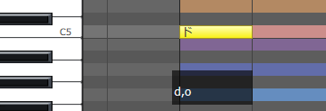
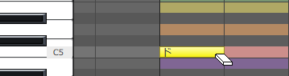
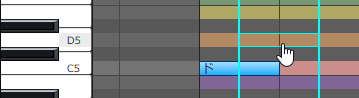
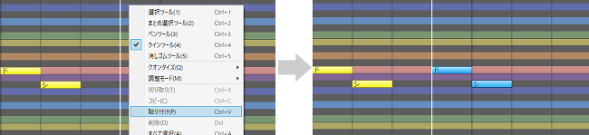

原文：[CeVIO AI ユーザーズガイド ┃ 音符の入力と編集](https://cevio.jp/guide/cevio_ai/songtrack/song_02/)

---

可以使用调整工具在「乐谱编辑」的状态下输入和编辑音符。

## 输入音符

若要输入音符，请从编辑工具里选择画笔工具。

在钢琴卷帘上，从放置音符的地方左右拖拽（按住鼠标左键并移动）来决定音符的长度。

在执行音符的输入、移动或粘贴的操作时，若音符与同一轨道的其他音符重叠，则其他音符会自动缩短。（可选项。可以在选项中选择「输入音符时不调整会重叠的音符」。）

最开始的小节（第 0 小节）不允许输入音符。

输入音符后，它的下方会显示歌词的音素和发声时间。可以在这里调整时间。

在键盘上单击，该轨道的角色会唱出当前音阶上的这个音。

!!! hint "音符输入的提示"

    不推荐用音符和音符间细小的空隙表示促音（っ），或用诸如 1/32 等细小的音符位置来表达发声的时机。

    将促音包含在歌词中，在音符下方或时间调整页面调整发声的时机，会得到更好的歌声。

## 删除音符

从编辑工具里选择橡皮擦工具，再单击音符，便可擦除音符。

另外，使用橡皮擦工具以外的工具时，选中音符再按 ++del++ 键也可以删除音符。

## 调整音符长度

从编辑工具里选择选择工具或画笔工具，再拖拽音符的左侧或右侧，便可调整音符长度。

## 移动音符

从编辑工具里选择选择工具或画笔工具，再拖拽音符，便可移动音符。

拖拽时按住 ++shift++ 键，可以水平或垂直移动音符。

同时选中多个音符时可以一并移动它们。

另外，拖拽时按住 ++alt++ 键可以复制选择的音符。

※不允许将音符移至第 0 小节。

!!! hint "连同音符的参数一并移动"

    如果选中一个音符，然后用 ++up++ 或 ++down++ 键移动它，则音高会自动随之变换。

    使用[范围选择工具](../song_05)圈定范围，然后移动它们，则选择范围内的音符会连同它们的参数一并移动。

## 复制与粘贴音符

从编辑工具中选择选择工具或画笔工具，然后点击待复制的音符。

可以通过按住 ++rctrl++ 或 ++shift++ 键并点击音符来选择多个音符。

也可以在使用选择工具的情况下，通过在钢琴卷帘上拖动，来选择拖动范围内的音符。

选定音符后，从右键菜单中选择「复制」。

然后，从右键菜单中选择「粘贴」，将音符粘贴在光标位置。

!!! hint "连同音符的参数一并粘贴"

    使用[范围选择工具](../song_05)圈定范围后复制，就可以一并复制范围内的音符调整值、节拍、强弱等参数。之后，利用光标指定位置并粘贴，便可简单地再现原始的音符和调整值。
