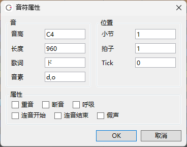

原文：[CeVIO AI ユーザーズガイド ┃ 音符のプロパティ](https://cevio.jp/guide/cevio_ai/songtrack/song_03/)

---

显示音符的详细参数。

同时选中多个音符时，面板中会显示它们相同的内容。可以同时修改内容，也可以用 `+` 和 `-` 改变相对值。

## 音

*音 / Sound*

### 音高

*高さ / Pitch*

显示音符的音高。

输入 `+12` 可以将所有选择的音符提高一个八度。

### 长度

*長さ / Duration*

显示音符的长度。一个四分音符的长度为 960 tick。

### 歌词

*歌詞 / Lyric*

分配给音符的歌词。

### 音素

*音素 / Phoneme*

歌词的音素。输入的音素优先于歌词。

## 位置

*位置 / Position*

### 小节

*小節 / Measure*

显示音符所在的小节。

### 拍子

*拍 / Beat*

显示音符所在的拍子。

### Tick

显示音符所在的 tick。

## 属性

*属性 / Attribute*

### 重音

*アクセント / Accent*

为音符指定重音。

### 断音

*スタッカート / Staccato*

为音符指定断音。

### 呼吸

*ブレス / Breath*

在音符后换气。

### 连音开始 / 连音结束

*スラー開始／スラー終了*

*Slur begin / Slur end*

从连音开始到结束为止以更流畅的方式演唱。

也可以通过在乐谱编辑屏幕上选择多个音符并按 ++ctrl+r++ 来设置连音的范围。

!!! tip "连音的提示"

    当后面的歌词（或长音）与前一个音符元音相同时，设置连音将使音量的连接更加平滑。
    
    如果想唱得更流畅，请使用调整屏幕，将音高和音量线平滑地连起来。

### 假声

为音符添加假声记号。

※受角色和音符音高（比如说音高偏低的音符）的影响，发出的声音可能不是假声。
