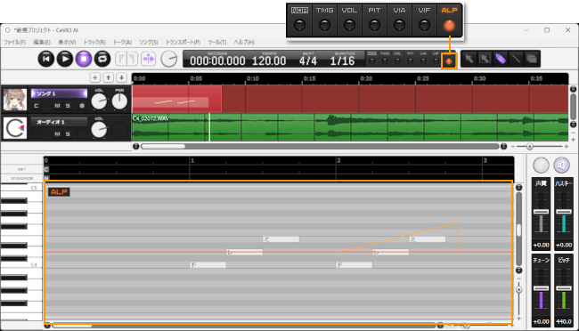

原文：[CeVIO AI ユーザーズガイド ┃ 歌声の調整③（声質ほか）](https://cevio.jp/guide/cevio_ai/songtrack/song_06/)

---

拖动（按住鼠标左键并移动）钢琴窗右侧的滑块（推子），可以对选定轨道的歌声做整体调整。也可以把鼠标光标悬停在滑块上，通过向上或向下移动鼠标滚轮来调整它；或是双击数字并直接输入。

### 音色

向上推得越多，声音会变得更像大人；向下会更像孩子。

※声音变化的程度因角色而异，例如「可不(KAFU)」「星界(SEKAI)」的变化就比较小。

### 沙哑度

向上推得越多，声音越沙哑。不影响调整画面。

### 精准音高

向上推得越多，歌手将越忠实地（即更机械地）按照乐谱的音程演唱。

### 音高偏移

以 440Hz 为基准偏移导出的声音。不影响调整画面。

### 感情

「すずきつづみ（铃木梓梓弥）」「星界」和「狐子(COKO)」会显示一个额外的感情滑块。

!!! info "关于感情"

    “CeVIO AI”的歌唱声库通过深度学习等 AI 技术，真实地再现了声源提供者的音色、特点和演唱风格。

    通常而言，歌唱表达会根据歌曲的内容自动重现（是学习的结果）。若是声源提供者歌唱表达的范围十分广泛或是有不同的歌唱表达，CeVIO AI 会特别地学习两种歌唱表达，并可以通过「感情」滑块选择不同的歌唱表达。

    

## 音色的详细调整

通过工具栏上的「ALP」按钮或菜单切换到调整屏幕，可以对音色进行微调（最小单位为 5 毫秒）。

调整是相对于整个音轨的音色而言的，当向上或向下移动音色滑块时，调整值也会相应地向上或向下移动。

## 沙哑度的详细调整

通过工具栏上的「HUS」按钮或菜单切换到调整屏幕，可以对沙哑度进行微调。

调整是相对于整个音轨的沙哑度而言的，当向上或向下移动沙哑度滑块时，调整值也会相应地向上或向下移动。

