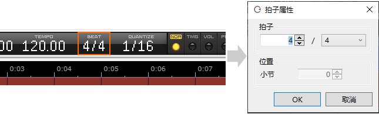

原文：[CeVIO AI ユーザーズガイド ┃ はじめてのソング作成](https://cevio.jp/guide/cevio_ai/tutorial_song/)

---
.填入音符来创作旋律，再输入歌词来合成自然的歌声。

在钢琴卷帘上直观地操作编辑，同时可以利用多条歌唱轨道进行合唱。

## 1.启动应用

启动软件后，音频轨道将在页面的上方显示。

※如果有多个音轨，点击写着「歌唱 1」的音轨（或者时间轴），页面的下方将会出现歌唱编辑界面。

## 2.设置曲速和拍子

点击信息面板的曲速或拍子，将会弹出设置窗口。

※若想要在曲子的中途变更曲速或拍子，请使用钢琴卷帘的标尺。

## 3.输入音符

输入音符时，请在编辑工具中选择画笔工具。

在钢琴卷帘上，从想要放置音符的地方向右移动（按住鼠标左键）来决定该音符的长度。

## 4.输入歌词

放置音符时默认填入的歌词为「ドレミファソラシド」（Do Re Mi Fa So La Si Do）。

双击音符可以输入歌词。

## 5.播放

点击控制面板的播放按钮，将会从光标的位置开始播放。

播放到音轨末尾或点击停止按钮时会停止播放。

## 6.音频文件的输出

通过点击菜单的「文件」→「导出」→「导出WAV音频文件」，可以将全部音轨合成一个文件并导出。

另外，选择「导出歌唱部分为WAV文件」，可以将选中的轨道导出为单声道。

*[标尺]:ルーラー / Rule