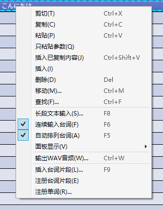

原文：[CeVIO AI ユーザーズガイド ┃ トークトラックの説明](https://cevio.jp/guide/cevio_ai/talktrack/)

---

在左边的台词列表中输入文字，在右边的状态与感情控制台以及音素图中进行调整。

在菜单栏中的「音轨」或在轨道上右键单击选择「添加语音轨道」，可以添加至多 32 个音轨。

### 试听

*試聴 / Listen*

试听台词列表中选中的行。试听时再按一次可以中断。

在音素图中左键单击，可以从指定的位置开始试听。

### 循环试听

*繰り返し試聴 / Cycle*

设置 / 取消循环播放试听。

### 自动试听

*自動試聴 / Auto Play*

切换输入台词后，或调整状态 / 感情 / 音素图后的自动试听与否。

如果勾选了[「音素图调整部分自动试听」](../../option/option/.md#partial-replay-with-phoneme-graph)选项，则音素图将从调整点的前一个停顿处（如标点符号）开始自动播放，直到遇到调整点的后一个停顿处。

!!! tip "活用自动试听"

    输入台词后按下 ++enter++ 键能自动试听该行的文本，这样一来便能和「连续输入台词」组合使用：提前输入脚本并依次播放；作为直播的实时语音合成工具；诸如此类。

## 右键菜单

在台词列表上右键单击来打开右键菜单。

### 剪切

*切り取り / Cut*

切取选择的台词。

### 复制

*コピー / Copy*

复制选择的台词。

### 粘贴

*貼り付け / Paste*

在光标当前的位置粘贴复制（剪切）的台词。

### 只粘贴参数

*パラメータのみ貼り付け / Paste Parameters Only*

剪切或复制台词后，将该台词的参数粘贴到所选行上。※复制台词后显示。

### 插入已复制内容

*コピーした内容の挿入 / Insert Copied Contents*

在所选行的位置插入复制的台词。※复制台词后显示。

### 插入

*挿入 / Insert*

在所选行的位置插入空白行。

### 删除

*削除 / Delete*

删除所选行。

### 移动

*移動 / Move*

将所选行的台词按指定的方式移动。

### 长段文本输入

*文のまとめ入力 / Enter Text Collectively*

将长段文本全部输入到一行中。

### 搜索

*検索 / Find Text*

通过关键词搜索台词。

### 连续输入台词

*連続でセリフ入力 / Continuous Input*

开启该选项时，提交台词的编辑后，自动移至下一行并进入编辑状态。

### 自动排列台词

*セリフの自動整列 / Automatic Line Alignment*

开启该选项时，输入台词后后续的台词会自动前后移动（以维持间距）。

### 面板显示

*显示 / View*

#### 其他音轨的台词

*別トラックのセリフ / Other Track Lines*

在台词列表中将选择的轨道外的台词一并显示。

#### 配音角色 / 开始时间 / 结束时间 / 时长 / 音轨

*キャスト／開始時間／終了時間／長さ／トラック*

*Cast / Start Time / End Time / Duration / Track*

切换各列的显示与否。

### 从这里开始播放

*ここから再生 / Play From Here*

与位置光标的关系无关，从选择中的台词位置开始播放。

使用快捷键 ++f5++ 停止播放时，位置光标会移动到停止时所在台词的起始处，并选中该台词。
  
可以使用 ++f5++ 代替 ++space++ 播放，或是用于以台词为单位朗读台词。

### 输出 WAV 音频

*WAV書き出し / Export Audio File*

将所选行以 WAV 格式导出。

\* 可以在[选项](../../option/index.md)中指定采样率和位深度。

### 插入台词片段

*セリフクリップの挿入 / Insert Speech Clips*

从已注册的台词中选择一个台词片段，然后插入到所选行。

### 注册台词片段

*セリフクリップの登録 / Register Speech Clips*

将所选行的台词注册为台词片段。

### 注册单词

*単語の登録 / Word Registration*

将所选行的台词注册为单词。
