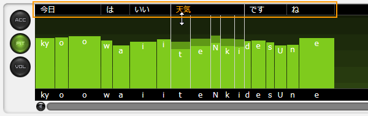
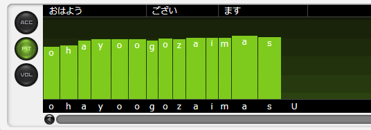

原文：[CeVIO AI ユーザーズガイド ┃ 音素グラフ（日本語ボイス）](https://cevio.jp/guide/cevio_ai/talktrack/phoneme/)

---

在这里修正单词的重音，调整每个音素的音高、长度和音量。

## 调整重音

「ACC」按钮表示的画面用于调整重音。

单击音拍（假名）以将其所在的位置标记为重音。

上下拖动音拍会自动将重音型应用到重音段中。

\* 修改后的音拍，它们的连接线会以橙色显示。

\* 按住 ++ctrl++ 并单击音拍可以恢复到原始的重音。

!!! info "重音型与重音段"
    在日语的标准语中有四种“重音型”：头高型、中高型、尾高型和平板型。

    “重音段”是由单词、助词等组成的重音单元，具有其中一种重音类型。
    
    在重音调整屏幕中，重音段的边界上会显示一条黑色的垂直线。

### 重音段的分割 / 连接

鼠标移到音拍之间时，它会变为剪刀（音拍已连接时）或绳索（音拍被分开时）。此时左键单击便可分割或连接重音段。

活用分割与连接重音段功能，便可以更加自由地调整重音的高低。

## 调整音高 / 音长 / 音量

「PIT」按钮表示的画面用于调整音高和音长。

「VOL」按钮表示的画面用于调整音量和音长。

\* PIT 屏幕的背景每八度有一个渐变，VOL 屏幕的背景每 10 dB 有一个渐变。

### 调整音高或音量

在条形图上用鼠标上下拖动（鼠标左键按住），便可根据鼠标的移动修改长条柱。也可以左右移动，或是按住 ++shift++ 键再往左（或右）移动，来纵向调整音素图。

也可以将鼠标光标放在长条柱上，然后上下滚动鼠标滚轮来调整。

\* 在放大显示时按住 ++alt++ 键，可以用鼠标滚轮向上 / 向下进行调整。

\* 音高的变化单位是 100 Cent，音量的变化单位是 1dB。

从上方的文字区域开始上下拖动，可以以单语单位调整音高 / 音量。

\* 当鼠标悬停在要调整的单词、音素或音拍（假名）上时，它会变为橙色。

### 调整音长

拖动白色的竖线（调整后为橙色）来调整发音的长度。

双击垂直线，或是在点击或拖动时按住 ++ctrl++ 键，可以使其恢复到原来的音长。

从上方的文字区域开始左右拖动，可以以单语单位调整音长。

除了拖动垂直线外，还可以通过拖动文字区域或在文字区域上下滚动鼠标滚轮来调整音长。

\* 以单语或音拍为单位调整音长时，会自动确保辅音与元音的比例。

!!! tip

    关闭右键菜单的「显示音长界限」，可以防止在调整音高时不小心拖动音长调整线。

    （即使隐藏了，也依然可以通过音素图上下的文本区域来调整音长。）

    

### 显示缩放

在 PIT 和 VOL 屏幕上，音素图右下方的 [+] 和 [-] 按钮可以用来放大和缩小显示。

当屏幕很窄或者想进行微调时很有用。

还可以用快捷键 ++ctrl++ + 鼠标滚轮向上/向下进行垂直放大和缩小，用 ++ctrl+shift++ + 鼠标滚轮向上/向下进行水平放大和缩小。

### 以音素为单位/假名为单位调整

关闭右键菜单的「按音素单位调整」，可以以假名为单位同时调整辅音和元音的长度。

\* 快捷键 ++ctrl+p++ 可以切换调整单位。按住 ++alt++ 键可以暂时切换。

## 共通功能

### 恢复初始值

选择音素图右键的「恢复初始值」，可以将重音、音高、音长和音量恢复到调整前的状态。

双击调整后的音素图可以只将该部分的图恢复到初始值。按住 ++ctrl++ 键再拖动鼠标，可以将鼠标经过的区域恢复到其初始值。

### 试听 / 调整部分自动试听

在音素图中点击，将从点击的位置开始试听。在试听过程中再次点击将停止试听。

在调整后自动开始试听的「自动试听」功能，可以用「自动试听按钮」来激活 / 停用。

如果在右键菜单中勾选了「调整部分自动试听」，音素图将从调整点的前一个停顿处（如标点符号）开始自动播放，直到遇到调整点的后一个停顿处。

### 滚动显示

除了滚动条之外，还可以按住鼠标中键拖动来滚动音素图。

也可以通过按住 ++shift++ 键然后上下拖动鼠标滚轮的方式来水平滚动；在放大显示时上下拖动鼠标滚轮则为垂直滚动。

*[「显示音长界限」]: 長さのラインを重ねて表示 / Overlay Duration Lines
